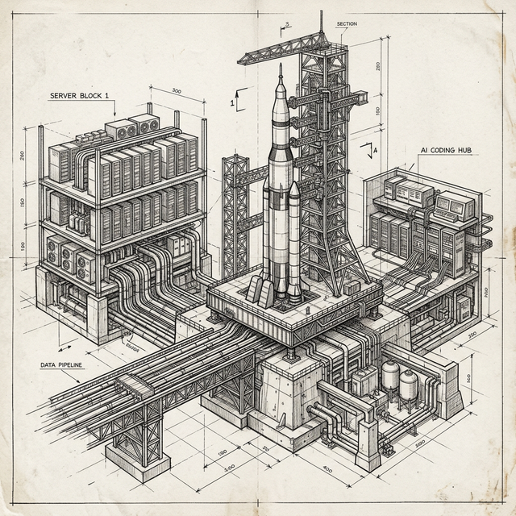

# LaunchPad

> The agentic coding harness that gives AI full context about your codebase, runs it in structured loops, and enforces quality before anything reaches `main`. Works for both greenfield and brownfield projects.




Most AI coding plugins are recipe packs — agents and prompts that produce a single PR and forget everything by the next session. LaunchPad is different: it installs a **governance kernel** that persists across sessions, so the AI's next run is informed by the last one instead of starting cold.

The kernel is five files and one runtime directory, dropped into any repository:

- **`docs/architecture/REPOSITORY_STRUCTURE.md` whitelist** — every file path the project allows, enforced by a pre-commit gate. Blocks structure-drift PRs before reviewer time is wasted.
- **`lefthook.yml` pre-commit hooks** — secret-scan, structure-drift, typecheck, lint run on every commit. Catches `.env.local` leaks and broken types before they reach `git push`.
- **`.launchpad/config.yml`** — single source of truth for slash-command behavior (test/typecheck/lint commands, paths, pipeline gates). `/lp-build`, `/lp-define`, and `/lp-commit` read from here, so semantics stay consistent across sessions and machines.
- **`.harness/`** — runtime workspace where review findings, observations, and design artifacts accumulate. Past mistakes inform the next review agent automatically; nothing has to be re-discovered.
- **`docs/architecture/` core docs** (PRD, TECH_STACK, BACKEND_STRUCTURE, APP_FLOW + 4 supporting docs) — living architecture, refreshed by `/lp-define` re-runs. Every AI session starts with these loaded as context.

On top of that kernel, LaunchPad ships 38 slash commands, 36 sub-agents, and 16 skills (collectively referred to as the LaunchPad plugin). The agents are productive _because_ the kernel is in place. Without it, recipe-pack plugins regenerate the same boilerplate every session and silently drift away from project conventions.

**Where it fits.** LaunchPad is built on top of the best agentic coding practices such as Compound Engineering Plugin, Compound Product, Spec-Driven Development, Ralph Loop, and more (read below for the full attribution). What makes it unique is the structural foundation that makes agent recipes productive across sessions. Run the plugin alongside the kernel.

Works on both **brownfield** projects (add the plugin to an existing repo, run `/lp-define`, get the kernel retrofitted) and **greenfield** (run the `/lp-brainstorm` → `/lp-pick-stack` → `/lp-scaffold-stack` → `/lp-define` pipeline for a fresh project with the kernel materialized from scratch).

LaunchPad ships under the **BuiltForm** marketplace at [github.com/builtform](https://github.com/builtform) — the umbrella brand for plugins and tools by Foad Shafighi.

For the full pipeline narrative and how each kernel component is used during a real build, see [HOW_IT_WORKS.md](docs/guides/HOW_IT_WORKS.md). For the architecture and design principles behind the kernel, see [METHODOLOGY.md](docs/guides/METHODOLOGY.md).

---

**Contents:** [Install](#install) · [First 15 Minutes](#first-15-minutes) · [What's Inside](#whats-inside) · [Security](#security) · [Methodology](#methodology) · [Companions](#companions) · [Links](#links)

---

## Install

### Path 1 — Add to any repo (Best for Brownfield)

Inside Claude Code, in the project where you want the commands, register the BuiltForm marketplace and install the plugin:

```
/plugin marketplace add builtform/launchpad
/plugin install launchpad@builtform
```

Restart Claude Code. All `/lp-*` commands are now available. Run `/lp-kickoff` to start.

The marketplace registration step is required today because BuiltForm is awaiting confirmation in the Anthropic public plugin registry. Once Anthropic confirms BuiltForm, `/plugin install launchpad@builtform` will work on its own and the `marketplace add` line above will no longer be necessary. Until then, run both lines.

### Path 2 — Fresh monorepo (Best for Greenfield)

Inside Claude Code, with the plugin installed via Path 1, run the four-command greenfield pipeline:

```
/lp-brainstorm  →  /lp-pick-stack  →  /lp-scaffold-stack  →  /lp-define
```

The pipeline scaffolds a fresh monorepo with `package.json`, `lefthook.yml`, the architecture docs, and project config rendered natively by the plugin's kernel renderer. No `git clone` step is required; the plugin is the canonical source for all scaffold content.

**If you need legacy v0/v1 install behavior** (the `init-project.sh` wizard): pin to v2.0.x:

```
git checkout v2.0.x
```

The `init-project.sh` script and 7 `*.template.*` swap files were decommissioned in v2.1 (BL-247). See `docs/maintainers/decommission-history.md` for the canonical audit log; see CHANGELOG.md (v2.1.0) for the user-facing migration note.

---

## First 15 Minutes

LaunchPad is organized around four **meta-orchestrators** that chain an idea all the way to a shipped PR:

```
/lp-kickoff  →  /lp-define  →  /lp-plan  →  /lp-build
 brainstorm     spec the       design +     build, review,
                product        plan         resolve, ship, learn
```

Each orchestrator checks a section's status before proceeding — you can run them in sequence for a whole feature, or invoke any one independently when resuming work.

- **`/lp-kickoff`** — collaborative brainstorming with codebase research, writes a design doc to `docs/brainstorms/`, hands off to `/lp-define`.
- **`/lp-define`** — seeds your architecture docs (PRD, tech stack, design system, app flow, backend, CI/CD) and section specs. Stack-aware: detects TypeScript / Python / polyglot projects and seeds `.launchpad/agents.yml` and `.launchpad/config.yml` accordingly.
- **`/lp-plan`** — design workflow (when UI is involved) → `/lp-pnf` (Plan Next Feature) → `/lp-harden-plan` (multi-agent plan stress-test) → human approval gate.
- **`/lp-build`** — fully autonomous: `/lp-inf` (execute the plan) → `/lp-review` (multi-agent review with confidence scoring and FP suppression) → `/lp-resolve-todo-parallel` (fix findings) → `/lp-test-browser` → `/lp-ship` (opens PR, never merges) → `/lp-learn` (captures learnings).

Full workflow guide: [HOW_IT_WORKS.md](docs/guides/HOW_IT_WORKS.md).

---

## What's Inside

| Component       | What the plugin ships                                                                                                                           |
| --------------- | ----------------------------------------------------------------------------------------------------------------------------------------------- |
| Slash commands  | 38 `/lp-*` commands for brainstorm, define, plan, build, review, resolve, learn, test, ship                                                     |
| Sub-agents      | 36 across 6 namespaces: research, review, resolve, design, skills, document-review                                                              |
| Skills          | 16 reusable instruction sets for design, planning, review, compound docs                                                                        |
| Runtime scripts | Stack detector, polyglot adapter, Jinja2 doc generator, content-hash audit log, autonomous-build integrity guard                                |
| Test suite      | 12 plugin-test suites covering adapters, config loader, stack detector, Jinja2 autoescape, pipeline integration, install-paths regression guard |

<details>
<summary>Plugin structure (click to expand)</summary>

```
LaunchPad/
├── .claude-plugin/
│   └── marketplace.json        # name=builtform, source="./plugins/launchpad"
├── plugins/launchpad/          # the plugin itself
│   ├── .claude-plugin/
│   │   └── plugin.json         # name=launchpad, version=1.0.0
│   ├── commands/               # /lp-* slash commands
│   ├── agents/                 # 36 sub-agents across 6 namespaces
│   ├── skills/                 # reusable instruction sets (lp-*/SKILL.md)
│   └── scripts/                # runtime: plugin-*.py/.sh + stack adapters + _vendor/
├── .launchpad/                 # project-local harness config (agents.yml, audit.log)
└── docs/                       # architecture, reports, handoffs, releases
```

</details>

The plugin is stack-agnostic: at `/lp-define` time it detects your project's stack (TypeScript monorepo, Python Django, polyglot, etc.) and adapts which review agents run, which quality commands (`pnpm test` vs `pytest`) are invoked, and which templates are rendered.

---

## Security

LaunchPad runs agents with elevated permissions. `/lp-build` creates branches, runs tests, commits, pushes, and opens PRs without asking.

Safeguards are layered:

- **PRs, not direct merges.** `/lp-ship` hard-refuses to run `gh pr merge` or `git merge main/master`.
- **Multi-agent review with confidence scoring.** `/lp-review` dispatches code + design + DB + copy agents in parallel; findings below a 0.60 confidence threshold are suppressed with an audit trail. P1 floor prevents silent suppression of critical issues.
- **Autonomous-build acknowledgment file.** `.launchpad/autonomous-ack.md` must exist before `/lp-build` will run, making autonomous authorization visible in git blame and PR diffs.
- **Content-hash audit log.** `.launchpad/audit.log` records every command invocation with ISO timestamp, git user, commit SHA, and a hash of the canonical commands section — so auditors can see what the harness ran and at what plugin state.
- **Integrity guard.** `/lp-build` refuses to run if the section spec and `autonomous-ack.md` were introduced in the same commit (the pattern a hostile PR would use to bypass review).

LaunchPad's autonomous loops pass `--dangerously-skip-permissions` to Claude Code so the loop can run unattended. To close the gap that flag opens — destructive shell commands like `rm -rf` or `git reset --hard` that the built-in merge-block hook does not cover — pair LaunchPad with [Destructive Command Guard (dcg)](https://github.com/Dicklesworthstone/destructive_command_guard), a third-party Rust `PreToolUse` hook. Strongly recommended for any unattended `/lp-build` run. Full threat model and the recommended companions: [SECURITY.md](SECURITY.md).

Detailed threat model and safeguard list: [HOW_IT_WORKS.md → Security](docs/guides/HOW_IT_WORKS.md#security-considerations).

---

## Methodology

LaunchPad organizes AI-assisted development into six layers — Scaffold, Definition, Planning, Execution, Quality, Learning — with design principles (status contract, fresh-context loops, confidence scoring, compound learning) designed to keep agents honest.

Full architecture, design principles, and credits: [METHODOLOGY.md](docs/guides/METHODOLOGY.md).

LaunchPad stands on the shoulders of:

- **[Compound Engineering Plugin](https://github.com/EveryInc/compound-engineering-plugin)** by Kieran Klaassen / [Every](https://every.to/) — 29 agents, 22 commands, 19 skills, ported natively.
- **[Compound Product](https://github.com/snarktank/compound-product)** by Ryan Carson — autonomous pipeline from report to PR.
- **[Ralph](https://ghuntley.com/ralph/)** by Geoffrey Huntley — fresh-context execution loop.
- **[HumanLayer](https://github.com/humanlayer/humanlayer)** — context-engineering patterns (Research → Plan → Implement, locator/analyzer pairs).
- **Spec-Driven Development** — SpecKit / AgentOS philosophy (specify before building).

---

## Companions

LaunchPad is intentionally narrow in scope. Two third-party tools pair well with it for users who want extra capabilities:

- **[Destructive Command Guard (dcg)](https://github.com/Dicklesworthstone/destructive_command_guard)** by [@Dicklesworthstone](https://github.com/Dicklesworthstone) — pattern-based shell-command guard that closes the `--dangerously-skip-permissions` gap by intercepting `rm -rf`, `git reset --hard`, `DROP TABLE`, and similar destructive operations before they execute. Strongly recommended for any unattended `/lp-build` run. See [SECURITY.md](SECURITY.md#recommended-companion-destructive-command-guard-dcg) for context.
- **[MemPalace](https://github.com/MemPalace/mempalace)** — local vector store + MCP server giving Claude Code verbatim recall of past sessions. Adds a fourth tier (raw transcript retrieval) on top of LaunchPad's three-tier knowledge system. Setup cookbook: [docs/guides/MEMPALACE_INTEGRATION.md](docs/guides/MEMPALACE_INTEGRATION.md).

LaunchPad does not bundle either tool, does not auto-install them, and does not depend on them at runtime. They're recommended pairings, not requirements.

---

## Links

- [How It Works](docs/guides/HOW_IT_WORKS.md) — day-to-day operator's manual
- [Methodology](docs/guides/METHODOLOGY.md) — architecture, design principles, credits
- [Release notes](docs/releases/v1.0.0.md)
- [Repository structure](docs/architecture/REPOSITORY_STRUCTURE.md) — file-placement decision tree
- [Contributing](CONTRIBUTING.md)

---

## License

MIT — see [LICENSE](LICENSE).
