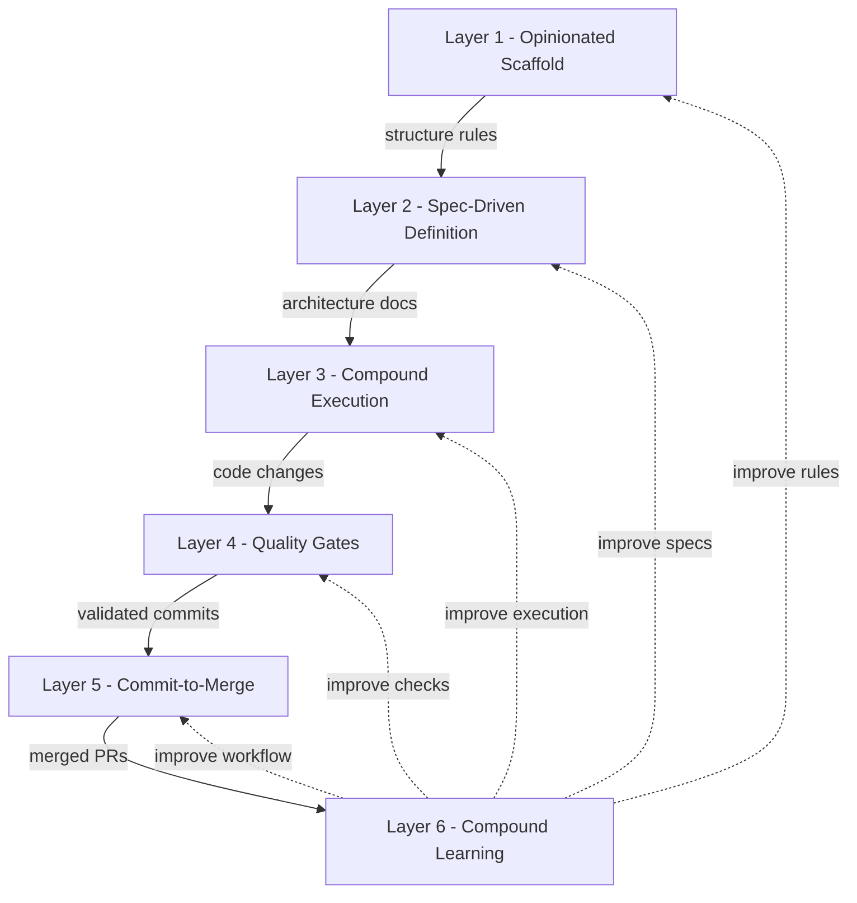

# Launchpad

> Structure for AI coding. Best practices, pre-configured.


<!-- TODO: Add hero image / social preview card -->

AI coding assistants generate code without memory, conventions, or quality gates. Launchpad fixes this -- an opinionated project scaffold that gives AI full context about your codebase, runs it in structured loops, and enforces quality before anything reaches `main`.

Built on top of best practices for AI-assisted development: existing patterns (compound loops, spec-driven dev, structure enforcement) wired into a single scaffold that works out of the box.

- **Context Engineering System** by **[HumanLayer](https://github.com/humanlayer/humanlayer)** -- Research → Plan → Implement workflow, The locator/analyzer agent pair pattern, and two-wave orchestration.
- **[Compound Product](https://github.com/snarktank/compound-product)** by Ryan Carson -- Autonomous pipeline from report to PR
- **[Ralph](https://github.com/snarktank/ralph)** by Ryan Carson & **[Ralph](https://ghuntley.com/ralph/)** by Geoffrey Huntley -- Fresh-context loop with git-based memory
- **Spec-Driven Development** -- Define architecture docs before building (SpecKit / AgentOS)
- **[CE Plugin](https://github.com/EveryInc/compound-engineering-plugin)** by Kieran Klaassen / **[Every](https://every.to/)** -- 29 agents, 22 commands, 19 skills (optional)

---

**Contents:** [Quick Start](#quick-start) | [How It Works](#how-it-works) | [What's Inside](#whats-inside) | [Commands](#commands) | [Configuration](#configuration) | [Pipeline Tools](#pipeline-tools) | [CI/CD](#cicd) | [Security](#security-considerations) | [CE Plugin](#optional-compound-engineering-plugin) | [Maintenance](#maintenance) | [Contributing](#contributing)

---

## Quick Start

### Prerequisites

| Prerequisite                                                  | Version | Required | Purpose                                        |
| ------------------------------------------------------------- | ------- | -------- | ---------------------------------------------- |
| [Node.js](https://nodejs.org/)                                | 22.x+   | Yes      | JavaScript runtime                             |
| [pnpm](https://pnpm.io/)                                      | 9.x+    | Yes      | Package manager (enable via `corepack enable`) |
| [PostgreSQL](https://www.postgresql.org/)                     | 14+     | Yes      | Database                                       |
| [Claude Code](https://docs.anthropic.com/en/docs/claude-code) | Latest  | Yes      | AI development workflows                       |
| [Codex](https://openai.com/codex/)                            | Latest  | Optional | AI development workflows alternative           |
| [GitHub CLI](https://cli.github.com/)                         | Latest  | Optional | PR creation from `/commit` and `/inf`          |
|                                                               |         |          |                                                |

### Installation

**1. Clone the repository**

```bash
git clone https://github.com/thinkinghand/launchpad.git my-project
cd my-project
```

> **Alternative:** Click the green **"Use this template"** button on GitHub to create a detached copy. This skips the init wizard's git setup but you can still add the upstream remote manually later.

**2. Initialize your project**

```bash
./scripts/setup/init-project.sh
```

The wizard prompts for your project name, description, copyright holder, contact email, and license (MIT, Apache-2.0, GPL-3.0, or Other). It validates all inputs, swaps template files into place, replaces all placeholders, updates `package.json`, and preserves the original Launchpad documentation at `.launchpad/GUIDE.md`.

**3. Set up git history**

After the init wizard completes, choose how to handle git history:

**Option A -- Stay connected (recommended)**

Keep the upstream connection so you can pull future Launchpad updates into safe directories (commands, skills, scripts, workflows):

```bash
git remote rename origin launchpad
git remote add origin <your-repo-url>
git push -u origin main
```

To pull updates later, use `/pull-launchpad` in Claude Code or run `bash scripts/setup/pull-upstream.launchpad.sh`.

**Option B -- Fresh start**

Remove all upstream history and start clean:

```bash
rm -rf .git && git init -b main && git add -A && git commit -m "Initial commit"
gh repo create my-project --private --source=. --push   # Optional
```

> **Note:** The init wizard automatically adds a `launchpad` remote. Option A preserves this; Option B removes it.

**4. Install dependencies**

```bash
corepack enable          # Enables pnpm via Corepack
pnpm install             # Installs all workspace deps + git hooks
```

**5. Configure environment**

```bash
cp .env.example .env.local
```

Open `.env.local` and set `DATABASE_URL` to your PostgreSQL connection string. AI provider keys (`ANTHROPIC_API_KEY`, `OPENAI_API_KEY`) are only needed for compound automation scripts.

**6. Start development**

```bash
pnpm dev
```

The web app runs on `http://localhost:3000` and the API on `http://localhost:3001`.

**7. Define your product (AI workflow)**

```
/define-product              # Answer questions about your product vision and goals
/define-architecture         # Answer questions about your technical architecture
```

This populates six architecture docs that give the AI complete context about what you are building.

### Trimming What You Don't Need

This template is comprehensive by design. Delete what your project does not require:

| If you don't need... | Delete              | Also remove from                                    |
| -------------------- | ------------------- | --------------------------------------------------- |
| Backend API          | `apps/api/`         | `turbo.json` tasks, `pnpm-workspace.yaml` if needed |
| Database / Prisma    | `packages/db/`      | `@repo/db` references in `apps/api/package.json`    |
| Compound automation  | `scripts/compound/` | --                                                  |
| Shared UI library    | `packages/ui/`      | `@repo/ui` references in `apps/web/package.json`    |

---

## How It Works

Launchpad organizes AI development into **6 layers**, each targeting a specific failure mode:

| Layer                | Purpose                                | Key Tool                                    |
| -------------------- | -------------------------------------- | ------------------------------------------- |
| 1. Scaffold          | Consistent file placement              | `check-repo-structure.sh`                   |
| 2. Definition        | Spec before code                       | `/define-product`, `/define-architecture`   |
| 3. Execution         | AI in fresh-context loops              | `/inf`, `auto-compound.sh`                  |
| 4. Quality           | Catch problems pre-commit              | Lefthook, TypeScript, ESLint                |
| 5. Commit-to-Merge   | Nothing unreviewed on main             | `/commit`, Codex review                     |
| 6. Compound Learning | Learnings improve every future session | `/compound`, `docs/solutions/`, `CLAUDE.md` |

How these layers connect -- each feeds into the next, with learnings cycling back to improve every future session:



Each loop iteration runs in a **fresh AI context** -- memory persists via git commits and state files (`prd.json`, `progress.txt`), not conversation history. This prevents context drift across long sessions. Layer 6 (Compound Learning) wraps the entire cycle -- after each run, learnings are captured to `docs/solutions/` and promoted into `CLAUDE.md`, so every future session benefits from past experience.

> See [How It Works](docs/guides/HOW_IT_WORKS.md) for the full operational breakdown and detailed per-layer diagrams.| [Methodology](METHODOLOGY.md) for the philosophy behind each layer. | Architecture in [System Overview](docs/architecture/SYSTEM_OVERVIEW.md)

---

## What's Inside

| Component | Technology                                                                                              |
| --------- | ------------------------------------------------------------------------------------------------------- |
| Frontend  | [Next.js 15](https://nextjs.org/) App Router, [Tailwind CSS v4](https://tailwindcss.com/)               |
| Backend   | [Hono](https://hono.dev/)                                                                               |
| Language  | TypeScript 5 (strict)                                                                                   |
| Database  | [Prisma](https://www.prisma.io/) + PostgreSQL                                                           |
| Build     | [Turborepo](https://turbo.build/) + [pnpm](https://pnpm.io/) workspaces                                 |
| Quality   | ESLint 9, Prettier, [Vitest](https://vitest.dev/), [Lefthook](https://github.com/evilmartians/lefthook) |
| CI        | GitHub Actions + Codex AI review                                                                        |
| AI        | [Claude Code](https://docs.anthropic.com/en/docs/claude-code), `CLAUDE.md`, `AGENTS.md`                 |

<details>
<summary>Project structure</summary>

```
launchpad/
├── apps/
│   ├── web/                # Next.js 15 frontend
│   └── api/                # Hono backend
├── packages/
│   ├── db/                 # Prisma schema + migrations
│   ├── shared/             # Shared types & utilities
│   ├── ui/                 # React component library
│   ├── eslint-config/      # Shared ESLint config
│   └── typescript-config/  # Shared TS presets
├── scripts/
│   ├── compound/           # Pipeline scripts
│   ├── agent_hydration/    # AI session bootstrapping
│   └── maintenance/        # Repo validation
├── docs/                   # Architecture, reports, learnings
├── .claude/                # Commands, skills, agents
├── CLAUDE.md               # AI instructions
└── AGENTS.md               # Multi-tool AI instructions
```

Full annotated structure with file placement decision tree in [`REPOSITORY_STRUCTURE.md`](docs/architecture/REPOSITORY_STRUCTURE.md)

</details>

<details>
<summary>Canonical files</summary>

These are the files that define how the project behaves. They are the control plane -- everything else is implementation.

**AI Instructions** -- What AI agents read before every session

| File                                   | Purpose                                                                                   | Layer        |
| -------------------------------------- | ----------------------------------------------------------------------------------------- | ------------ |
| `CLAUDE.md`                            | Primary instructions for Claude Code -- tech stack, commands, guardrails, workflow phases | All          |
| `AGENTS.md`                            | Same instructions adapted for non-Claude tools (Codex, Cursor, Gemini)                    | All          |
| `scripts/compound/iteration-claude.md` | Per-iteration prompt piped to AI during `/inf` execution loops                            | 3. Execution |

**Project Rules** -- What humans and AI follow

| File                                          | Purpose                                                                       | Layer       |
| --------------------------------------------- | ----------------------------------------------------------------------------- | ----------- |
| `docs/architecture/REPOSITORY_STRUCTURE.md`   | Single source of truth for file placement -- includes a 12-part decision tree | 1. Scaffold |
| `scripts/maintenance/check-repo-structure.sh` | Automated validator that enforces REPOSITORY_STRUCTURE.md on every commit     | 1. Scaffold |

**Architecture Specs** -- Populated by `/define-product` and `/define-architecture`

| File                                       | Created By             | Layer         |
| ------------------------------------------ | ---------------------- | ------------- |
| `docs/architecture/PRD.md`                 | `/define-product`      | 2. Definition |
| `docs/architecture/TECH_STACK.md`          | `/define-product`      | 2. Definition |
| `docs/architecture/APP_FLOW.md`            | `/define-architecture` | 2. Definition |
| `docs/architecture/BACKEND_STRUCTURE.md`   | `/define-architecture` | 2. Definition |
| `docs/architecture/FRONTEND_GUIDELINES.md` | `/define-architecture` | 2. Definition |
| `docs/architecture/CI_CD.md`               | `/define-architecture` | 2. Definition |

**Pipeline & Build Config** -- What controls automation and quality

| File                             | Purpose                                                                          | Layer              |
| -------------------------------- | -------------------------------------------------------------------------------- | ------------------ |
| `scripts/compound/config.json`   | Pipeline settings: max iterations, branch prefix, quality checks, AI tool        | 3. Execution       |
| `turbo.json`                     | Turborepo task pipeline: build, dev, lint, test, typecheck                       | 4. Quality         |
| `lefthook.yml`                   | Pre-commit hooks: prettier, eslint, typecheck, structure check, large file guard | 4. Quality         |
| `.github/codex-review-prompt.md` | Codex AI review instructions with P0-P3 severity format                          | 5. Commit-to-Merge |
| `.env.example`                   | Template for environment variables (copy to `.env.local`)                        | Setup              |

**Learnings** -- How knowledge compounds across sessions

| File                                                            | Purpose                                                  | Layer                |
| --------------------------------------------------------------- | -------------------------------------------------------- | -------------------- |
| `docs/solutions/compound-product/README.md`                     | Learnings catalog schema and 4-step knowledge flow       | 6. Compound Learning |
| `docs/solutions/compound-product/_template.md`                  | YAML frontmatter template for structured learnings files | 6. Compound Learning |
| `docs/solutions/compound-product/patterns/promoted-patterns.md` | Staging area for patterns graduating into `CLAUDE.md`    | 6. Compound Learning |

</details>

---

## Commands

### AI Workflow

| Command                | What it does                                                         |
| ---------------------- | -------------------------------------------------------------------- |
| `/define-product`      | Interactive Q&A to populate PRD + product vision docs                |
| `/define-architecture` | Interactive Q&A to populate architecture docs                        |
| `/create_plan`         | Break a feature into an implementation plan                          |
| `/implement_plan`      | Execute a plan phase by phase                                        |
| `/inf`                 | Full pipeline: report, PRD, tasks, execution loop, quality sweep, PR |
| `/commit`              | Quality gates, commit, PR creation, 3-gate monitoring                |
| `/pull-launchpad`      | Pull upstream Launchpad updates into safe directories                |
| `/Hydrate`             | Load minimal session context                                         |

### Development

| Command          | Description                              |
| ---------------- | ---------------------------------------- |
| `pnpm dev`       | Start dev servers (web :3000, API :3001) |
| `pnpm build`     | Build all apps and packages              |
| `pnpm test`      | Run Vitest tests                         |
| `pnpm typecheck` | TypeScript type checking                 |
| `pnpm lint`      | ESLint across all workspaces             |

---

## Configuration

Copy `.env.example` to `.env.local` and set:

| Variable            | Required | Description                           |
| ------------------- | -------- | ------------------------------------- |
| `DATABASE_URL`      | Yes      | PostgreSQL connection string          |
| `ANTHROPIC_API_KEY` | No       | For compound automation scripts       |
| `OPENAI_API_KEY`    | No       | Alternative LLM + GitHub Codex review |

> Full config reference for Turborepo pipelines, Lefthook hooks, and compound pipeline settings is available in their respective config files: `turbo.json`, `lefthook.yml`, and `scripts/compound/config.json`.

---

## Pipeline Tools

### Learnings Catalog

Each `/inf` run captures learnings into structured files at `docs/solutions/compound-product/`:

1. **During iteration** -- agent documents learnings in `progress.txt`
2. **After completion** -- Step 8 extracts learnings to `docs/solutions/compound-product/[feature]/`
3. **Human review** -- promote patterns to `promoted-patterns.md`
4. **Graduation** -- move promoted patterns into `CLAUDE.md` for all future sessions

### Kanban Board

`scripts/compound/board.sh` renders task progress from `prd.json`:

| Mode     | Flag        | Use Case                      |
| -------- | ----------- | ----------------------------- |
| ASCII    | (default)   | Terminal output during `/inf` |
| Markdown | `--md`      | VS Code preview, PR body      |
| Summary  | `--summary` | Log lines, CI output          |

The board renders automatically after each loop iteration.

---

## CI/CD

Every PR to `main` runs: dependency install, structure check, lint, typecheck, and tests. **Codex** posts an AI review with P0--P3 severity ratings. Both `/inf` and `/commit` monitor for P0/P1 issues automatically.

**Prerequisite:** Add `OPENAI_API_KEY` to GitHub Secrets for Codex review.

---

## Security Considerations

**Launchpad scaffolds AI-assisted workflows that run agents with elevated permissions.** Understand the risks before using.

**What the agents can do**

- Read and modify any file in your repository
- Execute shell commands (build, test, lint, git operations)
- Make network requests (API calls, package installs, git push)
- Create branches, commits, and pull requests autonomously
- Run multi-iteration loops that analyze, implement, and ship code without human intervention

**Safeguards in place**

1. **PRs, not direct merges** -- All autonomous changes go through pull requests for human review
2. **Lefthook pre-commit hooks** -- Linting, formatting, and structure validation run before every commit, blocking malformed or non-compliant code
3. **Codex AI review** -- An independent AI reviewer flags P0/P1 issues on every PR before merge
4. **Quality gates** -- Configurable checks (tests, type-checking, build) run at each iteration boundary
5. **Max iterations** -- The compound loop stops after N iterations to prevent runaway execution
6. **Structure validation** -- `check-repo-structure.sh` enforces file placement rules, preventing accidental creation of files in wrong locations
7. **Secrets via `.env.local`** -- All API keys and credentials load from `.env.local`, which is gitignored by default. No secrets are ever inlined in commands or committed to the repository
8. **Dry run mode** -- Test the analysis phase without making changes

**Recommendations**

- Review PRs carefully before merging -- even with AI review, human judgment is the final gate
- Run autonomous loops in a separate environment (VM, container) if concerned about file access
- Use API keys with minimal scope (read-only where possible, repo-scoped tokens for GitHub)
- Never target production branches -- always work on feature branches
- Monitor the first few autonomous runs to understand agent behavior and iteration patterns
- After running `init-project.sh`, verify that `.env.local` exists in `.gitignore` before committing anything

**Autonomous permission flags**

The compound scripts bypass interactive approval prompts to enable unattended operation. Each AI tool uses a different flag:

| Tool        | Flag                                         |
| ----------- | -------------------------------------------- |
| Claude Code | `--dangerously-skip-permissions`             |
| Codex CLI   | `--dangerously-bypass-approvals-and-sandbox` |
| Gemini CLI  | `--approval-mode=yolo`                       |

This is intentional for automation -- the safeguards above exist to catch mistakes before they reach your main branch. To add a pattern-based safety net alongside these flags, consider installing **[Destructive Command Guard (dcg)](https://github.com/Dicklesworthstone/destructive_command_guard)** -- a Rust-based `PreToolUse` hook that intercepts shell commands before your AI agent executes them, blocking recognized destructive operations (`rm -rf`, `git reset --hard`, `DROP TABLE`, etc.) in under 5ms. It replaces the interactive approval gate with automated pattern matching, so you get autonomous speed without risking catastrophic commands:

```bash
curl -fsSL "https://raw.githubusercontent.com/Dicklesworthstone/destructive_command_guard/main/install.sh" | bash -s -- --easy-mode
```

---

## Optional but Recommended: Compound Engineering Plugin

```
/plugin marketplace add https://github.com/EveryInc/compound-engineering-plugin
/plugin install compound-engineering
```

Adds `/plan`, `/lfg`, `/review`, `/compound`. See the [plugin repo](https://github.com/EveryInc/compound-engineering-plugin).

---

## Maintenance

**If you stayed connected (Option A during install):** Use `/pull-launchpad` in Claude Code or run `bash scripts/setup/pull-upstream.launchpad.sh` to pull upstream Launchpad updates. Only safe directories are updated (commands, skills, scripts, workflows) -- your application code is never touched.

**If you chose a fresh start (Option B during install):** You disconnected from upstream and cannot pull updates. To get new Launchpad features, compare against the [latest release](https://github.com/thinkinghand/launchpad/releases) manually or re-clone and diff.

---

## Contributing

PRs are welcomed to improve Launchpad's template for everyone starting fresh. Keep changes focused on tooling, scripts, documentation, or best practices that benefit all new projects. For significant changes, open an issue first to discuss your approach.

---

## License

MIT -- see [LICENSE](LICENSE).

---

<details>
<summary>Documentation index</summary>

| Topic                | Location                                                                                          |
| -------------------- | ------------------------------------------------------------------------------------------------- |
| Repository Structure | [`docs/architecture/REPOSITORY_STRUCTURE.md`](docs/architecture/REPOSITORY_STRUCTURE.md)          |
| System Architecture  | [`docs/architecture/SYSTEM_OVERVIEW.md`](docs/architecture/SYSTEM_OVERVIEW.md)                    |
| Compound Pipeline    | [`scripts/compound/README.md`](scripts/compound/)                                                 |
| Prisma Migrations    | [`docs/operations/PRISMA_MIGRATION_GUIDE.md`](docs/operations/PRISMA_MIGRATION_GUIDE.md)          |
| Learnings Catalog    | [`docs/solutions/compound-product/README.md`](docs/solutions/compound-product/README.md)          |
| Methodology          | [`METHODOLOGY.md`](METHODOLOGY.md) -- philosophy, principles, credits                             |
| How It Works         | [`docs/guides/HOW_IT_WORKS.md`](docs/guides/HOW_IT_WORKS.md) -- pipeline steps, config, reference |
| Troubleshooting      | [`docs/guides/HOW_IT_WORKS.md#troubleshooting`](docs/guides/HOW_IT_WORKS.md#troubleshooting)      |

</details>
