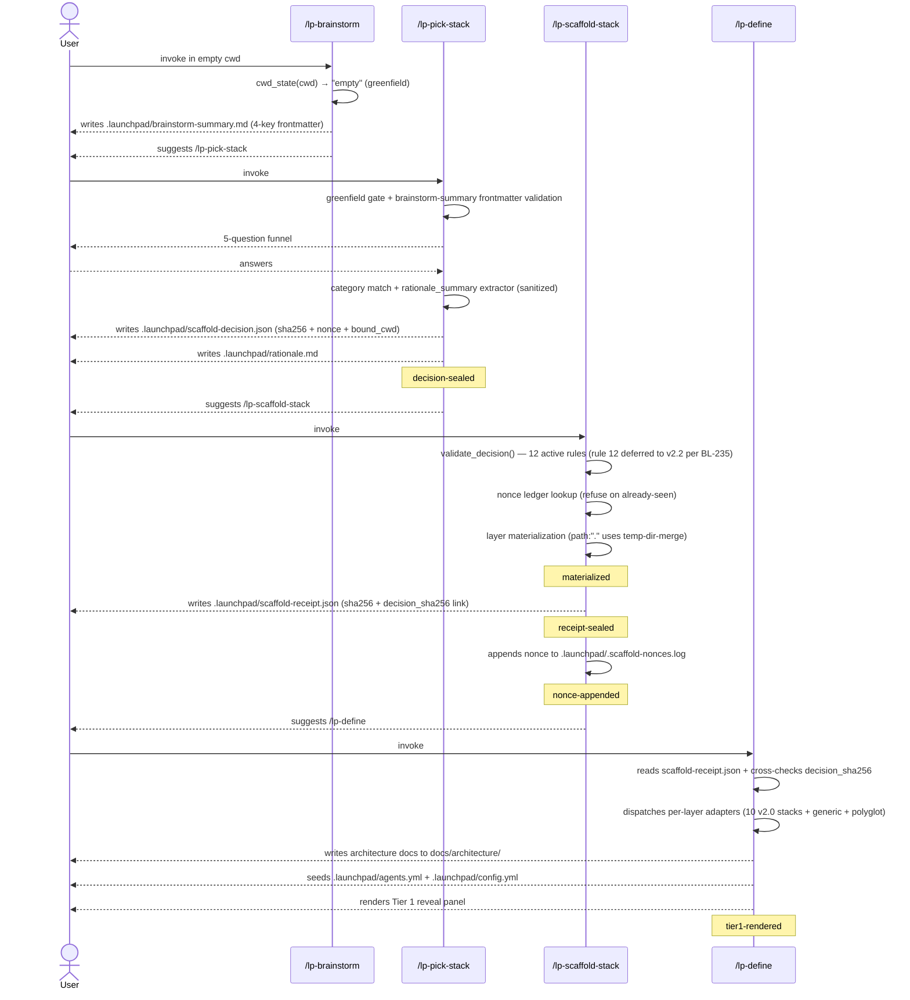

# How It Works

LaunchPad is an agentic coding harness with two main layers under the hood: a **governance kernel** plus a **Claude Code plugin** that ride together inside any repository. The kernel is the persistent substrate (`REPOSITORY_STRUCTURE.md` whitelist, `lefthook.yml` pre-commit gates, `.launchpad/config.yml`, `.harness/` runtime, `docs/architecture/` core docs) that survives between sessions; the plugin is the 38 slash commands, 36 sub-agents, and 16 skills that operate against the kernel. The kernel lets each agent run inherit the previous run's findings instead of starting cold; the plugin gives Claude Code the verbs to brainstorm, define, plan, build, review, ship, and learn.

Brownfield projects pick up the kernel by adding the plugin to an existing repo and running `/lp-define`, while greenfield projects materialize the kernel from scratch through the four-command v2.0 pipeline (`/lp-brainstorm` → `/lp-pick-stack` → `/lp-scaffold-stack` → `/lp-define`). Both paths converge on the same operating model. For the framing of why this works, see [README.md](../../README.md). For the day-to-day pipeline below, read on.

This guide walks the full pipeline day-to-day. For the "why" behind the design, see [METHODOLOGY.md](METHODOLOGY.md).

---

**Contents:**

- [Installing the plugin](#installing-the-plugin)
- [The Greenfield Pipeline (v2.0)](#the-greenfield-pipeline-v20)
- [Post-scaffold lifecycle: `/lp-update-identity`](#post-scaffold-lifecycle-lp-update-identity)
- [The four meta-orchestrators](#the-four-meta-orchestrators)
- [Phase 1: Kickoff](#phase-1-kickoff)
- [Phase 2: Definition](#phase-2-definition)
- [Phase 3: Planning](#phase-3-planning)
- [Phase 4: Build](#phase-4-build)
- [Key commands reference](#key-commands-reference)
- [Learnings catalog](#learnings-catalog)
- [Kanban board](#kanban-board)
- [Canonical files](#canonical-files)
- [Skills](#skills)
- [Quality gates](#quality-gates)
- [CI/CD](#cicd)
- [Security considerations](#security-considerations)
- [Configuration](#configuration)
- [Maintenance](#maintenance)
- [Releasing a versioned artifact](#releasing-a-versioned-artifact)
- [Troubleshooting](#troubleshooting)

---

## Installing the plugin

### Quick install

Inside Claude Code, in the project where you want the commands, register the BuiltForm marketplace and install the plugin:

```
/plugin marketplace add builtform/launchpad
/plugin install launchpad@builtform
```

Restart Claude Code. All `/lp-*` commands are now available.

The `marketplace add` step is required today because BuiltForm is awaiting confirmation in the Anthropic public plugin registry. Once Anthropic confirms BuiltForm, `/plugin install launchpad@builtform` will work on its own and the `marketplace add` line will no longer be necessary. Until then, run both lines.

### Verifying installation

After restart, type `/lp-` and Claude Code should autocomplete with LaunchPad commands. You can also confirm via `claude plugin list` in your terminal: LaunchPad should appear with the version from `plugins/launchpad/.claude-plugin/plugin.json` (`2.1.0` at the time of writing) and marketplace `builtform`.

### Install scopes

`/plugin install` supports three scopes:

- `--scope local`: scoped to the current project path only
- `--scope project`: scoped to the project; if you're on a team, others can install the same plugin
- `--scope user`: enabled globally for all projects

v2.x greenfield projects scaffolded via `/lp-brainstorm` → `/lp-pick-stack` → `/lp-scaffold-stack` → `/lp-define` install the plugin under `--scope project` so the plugin travels with the repo for teammates. (v2.1 BL-247 decommissioned the legacy `init-project.sh` auto-install; pin to v2.0.x for that flow.)

### Updating

```
/plugin marketplace update builtform
/plugin uninstall launchpad --scope <same-scope>
/plugin install launchpad@builtform --scope <same-scope>
```

Restart Claude Code after updating. The install cache (`~/.claude/plugins/cache/builtform/launchpad/<version>/`) is a snapshot taken at install time, so uninstall + marketplace-update + reinstall is the supported refresh flow.

---

## The Greenfield Pipeline (v2.0)

LaunchPad v2.0 introduced a four-command greenfield pipeline that produces a project from an empty directory and materializes the governance kernel against whichever stack you pick. It's the canonical greenfield path. Supported stacks at v2.0: Astro, Next.js, Python (Django), FastAPI, Rails, Hugo, Eleventy, Expo, Hono, Supabase, plus a `generic` adapter for stacks not explicitly listed and a `polyglot` composer for multi-stack projects (e.g., Next.js frontend + FastAPI backend).

```
/lp-brainstorm  →  /lp-pick-stack  →  /lp-scaffold-stack  →  /lp-define
 capture intent    pick stack +       run scaffolder +       per-stack adapters +
 (greenfield       seal decision      seal receipt           Tier 1 panel
  detection)
```

Each step writes a structured artifact under `.launchpad/` that the next step consumes; chain-of-custody is enforced by sha256 envelopes, a nonce ledger, and a `bound_cwd` triple (realpath + st_dev + st_ino) that prevents a sealed decision from being replayed in another repository.

### The pipeline at a glance



The diagram captures the happy path. Failure paths are not drawn (they would clutter the diagram and obscure the chain-of-custody ordering); they're described in the next subsection.

### Step-by-step

1. **`/lp-brainstorm`**: runs in any cwd. Computes `cwd_state(cwd)` (one of `empty`, `brownfield`, `ambiguous` per the greenfield-detection heuristic in [SCAFFOLD_HANDSHAKE.md §8](../architecture/SCAFFOLD_HANDSHAKE.md#8-greenfield-detection-heuristic)). Captures user intent through a structured dialogue. On greenfield, writes `.launchpad/brainstorm-summary.md` with a 4-key frontmatter (`generated_at`, `generated_by`, `greenfield`, `cwd_state_when_generated`) and suggests `/lp-pick-stack`. On brownfield, writes a brainstorm doc to `docs/brainstorms/` and suggests `/lp-define` instead.
2. **`/lp-pick-stack`**: refuses on brownfield, validates the brainstorm-summary frontmatter (refuses on shape mismatch or `greenfield: false`), then runs a 5-question funnel. The answers + the brainstorm summary feed a category matcher that picks one of the v2.0 stack categories. The user's free-text gets sanitized through a `rationale_summary` extractor (closed-bullet allowlist, RTL/zero-width refusal) before going anywhere user-visible. Output: a sealed `scaffold-decision.json` (sha256 envelope + nonce + `bound_cwd` triple) and a human-readable `rationale.md`.
3. **`/lp-scaffold-stack`**: validates the decision against 12 active rules (rule 12, `brainstorm_session_id` cross-binding, deferred to v2.2 per BL-235). Looks up the decision's nonce in `.launchpad/.scaffold-nonces.log`, refuses on already-seen. For each layer in the decision, runs the configured scaffolder (orchestrate-mode CLIs like `npm create astro@latest`, or the `curate` adapter for stacks like Django that bring their own structure). For `path: "."` orchestrate scaffolders, the materializer runs the CLI in a same-filesystem temp dir and merges via `shutil.move`, keeping `.launchpad/` artifacts intact while satisfying CLIs that demand an empty target. On success: writes a sealed `scaffold-receipt.json` (links back to the decision via `decision_sha256`) and appends the nonce to the ledger.
4. **`/lp-define`**: reads `scaffold-receipt.json`, cross-checks `decision_sha256` against the on-disk decision, dispatches one per-layer adapter (`plugin_stack_adapters/<stack>_adapter.py`), and renders the architecture docs into `docs/architecture/`. Seeds `.launchpad/agents.yml` and `.launchpad/config.yml` if absent. Then renders the **Tier 1 reveal panel**, described below.

### Failure paths

When validation, integrity, or materialization fails, the pipeline writes a structured artifact under `.harness/observations/` instead of stopping silently, so the user can see exactly which check refused, and re-running gives the same diagnosis:

- **`scaffold-rejection-<microsecond-ts>.<pid>.jsonl`**: written by `/lp-scaffold-stack` on validator or integrity failure. The line carries `schema_version: "1.0"` and a closed-enum `reason` field (e.g., `sha256_mismatch`, `nonce_seen`, `bound_cwd_realpath_mismatch`, `generated_at_expired`, `path_traversal`, `rationale_summary_empty`, `forbidden_bullet_token`, `version_unsupported`). No subprocess executes, the rejection happens before any scaffolder runs.
- **`scaffold-failed-<ts>.json`**: written when layer materialization fails partway through (e.g., the CLI returned non-zero after creating some files). Includes `recommended_recovery_action` prose, a `see_recovery_doc` URL, and a structured `recovery_commands` array (forward-compat hint for v2.2, at v2.0, humans consume the prose).
- **`v2-pipeline-<ts>.jsonl`**: append-only telemetry, written by every command in the pipeline regardless of outcome. Privacy-preserving fields only (`outcome`, `time_seconds`, `cwd_state`, `matched_category_id`); never user free-text. Opt out via `.launchpad/config.yml: telemetry: off`.

The full schema for each artifact is in [SCAFFOLD_HANDSHAKE.md](../architecture/SCAFFOLD_HANDSHAKE.md) (decision/receipt) and [SCAFFOLD_OPERATIONS.md §5](../architecture/SCAFFOLD_OPERATIONS.md#5-v20-health-signals-telemetry--tier-1-reveal-panels) (telemetry/rejection lines).

### Tier 1 reveal panel

After `/lp-define` finishes successfully, it prints a **Tier 1 reveal panel**, a one-screen summary of the governance kernel just installed (or, on brownfield, just verified). The panel is the visible moment where LaunchPad's structural foundation becomes legible to the user, so they understand what they're getting beyond the slash-command roster.

Three variants render depending on context:

**Greenfield variant**, after a fresh pipeline run on an empty cwd. Lists the 5 governance components with one-line _why-it-matters_ outcomes:

```
✓ Tier 1 governance kernel installed:

  • REPOSITORY_STRUCTURE.md whitelists N paths; CI rejects anything else
    → blocks structure-drift PRs before reviewer time is wasted
  • lefthook pre-commit hooks gate: secret-scan, structure-drift,
    typecheck, lint
    → catches `.env.local` leaks and broken types before push
  • .launchpad/config.yml drives slash-command behavior across
    your project lifecycle
    → consistent /lp-build, /lp-define, /lp-commit semantics across sessions
  • .harness/ captures run logs, observations, todos for compound
    learning
    → past mistakes inform future review agents automatically
  • docs/architecture/ — 8 living architecture docs, kept current
    by /lp-define re-runs
    → architecture stays in sync with code; no doc rot

Telemetry: local-only (.harness/observations/v2-pipeline-*.jsonl).
Opt out via .launchpad/config.yml: telemetry: off.
CI users: set CI=true + LP_CONFIG_AUTO_REVIEW=1 (with positive CI
filesystem signal) to skip config-review prompts on first invocation.

Run /help to see what slash commands are now available, or
/lp-build when you're ready to ship a feature.
```

Concrete numbers (path counts, last-run timestamps) come from `scaffold-receipt.json.tier1_governance_summary`, which `/lp-scaffold-stack` populates during the receipt-sealed step.

**Brownfield variant**, when `/lp-define` runs in an existing repo (first install on a brownfield project, or a re-run after code changes). Same five components, but each line uses "verified" rather than "installed" wording, and the values are sourced from filesystem-only detection rather than the receipt. The panel signals "all gates green" rather than a fresh installation event.

**Telemetry-disabled variant**, when `.launchpad/config.yml` has `telemetry: off`, the two telemetry lines collapse to a single `Telemetry: disabled` line. Both greenfield and brownfield variants honor this.

The panel's contents are spec'd in [SCAFFOLD_OPERATIONS.md §5](../architecture/SCAFFOLD_OPERATIONS.md#5-v20-health-signals-telemetry--tier-1-reveal-panels), that's the canonical source. This guide describes _why_ the panel exists; OPERATIONS describes _exactly what_ it prints.

---

## Post-scaffold lifecycle: `/lp-update-identity`

Once `/lp-define` has rendered the project's architecture docs and the four-command pipeline has settled, the project's identity values (project name, email, copyright holder, repo URL, license) live sealed in `.launchpad/scaffold-decision.json` under `schema_version: "1.1"`. To update any of these values later without re-scaffolding, run `/lp-update-identity`.

The command detects which of five re-entry cases applies (A through E per the canonical matrix in [lp-update-identity command spec](../../plugins/launchpad/commands/lp-update-identity.md)). Migration of pre-v2.1 envelopes from `schema_version: "1.0"` to `"1.1"` happens transparently as in-memory preprocessing before case dispatch, so the legacy-migration path folds into Case B (seed-as-first-time). The command validates the new identity input against the documented regex constants, re-renders the 7 kernel templates atomically, and re-seals `scaffold-decision.json` with `generated_at` preserved byte-identical. After a successful run, `/lp-update-identity` prints a PII WARN noting that prior identity values persist in git history.

| Flag                     | Effect                                                                                                    |
| ------------------------ | --------------------------------------------------------------------------------------------------------- |
| `--dry-run`              | preview the changes without writing                                                                       |
| `--seed-brownfield`      | seed identity for projects scaffolded before v2.1 (triggers Case D email cross-check)                     |
| `--allow-email-mismatch` | accept that the project email differs from `git config user.email` (Case D escape)                        |
| `--quiet`                | suppress the PII WARN print + diff summary (informational only; does not change history-rewrite behavior) |

Stale-sentinel recovery is automatic: a dead-PID sentinel from an interrupted prior run is auto-cleared at preflight time with an INFO entry; no flag needed. Plugin-version drift is recorded automatically in `version_drift_log` whenever the running plugin version differs from the value sealed in `scaffold-decision.json`.

For the canonical re-entry case table, error-code map, on-disk artifacts touched, and privilege model, see [SCAFFOLD_OPERATIONS.md §12](../architecture/SCAFFOLD_OPERATIONS.md#12-lp-update-identity-re-entry-case-table-v21-phase-10). For the PII removal recipe (`git filter-repo` over committed identity values), see [IDENTITY_AND_PII.md](IDENTITY_AND_PII.md).

---

## The four meta-orchestrators

```
/lp-kickoff → /lp-define → /lp-plan → /lp-build
  brainstorm  definition  design+plan  build+ship
```

Each orchestrator owns a phase of the lifecycle. You can run them in sequence for a full feature, or invoke any one independently when resuming work.

### Status contract

Every section progresses through a strict status chain tracked in its spec file's YAML frontmatter:

```
defined → shaped → designed / "design:skipped" → planned → hardened → approved → reviewed → built
```

Each meta-orchestrator checks this status before proceeding and refuses to run if the section is not at the expected stage. Registry integrity is validated at every transition, the harness refuses to proceed if artifacts are missing for the current status (e.g., status is `approved` but `approved_at` field is absent).

---

## Phase 1: Kickoff

**`/lp-kickoff`** delegates to `/lp-brainstorm` for collaborative idea exploration, then hands off to `/lp-define`.

`/lp-brainstorm` loads the brainstorming skill, dispatches research agents when a codebase exists (`file-locator`, `pattern-finder`, `docs-locator`), guides structured one-question-at-a-time dialogue, and captures a design document to `docs/brainstorms/` (with YAML frontmatter and PII/secret scanning pre-capture). It never writes code.

Output: a brainstorm doc at `docs/brainstorms/YYYY-MM-DD-<slug>.md` plus a literal transition message suggesting `/lp-define` next.

---

## Phase 2: Definition

**`/lp-define`** chains four commands in sequence:

1. **`/lp-define-product`**: Interactive Q&A producing `PRD.md` and `TECH_STACK.md`
2. **`/lp-define-design`**: Produces `DESIGN_SYSTEM.md`, `APP_FLOW.md`, `FRONTEND_GUIDELINES.md`
3. **`/lp-define-architecture`**: Produces `BACKEND_STRUCTURE.md` and `CI_CD.md`
4. **`/lp-shape-section [name]`**: Deep-dive per section producing `docs/tasks/sections/[name].md` (up to 3 per session)

Each command detects existing artifacts and runs in update mode when they exist. After shaping, sections have status `shaped`.

### What `/lp-define` also seeds

Beyond the architecture docs, `/lp-define` is the authoritative seeder for:

- **`.launchpad/config.yml`**: harness config. Keys: `commands` (test/typecheck/lint/build), `paths` (architecture_dir, tasks_dir, sections_dir, plans_file_pattern), `pipeline` (plan.design_review, build.test_browser), `audit.committed`, `version`.
- **`.launchpad/agents.yml`**: stack-aware agent roster. Keys: `review_agents`, `review_db_agents`, `review_design_agents`, `review_copy_agents`, `harden_plan_agents`, `harden_plan_conditional_agents`, `harden_document_agents`, `protected_branches`. Stack-conditional rows (`lp-kieran-foad-ts-reviewer` only when `ts_monorepo` is detected, etc.).
- **`docs/tasks/SECTION_REGISTRY.md`**: canonical section registry (replaces the old "Product Sections table" in PRD.md).
- **`.launchpad/audit.log`**: appended to `.gitignore` automatically unless `audit.committed: true` is set in config.
- **`docs/tasks/sections/`**: created if absent (realpath-confined).

Stack detection runs deterministically: the output is sorted alphabetically for `stacks` and `manifests`, so re-running `/lp-define` with no semantic changes produces bit-identical output.

### Copy workflow

For public-facing pages, `/lp-shape-section` prompts to create page copy via the `web-copy` skill (if installed). Copy informs design, not the other way around.

---

## Phase 3: Planning

**`/lp-plan`** resolves the target section from the registry, checks its status, and routes to the appropriate step. This is the most complex orchestrator.

### Step 1: Resolve target

Reads the section spec's YAML frontmatter `status:` field and routes:

| Current status                   | Route to                     |
| -------------------------------- | ---------------------------- |
| `hardened`                       | Step 5 (approval)            |
| `planned`                        | Step 4 (harden)              |
| `designed` or `"design:skipped"` | Step 3 (plan)                |
| `shaped`                         | Step 2 (design)              |
| `defined` or no status           | "Not shaped. Run /lp-define" |

### Step 2: Design workflow

Runs before planning so the plan incorporates concrete design decisions. UI detection parses the section spec for UI keywords (component, page, layout, modal, form, dashboard, etc.) and file references containing `apps/web/` or `packages/ui/`. The user can always skip design, setting status to `"design:skipped"`.

| Sub-step                        | What happens                                                                                                                                                                                                                                                                                                                                                                   |
| ------------------------------- | ------------------------------------------------------------------------------------------------------------------------------------------------------------------------------------------------------------------------------------------------------------------------------------------------------------------------------------------------------------------------------ |
| **2a, Autonomous first draft**  | Loads design skills (`frontend-design`, `web-design-guidelines`, `responsive-design`) and copy context. Builds UI components following design system tokens, opens browser (agent-browser or Playwright), screenshots and self-evaluates for 3–5 auto-cycles via `design-iterator`. Presents first draft with live localhost URL.                                              |
| **2b, Interactive refinement**  | User gives feedback; dispatches `design-iterator` (one change per iteration). Supports Figma sync (`figma-design-sync`) and systematic polish (`/lp-design-polish`).                                                                                                                                                                                                           |
| **2c, Design review and audit** | Runs `/lp-design-review` first (8 design + 4 tech dimensions, AI slop detection), then in parallel: `design-ui-auditor` (5 checks), `design-responsive-auditor` (6 checks), `design-alignment-checker` (14 dimensions), `design-implementation-reviewer` (Figma comparison, conditional), `/lp-copy-review` (dispatches `review_copy_agents`). Re-audit cap: 3 cycles maximum. |
| **2d, Walkthrough recording**   | Optional `/lp-feature-video`, captures screenshots, stitches into MP4+GIF, uploads via rclone or imgup.                                                                                                                                                                                                                                                                        |

### Step 3: Plan

Runs `/lp-pnf [section]`, research-first planning with sub-agents in the same two-wave pattern as definition (Discovery → Analysis). Produces an implementation plan at the path expanded from `paths.plans_file_pattern` (default `docs/tasks/sections/{section_name}-plan.md`). Status becomes `planned`.

**Conditional skill loading.** `/lp-pnf` auto-loads additional skills based on the section spec: `react-best-practices` (70 rules across 9 categories) when the section references frontend pages / components / UI, and `stripe-best-practices` when it references payment / billing / checkout / Stripe. Both skills are loaded in addition to the base planning context.

### Step 4: Harden

Runs `/lp-harden-plan` to stress-test the plan. Modes:

- **`--full`**: all agents (for section builds)
- **`--lightweight`**: core agents only (standalone features)
- **`--auto`**: auto-apply findings without prompting
- **`--interactive`**: present each finding for accept/reject/discuss (default from `/lp-plan`)

Hardening includes: document quality pre-check (Step 2), learnings scan from `docs/solutions/` via `learnings-researcher` (Step 2.5, parallel with Step 2.7), Context7 technology enrichment (Step 2.7, parallel with Step 2.5), code-focused agent dispatch (Step 3), document-review agent dispatch (Step 3.5, 7 agents including conditional `design-lens-reviewer` for UI sections), and interactive deepening (Step 3.7). Idempotent: skips if plan already has `## Hardening Notes`. Status becomes `hardened`.

### Step 5: Human approval

Presents plan summary with hardening notes and design status. Four options:

| Choice            | Effect                                                                            |
| ----------------- | --------------------------------------------------------------------------------- |
| **yes**           | Status → `approved`; records `approved_at` + `plan_hash`; proceeds to `/lp-build` |
| **revise design** | Reset to `shaped`, clear design artifacts, restart Step 2                         |
| **revise plan**   | Reset to `designed`/`"design:skipped"`, restart Step 3 (design preserved)         |
| **revise both**   | Reset to `shaped`, clear everything, restart Step 2                               |

---

## Phase 4: Build

**`/lp-build`** is fully autonomous. Before anything runs, it validates preconditions:

### Step 0: Preflight

- **Autonomous-mode acknowledgment**: `.launchpad/autonomous-ack.md` must exist as a tracked file. It's a social/review signal, not a cryptographic gate, but having the file tracked in git blame makes autonomous-execution authorization visible.
- **Commands-hash check**: `LP_CONFIG_REVIEWED` env var must match either the full 64-char sha256 of the canonical `commands:` block or its 16-char prefix. The audit log records the 16-char prefix for readability; both forms validate.
- **Integrity guard**: refuses to run if the section spec and `autonomous-ack.md` were introduced in the same commit (the exact pattern a hostile PR would use to bypass review).
- **Audit entry**: appends one line to `.launchpad/audit.log` with ISO timestamp, git user, commit SHA, content-hash of commands, and the invoking command name.
- **Pipeline skip gates**: honors `pipeline.build.test_browser: skipped` from config for backend-only projects.

### Execution steps

| Step | Command                     | What happens                                                                                                                                                         |
| ---- | --------------------------- | -------------------------------------------------------------------------------------------------------------------------------------------------------------------- |
| 1    | `/lp-inf`                   | Execute plan: create feature branch, fresh-context loop (up to 25 iterations via `build.sh`), quality sweep.                                                         |
| 2    | `/lp-review`                | Multi-agent parallel review (interactive mode).                                                                                                                      |
| 2.5  | `/lp-resolve-todo-parallel` | Up to 5 concurrent resolver agents, groups overlapping files sequentially, durable fix commit.                                                                       |
| 3    | `/lp-test-browser`          | Maps changed files to UI routes (max 15), tests each (30s per route). Gracefully skips if no browser tool or no UI routes. Findings are informational, not blocking. |
| 4    | `/lp-ship`                  | Quality gates, commit, push, PR creation, 3-gate CI monitoring. **Never merges.**                                                                                    |
| 5    | `/lp-learn`                 | 5-agent parallel research pipeline writes structured solution doc to `docs/solutions/`.                                                                              |
| 6    | Report                      | Sets status to `built`, prints summary, runs `/lp-regenerate-backlog --stage`.                                                                                       |

**Preview mode.** `/lp-inf --dry-run` shows which section, plan file, and branch name would be used, without running the build loop. Useful when `/lp-inf` auto-picks from the registry (CASE B) and you want to verify the priority selection before committing to an autonomous run.

---

## Key commands reference

### `/lp-review`

Multi-agent code review with confidence-based false-positive suppression.

- Dispatches agents from `.launchpad/agents.yml` in parallel (code, DB, design, copy agents)
- Pre-dispatch secret scan on added lines using `.launchpad/secret-patterns.txt`
- Confidence scoring (0.00–1.00) per finding. Threshold: **0.60**. Findings below threshold are suppressed with audit trail in `.harness/review-summary.md`
- Boosters: multi-agent agreement (+0.10), security concerns (+0.10), P1 floor (minimum 0.60)
- PR intent verification: findings contradicting stated PR intent are suppressed
- Writes actionable findings to `.harness/todos/`, suppressed findings to review summary
- **`--headless` mode:** identical pipeline but suppresses interactive output. Used by `/lp-harden-plan` and `/lp-commit`

**Confidence tiers:**

| Tier        | Range     | Meaning                                           |
| ----------- | --------- | ------------------------------------------------- |
| Certain     | 0.90–1.00 | Verified bug or security vulnerability with proof |
| High        | 0.75–0.89 | Strong evidence, clear code path to failure       |
| Moderate    | 0.60–0.74 | Reasonable concern, benefits from review          |
| Low         | 0.40–0.59 | Possible issue, limited evidence                  |
| Speculative | 0.20–0.39 | Theoretical concern, no concrete evidence         |
| Noise       | 0.00–0.19 | Generic advice, not actionable                    |

Only Moderate-and-above findings reach `.harness/todos/`. The six false-positive suppression categories (pre-existing issues, style nitpicks, intentional patterns, handled-elsewhere, code restatement, generic advice) filter the rest.

### `/lp-ship`

Autonomous shipping pipeline. Stages tracked files, runs quality gates (parallel `pnpm test` / `pnpm typecheck` / `pnpm lint` + pre-commit hooks, with 3-attempt auto-fix), generates a conventional commit, pushes, creates a PR, and enters a 3-gate monitoring loop (CI checks, advisory AI reviews from Codex + Greptile, merge conflicts). **Never merges.**

### `/lp-commit`

Interactive commit workflow with optional code review chain:

1. Branch guard (refuses to commit on main/master, suggests branch name)
2. Stage and review (user selects files)
3. Optional code review: `/lp-review --headless` → `/lp-triage` → `/lp-resolve-todo-parallel`
4. Skill staleness audit (non-blocking)
5. Quality gates in parallel (test/typecheck/lint + pre-commit hooks)
6. Commit message generation and user approval
7. Optional PR creation with 3-gate monitoring loop
8. Runs `/lp-regenerate-backlog` after successful commit

### `/lp-harden-plan`

Stress-tests implementation plans. Dispatches code-focused agents and document-review agents. Includes learnings scan from `docs/solutions/`, Context7 technology enrichment, and interactive deepening where each finding is presented for accept/reject/discuss. Idempotent (skips if `## Hardening Notes` exists).

### `/lp-triage`

Interactive triage of review findings in `.harness/todos/`. Presents each finding one-by-one (sorted P1 → P2 → P3, grouped by same file:line); user sorts into fix (ready), drop (dismissed), or defer (backlog). Overflow cap: if more than 25 pending findings, top 25 are presented and the rest are auto-deferred.

`/lp-triage` is the **human-invoked inflection point in the compound-learning feedback loop**: without it, review findings accumulate in `.harness/todos/` without direction. With it, you explicitly route each finding toward `/lp-resolve-todo-parallel` (fix now), `/lp-learn` (capture as a learning), or the backlog (defer), and that's what feeds the next cycle's plan better than the last one.

### `/lp-learn`

Captures learnings from resolved problems. Loads the `compound-docs` skill, spawns 5 inline research sub-agents in parallel (Context Analyzer, Solution Extractor, Related Docs Finder, Prevention Strategist, Category Classifier), writes structured YAML-frontmatter solution docs to `docs/solutions/[category]/`.

### `/lp-test-browser`

Dual browser support: agent-browser CLI (primary, 93% fewer tokens) or Playwright MCP (fallback). Self-scoping, maps changed files to UI routes. Graceful skip when no browser tool, no dev server, or no UI routes detected.

### `/lp-brainstorm`

Collaborative idea exploration. Loads brainstorming skill, dispatches research agents, guides structured dialogue, captures design document to `docs/brainstorms/`. Never writes code.

### Other commands

| Command                   | Purpose                                                                                                            |
| ------------------------- | ------------------------------------------------------------------------------------------------------------------ |
| `/lp-defer`               | Manually add a task to the backlog via `.harness/observations/`                                                    |
| `/lp-regenerate-backlog`  | Regenerate `docs/tasks/BACKLOG.md` from deferred observations and section registry                                 |
| `/lp-design-review`       | 8-design + 4-tech dimension quality audit with AI slop detection                                                   |
| `/lp-design-polish`       | Pre-ship refinement pass for alignment, spacing, copy, interaction states                                          |
| `/lp-copy`                | Reads copy brief from section spec, provides copy context for design builds                                        |
| `/lp-copy-review`         | Dispatches copy review agents from `review_copy_agents`                                                            |
| `/lp-feature-video`       | Records design walkthrough: screenshots → MP4+GIF via ffmpeg → upload via rclone/imgup                             |
| `/lp-resolve-pr-comments` | Batch-resolves unresolved PR review comments with parallel agents                                                  |
| `/lp-update-spec`         | Scans all spec files for gaps, TBDs, cross-file inconsistencies                                                    |
| `/lp-hydrate`             | Session bootstrapping with minimal context                                                                         |
| `/lp-research-codebase`   | Two-wave research → `docs/reports/` (input for `/lp-inf`)                                                          |
| `/lp-pull-launchpad`      | Decommissioned in v2.1 (BL-247); use `claude /plugin update launchpad` instead                                     |
| `/lp-create-agent`        | Create a new agent or convert an existing skill into an agent                                                      |
| `/lp-memory-report`       | Update session memory files and create a detailed session report                                                   |
| `/lp-design-onboard`      | Design onboarding flows, empty states, first-time user experiences (invoked from `/lp-plan` Step 2b when relevant) |

---

## Learnings catalog

Every `/lp-inf` run captures learnings into structured files at `docs/solutions/[category]/`. Knowledge flows through four stages, from transient per-iteration notes to permanent project rules:

1. **During iteration.** The build agent documents learnings in `scripts/compound/progress.txt` as it works. The next iteration reads this file as part of its fresh-context bootstrap, so one iteration's discovery shortcuts the next.
2. **After completion.** `/lp-learn` (Step 5 of `/lp-build`) spawns 5 parallel research sub-agents (Context Analyzer, Solution Extractor, Related Docs Finder, Prevention Strategist, Category Classifier) and writes a structured solution doc to `docs/solutions/[category]/YYYY-MM-DD-[slug].md` with YAML frontmatter.
3. **Human review.** You review `docs/solutions/` periodically and promote the most valuable patterns to `docs/solutions/compound-product/patterns/promoted-patterns.md`, a staging area for graduation.
4. **Graduation.** Promoted patterns move into `CLAUDE.md` as permanent project rules. Every future AI session starts with those rules pre-loaded, so the pattern compounds forever.

### The compound-docs taxonomy

The `compound-docs` skill defines the vocabulary every solution doc is classified against, **14 categories** for classifying problems (e.g., database, api, auth, deployment, testing), **16 components** for identifying affected system parts, and **17 root causes** for diagnosing why problems occurred. This is what makes the catalog searchable by `learnings-researcher` during later planning cycles.

### Solution document format

Each solution doc opens with YAML-validated frontmatter:

```yaml
---
title: Feature Name
category: database
component: prisma-client
root_cause: missing-null-check
resolution_type: code-fix
severity: medium
tags: [prisma, n+1, query-optimization]
modules_touched: [packages/db, apps/api]
---
```

Safety gates: YAML validation blocks write if frontmatter is invalid. A secret scan redacts API keys, tokens, and passwords before writing.

The pipeline is designed so that a 30-minute fix becomes a seconds-long pattern match on next occurrence, and eventually a rule that prevents the problem entirely.

---

## Kanban board

`scripts/compound/board.sh` renders task progress from `prd.json` (the structured task file that `/lp-inf` creates from your plan). It's rendered automatically after each loop iteration inside `/lp-inf`, so you can watch progress in real time; you can also invoke it manually.

| Mode     | Flag        | Use case                                   |
| -------- | ----------- | ------------------------------------------ |
| ASCII    | (default)   | Terminal output during `/lp-inf` loops     |
| Markdown | `--md`      | VS Code markdown preview, PR descriptions  |
| Summary  | `--summary` | Single-line status for CI logs, monitoring |

---

## Canonical files

These are the files that define how the project behaves, the control plane every session reads from.

**AI instructions** (what AI agents read before every session):

| File                                   | Purpose                                                                                                                              |
| -------------------------------------- | ------------------------------------------------------------------------------------------------------------------------------------ |
| `CLAUDE.md`                            | Primary instructions for Claude Code, tech stack, commands, guardrails, workflow                                                     |
| `AGENTS.md`                            | Same instructions adapted for non-Claude tools reading the template scaffold (context only, agentic capabilities live in the plugin) |
| `scripts/compound/iteration-claude.md` | Per-iteration prompt piped to AI during `/lp-inf` execution loops                                                                    |

**Project rules:**

| File                                          | Purpose                                                                       |
| --------------------------------------------- | ----------------------------------------------------------------------------- |
| `docs/architecture/REPOSITORY_STRUCTURE.md`   | Single source of truth for file placement, includes a 12-branch decision tree |
| `scripts/maintenance/check-repo-structure.sh` | Automated validator that enforces `REPOSITORY_STRUCTURE.md` on every commit   |

**Architecture specs** (populated by `/lp-define`):

| File                                       | Created by                                                                            |
| ------------------------------------------ | ------------------------------------------------------------------------------------- |
| `docs/architecture/PRD.md`                 | `/lp-define-product`                                                                  |
| `docs/architecture/TECH_STACK.md`          | `/lp-define-product`                                                                  |
| `docs/architecture/DESIGN_SYSTEM.md`       | `/lp-define-design`                                                                   |
| `docs/architecture/APP_FLOW.md`            | `/lp-define-design`                                                                   |
| `docs/architecture/FRONTEND_GUIDELINES.md` | `/lp-define-design`                                                                   |
| `docs/architecture/BACKEND_STRUCTURE.md`   | `/lp-define-architecture`                                                             |
| `docs/architecture/CI_CD.md`               | `/lp-define-architecture`                                                             |
| `docs/tasks/SECTION_REGISTRY.md`           | `/lp-define` (canonical section index, replaces the old PRD "Product Sections" table) |

**Pipeline and build config:**

| File                             | Purpose                                                                                                                                            |
| -------------------------------- | -------------------------------------------------------------------------------------------------------------------------------------------------- |
| `.launchpad/config.yml`          | Harness config: `commands`, `paths`, `pipeline`, `audit`                                                                                           |
| `.launchpad/agents.yml`          | Agent roster (7 keys: review, review_db, review_design, review_copy, harden_plan, harden_plan_conditional, harden_document) + `protected_branches` |
| `scripts/compound/config.json`   | Pipeline settings: max iterations, branch prefix, quality checks, AI tool (self-host only)                                                         |
| `turbo.json`                     | Turborepo task pipeline: build, dev, lint, test, typecheck (self-host only)                                                                        |
| `lefthook.yml`                   | Pre-commit hooks                                                                                                                                   |
| `.github/codex-review-prompt.md` | Codex review instructions with P0–P3 severity format (self-host only)                                                                              |
| `.env.example`                   | Template for environment variables (copy to `.env.local`)                                                                                          |

---

## Skills

Skills are reusable instruction sets in `plugins/launchpad/skills/<name>/SKILL.md` that change how the AI reasons about specific problem domains. They're loaded automatically when trigger phrases appear.

| Command            | Purpose                                               |
| ------------------ | ----------------------------------------------------- |
| `/lp-create-skill` | Create a new skill using the 7-phase Meta-Skill Forge |
| `/lp-port-skill`   | Import an external skill from GitHub or local files   |
| `/lp-update-skill` | Iterate on an existing skill after real-world usage   |

Two tracking files in `docs/skills-catalog/` provide visibility: `skills-index.md` (all installed skills with descriptions and triggers) and `skills-usage.json` (last-used dates, updated automatically by a PostToolUse hook). A session-end hook audits for stale skills unused for 14+ days.

---

## Quality gates

Every change passes through:

1. **Pre-commit hooks (Lefthook)**: formatting, linting, type checking, structure validation, large file guard.
2. **CI pipeline (GitHub Actions, self-host only)**: lint, typecheck, test, build, structure check.
3. **AI review**: multi-agent confidence-scored review (P1/P2/P3 severity).

### Pre-commit hooks (Lefthook)

Seven hooks run on every commit, ordered by priority, auto-fixers first, then validators that block the commit on failure:

**Auto-fixers (priority 1–2):**

| Priority | Hook           | What it does         |
| -------- | -------------- | -------------------- |
| 1        | `prettier-fix` | Format staged files  |
| 2        | `eslint-fix`   | Auto-fix lint issues |

**Validators (priority 10, block commit on failure):**

| Hook                  | What it does                                     |
| --------------------- | ------------------------------------------------ |
| `typecheck`           | TypeScript strict mode                           |
| `structure-check`     | Repo structure rules (`check-repo-structure.sh`) |
| `large-file-guard`    | Block files over 500KB in tracked extensions     |
| `trailing-whitespace` | No trailing whitespace                           |
| `end-of-file-newline` | POSIX-compliant file endings                     |

### Three-layer merge prevention

1. **Command prohibition**: `/lp-ship` and `/lp-commit` explicitly refuse to run `gh pr merge` or `git merge main`.
2. **PreToolUse hook**: intercepts merge commands at the tool level before execution.
3. **GitHub branch protection**: server-side rules requiring approvals before merge.

---

## CI/CD

Every PR to `main` runs six jobs on GitHub Actions:

- `install`, cached `node_modules`, fans out to the check jobs
- `lint`, `typecheck`, `build`, `test`, run in parallel
- `structure`, `check-repo-structure.sh` (repository layout rules)
- `summary`, aggregate status gate

Additionally, **two AI code reviewers post advisory reviews** on every PR. Both are advisory-only, neither blocks merge, and they cover complementary lanes:

- **Codex (narrow / line-level)**: posts a P0–P3-ranked review comment via the `codex-review.yml` GitHub Action. Sees the diff plus what it can read in its sandbox. Strong on per-line correctness, off-by-one bugs, missing null checks, typos in changed code. Quota-bounded (per-user OpenAI billing).
- **Greptile (wide / codebase-aware)**: posts a review comment via the Greptile GitHub App. Pre-indexes the entire repo as a graph (functions, classes, dependencies) and reviews each PR with whole-codebase context. Strong on cross-file refactor consistency, architectural drift, and convention violations a per-PR-diff reviewer cannot see. Free under Greptile's OSS Program for MIT/Apache/GPL repos.

Both `/lp-inf` and `/lp-commit` monitor PR review comments and surface findings to the user. The two lanes overlap on local logic bugs; they don't on cross-file or architecture concerns. Running both at advisory-only level is the safest balance, broad coverage, no false-positive blocks.

### Required GitHub Secret for Codex review

Add `OPENAI_API_KEY` to your GitHub repository secrets (Settings → Secrets and variables → Actions). Without it, the Codex review job skips silently.

### Setting up Greptile (one-time per repo)

Greptile is a GitHub App, not a GitHub Action, there's no workflow to author. Setup:

1. **Apply for the OSS program** at [greptile.com/open-source](https://www.greptile.com/open-source) if your repo is MIT/Apache/GPL (free reviews). Otherwise pricing is $30/seat/month.
2. **Install the GitHub App** at [github.com/apps/greptile-apps](https://github.com/apps/greptile-apps), scoped to this repo (or "All repositories" if you want it across the org).
3. **Enable indexing** in the Greptile dashboard: Repositories → Manage Repos → enable your repo. Initial index takes 3–5 minutes for a small repo, up to 1–2 hours for a large monorepo.
4. **Verify on the next PR**: Greptile should post a "Greptile Summary" comment within ~5 minutes. If not, check the App's repository scope at `github.com/settings/installations`.

Configuration lives in `greptile.json` at the repo root. Tune `commentTypes`, `strictness`, and `ignorePatterns` to taste. See [docs/architecture/CI_CD.md](../architecture/CI_CD.md) for the field-by-field reference. (v2.1 BL-247 decommissioned the `greptile.template.json` swap file; downstream projects scaffolded via the v2.x kernel renderer author `greptile.json` manually post-scaffold until a kernel template lands in v2.2.)

Other CI-relevant env vars live in the [Environment variables](#environment-variables) table below, `LP_CONFIG_REVIEWED` is specifically the CI-side pin that unblocks autonomous `/lp-build` runs under the content-hash audit.

---

## Security considerations

**LaunchPad runs agents with elevated permissions.** Understand the risks before using.

### What the agents can do

- Read and modify any file in your repository
- Execute shell commands (build, test, lint, git operations)
- Make network requests (API calls, package installs, git push)
- Create branches, commits, and pull requests autonomously
- Run multi-iteration loops that analyze, implement, and ship code without human intervention

### Safeguards in place

1. **PRs, not direct merges.** All autonomous changes go through pull requests.
2. **Pre-commit hooks**, linting, formatting, structure validation run before every commit.
3. **Codex AI review** (self-host only), independent AI reviewer flags P0/P1 issues on every PR before merge.
4. **Quality gates**: configurable checks (tests, type-checking, build) at each iteration boundary.
5. **Max iterations**: the compound loop stops after N iterations (default 25) to prevent runaway execution.
6. **Structure validation**, `check-repo-structure.sh` enforces file placement.
7. **Secrets via `.env.local`**: all API keys load from gitignored `.env.local`. No secrets inline in commands.
8. **Pre-dispatch secret scan**: `/lp-review` scans added lines against `.launchpad/secret-patterns.txt` (one regex per line, `sk-`, `ghp_`, `AKIA`, `-----BEGIN .* PRIVATE KEY-----`, etc.) before any review agents are dispatched. Findings block review.
9. **Autonomous-execution acknowledgment**: `.launchpad/autonomous-ack.md` must exist as a tracked file; absence blocks `/lp-build`.
10. **Commands-hash audit**: `LP_CONFIG_REVIEWED` env var must match the canonical commands hash; mismatch blocks `/lp-build`.
11. **Integrity guard**: `/lp-build` refuses if section spec and `autonomous-ack.md` were introduced in the same commit.
12. **Audit log**: `.launchpad/audit.log` (gitignored by default; opt-in via `audit.committed: true`) records every command with timestamp, git user, commit SHA, and content hash.

### Recommendations

- Review PRs carefully before merging, even with AI review, human judgment is the final gate.
- Run autonomous loops in a separate environment (VM, container) if concerned about file access.
- Use API keys with minimal scope (read-only where possible, repo-scoped tokens for GitHub).
- Never target production branches, always work on feature branches.
- Monitor the first few autonomous runs to understand agent behavior.
- Verify `.env.local` is in `.gitignore` before committing anything.

### Autonomous permission flags

The compound scripts bypass interactive approval prompts to enable unattended operation:

| Tool        | Flag                             |
| ----------- | -------------------------------- |
| Claude Code | `--dangerously-skip-permissions` |

### Recommended companion: Destructive Command Guard (dcg)

The `--dangerously-skip-permissions` flag is what enables unattended operation, but it also removes the human prompt that would normally catch destructive shell commands. LaunchPad's built-in `PreToolUse` hook covers `gh pr merge`, `git merge main/master`, `git push --force`, push to `main`, and `gh pr review --approve`, but it does NOT cover `rm -rf`, `git reset --hard`, `git clean -fdx`, `DROP TABLE`, `chmod -R`, or other destructive patterns.

[Destructive Command Guard (dcg)](https://github.com/Dicklesworthstone/destructive_command_guard) by [@Dicklesworthstone](https://github.com/Dicklesworthstone) is a third-party Rust binary that registers as a `PreToolUse` hook on the `Bash` tool and blocks recognized destructive operations before they execute. **It is strongly recommended for any unattended `/lp-build` run.**

Install path:

1. Install the Rust toolchain if not present (https://rustup.rs).
2. Clone the dcg repository and `cargo install --path .` per its README.
3. Register dcg as a `PreToolUse` hook in `~/.claude/settings.json` or your project's `.claude/settings.json` per dcg's setup instructions.
4. Verify by running a sample blocked command (e.g. `rm -rf /tmp/test-dcg`) and confirming it is intercepted.

LaunchPad does not bundle dcg, does not auto-install it, and does not check for its presence at startup. Whether to install it is your call. See [SECURITY.md](../../SECURITY.md#recommended-companion-destructive-command-guard-dcg) for the full security context.

### Optional companion: MemPalace (session-memory recall)

LaunchPad's three-tier knowledge system (`.harness/progress.txt` → `docs/solutions/` → `CLAUDE.md`) covers structured artifacts but not verbatim transcript recall. If you context-switch between long-running projects and want to query "what did we say three sessions ago," pair LaunchPad with [MemPalace](https://github.com/MemPalace/mempalace), an optional fourth tier covering raw transcript retrieval.

Setup is a four-line block per project. Full cookbook: [docs/guides/MEMPALACE_INTEGRATION.md](MEMPALACE_INTEGRATION.md).

LaunchPad does not bundle MemPalace and runs identically without it.

---

## Configuration

### `.harness/` runtime directory

The `.harness/` directory is the runtime workspace for the harness. It's created per-project and gitignored, it holds session-specific artifacts, not source code.

| Subdirectory        | Purpose                                                                           |
| ------------------- | --------------------------------------------------------------------------------- |
| `todos/`            | Review findings written by `/lp-review` (YAML frontmatter + markdown)             |
| `observations/`     | Out-of-scope observations from `code-simplicity-reviewer` (feeds the backlog)     |
| `design-artifacts/` | Approved design screenshots (`[section]-approved.png`)                            |
| `screenshots/`      | Working screenshots from design-iterator cycles                                   |
| `review-summary.md` | Confidence-scored findings summary (including suppression audit trail)            |
| `harness.local.md`  | Project-specific review context read by all agents, the one file worth committing |

### `.launchpad/config.yml`

Seeded by `/lp-define`, owned by the project. Key fields:

| Field                                            | Purpose                                                                                                                                                  |
| ------------------------------------------------ | -------------------------------------------------------------------------------------------------------------------------------------------------------- |
| `commands.test` / `typecheck` / `lint` / `build` | Arrays of shell commands the harness runs for quality gates. Empty array = skip. Stack-adapted (e.g., `pnpm test` for TS monorepo, `pytest` for Python). |
| `paths.architecture_dir`                         | Default `docs/architecture`                                                                                                                              |
| `paths.tasks_dir`                                | Default `docs/tasks`                                                                                                                                     |
| `paths.sections_dir`                             | Default `docs/tasks/sections`                                                                                                                            |
| `paths.plans_file_pattern`                       | Default `docs/tasks/sections/{section_name}-plan.md`                                                                                                     |
| `pipeline.plan.design_review`                    | `enabled` or `skipped` (backend-only projects). Controls `/lp-plan` Step 2.                                                                              |
| `pipeline.build.test_browser`                    | `enabled` or `skipped`. Controls `/lp-build` Step 3.                                                                                                     |
| `audit.committed`                                | `false` (default), `.launchpad/audit.log` is gitignored. `true`, opts in to tracked audit log.                                                           |
| `version`                                        | Harness config schema version.                                                                                                                           |

### `.launchpad/agents.yml`

Seeded by `/lp-define` with stack-aware defaults. Keys:

```yaml
review_agents: # Dispatched by /lp-review (always)
review_db_agents: # Dispatched when Prisma/schema changes detected
review_design_agents: # Dispatched when design artifacts exist
review_copy_agents: # Dispatched by /lp-copy-review (downstream populates)
harden_plan_agents: # Dispatched by /lp-harden-plan (both intensities)
harden_plan_conditional_agents: # Dispatched by /lp-harden-plan (--full only)
harden_document_agents: # Dispatched by /lp-harden-plan Step 3.5
protected_branches: # Read by /lp-ship, /lp-commit (default: [main, master])
```

Hand-edit freely, `/lp-define` never overwrites an existing `agents.yml`; only `/lp-define` seeds it, and re-seeding is explicit.

### Environment variables

| Variable             | Required    | Description                                                                                        |
| -------------------- | ----------- | -------------------------------------------------------------------------------------------------- |
| `DATABASE_URL`       | Yes         | PostgreSQL connection string                                                                       |
| `ANTHROPIC_API_KEY`  | No          | For compound automation scripts                                                                    |
| `OPENAI_API_KEY`     | Conditional | Required in GitHub Secrets to enable Codex review on PRs                                           |
| `LP_CONFIG_REVIEWED` | Conditional | Full or 16-char prefix of canonical commands hash; required in CI to unblock `/lp-build` preflight |

Print the current canonical hash with `${CLAUDE_PLUGIN_ROOT}/scripts/plugin-config-hash.py`.

---

## Maintenance

### Updating the plugin

```
/plugin marketplace update builtform
/plugin uninstall launchpad --scope <same-scope>
/plugin install launchpad@builtform --scope <same-scope>
```

Restart Claude Code after updating.

### Pulling upstream LaunchPad scaffold updates (decommissioned in v2.1)

v0/v1 used `/lp-pull-launchpad` and `scripts/setup/pull-upstream.launchpad.sh` to delta-patch downstream template-cloned projects. v2.1 (BL-247) decommissioned both because v2.x kernel-renderer projects no longer carry a forked copy of the scaffold; all scaffold content is rendered by the plugin at scaffold time. To sync from upstream in v2.x:

```
claude /plugin update launchpad
```

If you need legacy v0/v1 scaffold-pull behavior, pin to v2.0.x: `git checkout v2.0.x`. See `docs/maintainers/decommission-history.md`.

### Refreshing a stale plugin cache

The plugin cache at `~/.claude/plugins/cache/builtform/launchpad/<version>/` is a snapshot taken at install time. After updating LaunchPad, always refresh via the uninstall + marketplace-update + reinstall flow above, the cache does not update in place.

---

## Releasing a versioned artifact

This section documents how to ship a tagged release for a LaunchPad-managed plugin, CLI, library, or specification project. It does **not** apply to SaaS-shape projects scaffolded by `/lp-pick-stack`, those ship continuously to a hosted environment and have no editorial release cadence. It applies only to artifacts where a tag like `v1.2.3` is itself the deliverable: plugins published to a marketplace, CLIs published as binaries, libraries published to a package registry, specs published as document sets.

Two patterns are in use across the LaunchPad-managed ecosystem. They aren't competing, they fit different artifact shapes. Pick the one that matches yours.

### Pattern A: Manual ceremony (LaunchPad, growth-toolkit)

Used by LaunchPad itself and by [growth-toolkit](https://github.com/builtform/growth-toolkit). The maintainer drives a 3-step ceremony: tag the merge commit, push the tag, watch the post-tag verification job, then publish a release with hand-authored notes.

The ceremony assumes:

- The PR has merged to `main` with all CI green
- `docs/releases/v<MAJOR>.<MINOR>.<PATCH>.md` exists at the merge commit (see [release-notes file required feedback](../tasks/BACKLOG.md#release-process))
- A post-tag verification workflow (`verify-v2-ship.yml` for LaunchPad) runs on tag push and validates the released state

**Steps:**

1. **Tag the merge commit:**
   ```bash
   git fetch origin main
   git checkout origin/main
   git tag v1.2.3
   ```
2. **Push the tag and watch verification:**
   ```bash
   git push origin v1.2.3
   gh run watch  # or: gh run list --workflow=verify-v2-ship.yml --limit 1
   ```
   The verification job at v2.0 is single-shot and runs four checks: tag SHA matches the squash-merge HEAD, `plugin.json` version matches the tag, no pre-release version residual remains in the tagged tree, and no leakage regex hits. If it fails, follow the [SCAFFOLD_OPERATIONS.md §7 rollback procedure](../architecture/SCAFFOLD_OPERATIONS.md#7-rollback-procedure-layer-2-f-11--p1-4--layer-3-simplicity-p1-e--scope-p1-2--product-p2-1-compressed) (compressed 4-step v2.0 form).
3. **Publish the release:**
   ```bash
   gh release create v1.2.3 --notes-file docs/releases/v1.2.3.md
   ```

The ceremony exists for two reasons specific to LaunchPad-shape artifacts:

- **Marketplace soak window.** Anthropic's plugin marketplace pulls from tagged releases; tagging _after_ merge gives a soak window where downstream installs catch any post-merge issue before pinning.
- **Editorial release cadence.** Release notes are hand-authored from the PR set since the last tag, not auto-generated. The maintainer owns the framing of what shipped.

`/lp-release` (BL-246, scoped for v2.1) automates this 3-step ceremony as a single command. Until v2.1 ships, run the ceremony by hand using the steps above.

### Pattern B: Branch-triggered automation ([ulc.spec.org](https://github.com/ulc-spec/ulc), goreleaser projects)

Used by spec/CLI/library projects where releases are commit-driven rather than editorial, the merge of a `release/v<MAJOR>.<MINOR>.<PATCH>` branch _is_ the release event, no manual ceremony required.

The pattern assumes:

- A `release.yml` GitHub Actions workflow watches for merges from `release/v*` branches into `main`
- The workflow auto-tags the merge commit with the branch's version, then auto-publishes via [goreleaser](https://goreleaser.com/) (for Go binaries) or an equivalent multi-target publisher
- The CHANGELOG section update lands in the same `release/v*` branch as the version bump

**Maintainer flow:**

1. Open a `release/v1.2.3` branch with the version bump + CHANGELOG section update.
2. Open a PR; review and merge.
3. The workflow tags, builds, and publishes automatically. No `git tag`, no `gh release create`, no soak window.

Branch-triggered automation fits when:

- Release notes are derived mechanically from commit messages or CHANGELOG (no editorial layer)
- Build artifacts are binaries that need cross-platform compilation (goreleaser shines here)
- The maintainer is comfortable with "merge ⇒ release" as the operating model

`/lp-release` does **not** target this pattern. Projects using branch-triggered automation already have the workflow doing the work; no slash command is needed. LaunchPad-managed projects in this category should not adopt `/lp-release` when v2.1 ships, keep the existing automation.

### Choosing between them

| Property                          | Manual ceremony (Pattern A)                                   | Branch-triggered (Pattern B)                                       |
| --------------------------------- | ------------------------------------------------------------- | ------------------------------------------------------------------ |
| Soak window between merge and tag | Yes (intentional)                                             | No (merge ≡ release)                                               |
| Release notes                     | Hand-authored                                                 | Mechanical from CHANGELOG                                          |
| Build targets                     | Plugin marketplace, simple package registries                 | Cross-platform binaries (goreleaser strength)                      |
| Maintainer overhead per release   | 3 commands + CI watch                                         | 0 (merge already happened)                                         |
| Best fit                          | Plugins, hand-curated libraries, specs, marketplace artifacts | CLIs with binary builds, projects on a tight commit-driven cadence |
| `/lp-release` (v2.1) automates it | Yes                                                           | No (already automated)                                             |

LaunchPad keeps Pattern A for its own releases for three reasons: the marketplace requires the soak window, there are no binaries to cross-compile (so goreleaser's value doesn't apply), and release notes are editorial rather than mechanical. growth-toolkit follows the same pattern for the same reasons.

For the canonical post-tag verification flow and the rollback procedure if `verify-v2-ship` fails, see [SCAFFOLD_OPERATIONS.md §7](../architecture/SCAFFOLD_OPERATIONS.md#7-rollback-procedure-layer-2-f-11--p1-4--layer-3-simplicity-p1-e--scope-p1-2--product-p2-1-compressed). For the Keep-a-Changelog convention used in `docs/releases/`, see [CHANGELOG.md](../../CHANGELOG.md).

---

## Troubleshooting

**Quality gates fail and block commit.** Run `pnpm test`, `pnpm typecheck`, and `pnpm lint` manually to see the full error. Fix the root cause. Never use `--no-verify`.

**Structure check: "Non-whitelisted file at root."** Move the file using the decision tree in `docs/architecture/REPOSITORY_STRUCTURE.md` Section 7, or add it to the whitelist in `check-repo-structure.sh`.

**Structure check: "Found duplicate files."** Compare both versions with `diff`, keep the better one, delete the other. Do not auto-delete.

**`build.sh` fails: "jq / gh / lefthook not found."** Install the missing tool: `brew install jq`, `brew install gh`, or `brew install lefthook`.

**PR creation fails: "gh: not logged in."** Run `gh auth login` and verify with `gh auth status`.

**Codex review never runs on PRs.** Add `OPENAI_API_KEY` to GitHub repository secrets (Settings → Secrets and variables → Actions). The Codex job skips silently if the secret is absent.

**`/lp-test-browser` reports no browser tool.** Install agent-browser (`npm install -g agent-browser && agent-browser install`) or ensure Playwright MCP is configured.

**Loop exits early.** Check `scripts/compound/progress.txt`. Common causes: tasks too large, quality checks failing repeatedly, context overflow. Break large tasks into smaller ones.

**Large file guard blocks commit.** Files over 500KB in tracked extensions are rejected. Add to `.gitignore` or split into smaller files.

**`/lp-build` refuses: "LP_CONFIG_REVIEWED does not match current commands section."** Regenerate the canonical hash with `${CLAUDE_PLUGIN_ROOT}/scripts/plugin-config-hash.py`, update the CI env var, re-run.

**`/lp-build` refuses: "Autonomous execution requires `.launchpad/autonomous-ack.md`."** Create the file with a one-paragraph acknowledgment of autonomous-execution risks, commit it, then re-run.

**L2 commands (`/lp-commit`, `/lp-review`, `/lp-ship`, `/lp-harden-plan`) halt at Step 0 Lite with "run /lp-define."** `.launchpad/agents.yml` is missing, run `/lp-define` to seed it. `/lp-define` is the authoritative seeder for that file.

**Plugin commands aren't available after install.** Restart Claude Code. If still missing, verify install: `claude plugin list`. If installed but commands aren't registering, the cache may be stale, uninstall + marketplace-update + reinstall.

**`/lp-pull-launchpad` is decommissioned in v2.1.** Use `claude /plugin update launchpad` instead. Pin to v2.0.x for the legacy delta-patch flow. See `docs/maintainers/decommission-history.md`.

---

## Related

- [README](../../README.md)
- [Methodology](METHODOLOGY.md), architecture, design principles, credits
- [Repository Structure](../architecture/REPOSITORY_STRUCTURE.md), file-placement decision tree
- [Release notes](../releases/v2.1.0.md)
