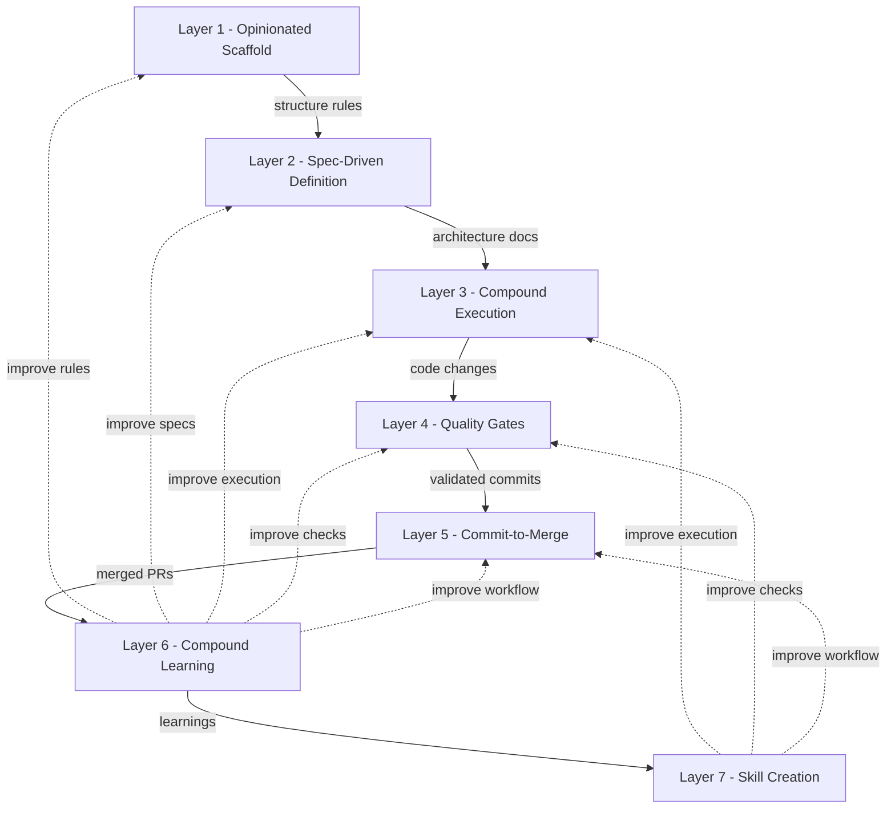
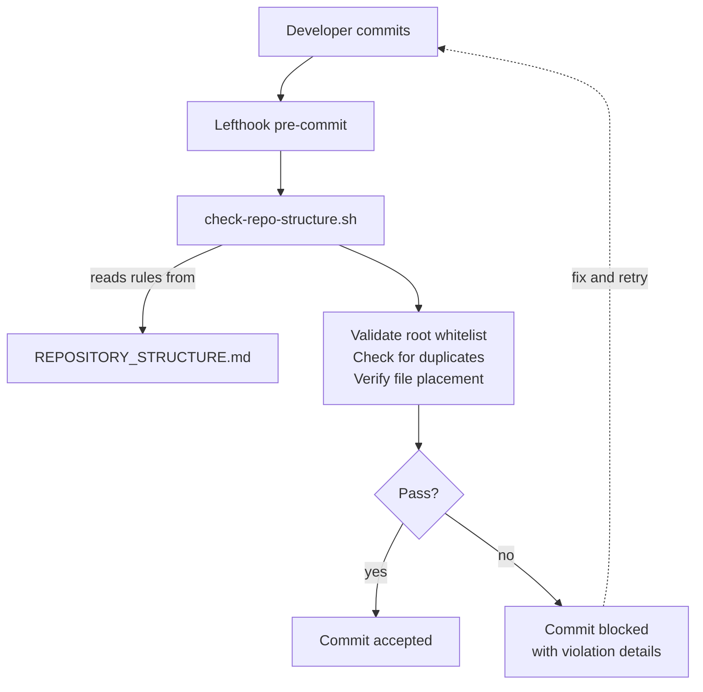
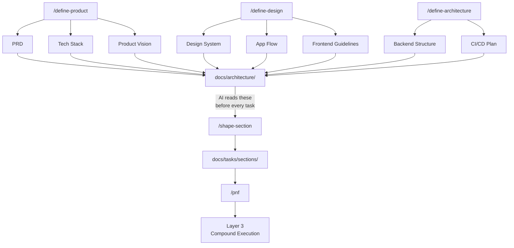
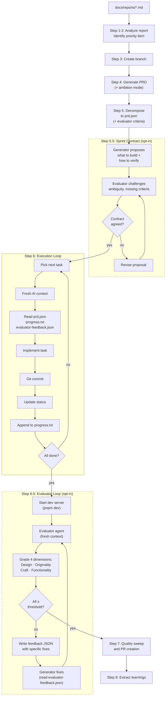
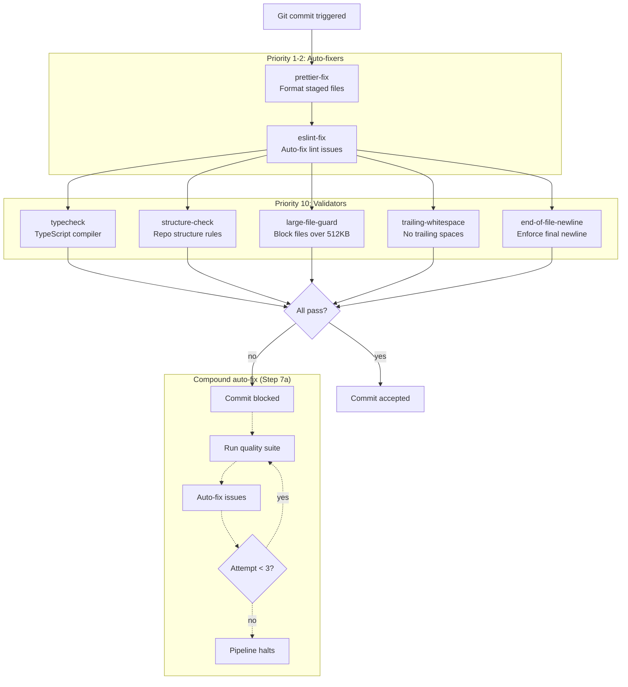
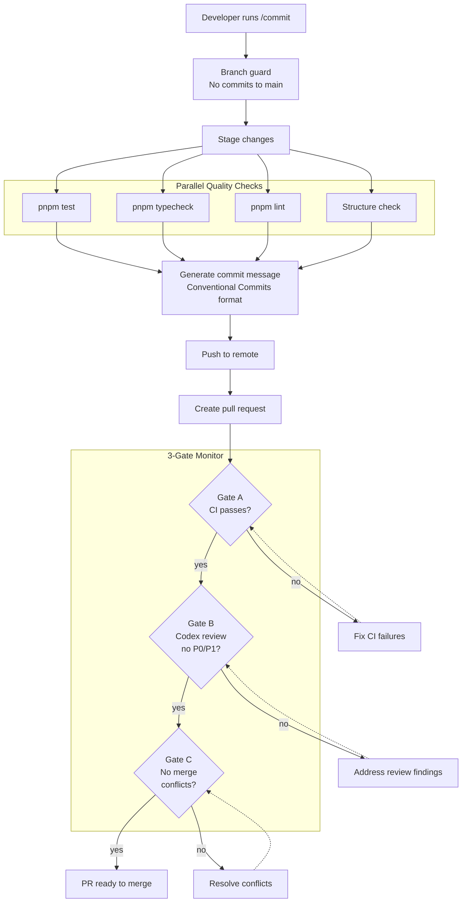
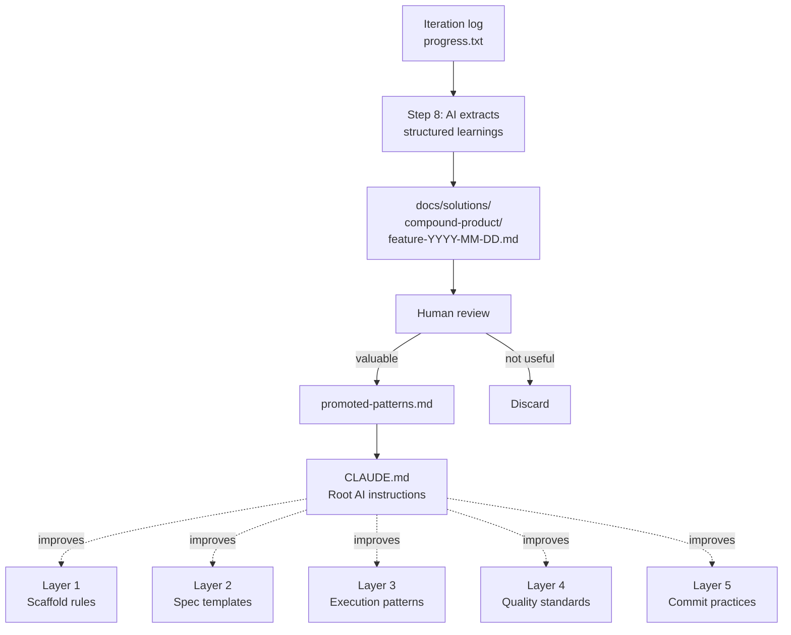
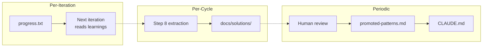

# Methodology

> **The harness your AI agent didn't know it needed. With best practices pre-wired for AI coding.**

AI coding tools are powerful. Without structure, they're a trap.

You prompt an agent to build a feature. It generates code that looks right -- until you discover it hallucinated an API, ignored your existing patterns, or duplicated a utility that already exists. You fix it, start a new session, and the agent has forgotten everything. No specs. No guardrails. No memory. Just vibes.

The best practices exist. Spec-driven development. Compound loops with fresh context. Structure enforcement. Automated quality gates. Context engineering via CLAUDE.md. They're scattered across blog posts, repos, and conference talks. You know you should set them up. You haven't had time.

Launchpad is an AI coding harness where all of it is already wired in and working. Clone it, define your product, and start building with an AI workflow that has specs, guardrails, autonomous execution loops, pre-commit hooks, CI pipelines, and automated code review -- from the first commit.

For a step-by-step workflow guide, see [How It Works](HOW_IT_WORKS.md).

---

## Overview



Launchpad organizes AI-assisted development into seven layers. Each layer addresses a specific failure mode of unstructured AI coding. The layers build on each other sequentially -- scaffold enforces where files go, specs define what to build, execution builds it, quality gates catch mistakes, commit-to-merge ensures review, learning feeds improvements back into every layer, and skill creation turns accumulated knowledge into reusable instruction sets that change how the AI reasons.

The first five layers form a forward pipeline. The sixth layer wraps all of them, creating a feedback loop that makes the entire system smarter over time. The seventh layer extends this -- skills are the executable form of compounded knowledge, turning learnings into reusable instruction sets that reshape how the AI approaches specific problem domains.

> **Workflow vs. architecture order:** While layers are numbered architecturally (1–7), the recommended workflow execution order starts with skills. In the four-tier workflow, skill creation is **Tier 0 — Capabilities** — users create or port skills before starting Tier 1 definition. This ensures every subsequent command benefits from domain-specific reasoning.

| Layer                                                        | What It Does                                                                                                                | Key Files                                                                             |
| ------------------------------------------------------------ | --------------------------------------------------------------------------------------------------------------------------- | ------------------------------------------------------------------------------------- |
| 1. [Opinionated Scaffold](#layer-1-opinionated-scaffold)     | Monorepo with enforced structure, whitelisted root files, and a decision tree for file placement                            | `REPOSITORY_STRUCTURE.md`, `check-repo-structure.sh`, `init-project.sh`               |
| 2. [Spec-Driven Definition](#layer-2-spec-driven-definition) | Four-tier workflow: Capabilities → Definition → Development → Implementation, producing architecture docs and section specs | `/define-product`, `/define-design`, `/define-architecture`, `/shape-section`, `/pnf` |
| 3. [Compound Execution](#layer-3-compound-execution)         | Report --> analysis --> PRD --> tasks --> autonomous loop --> PR. Fresh-context iterations with a Kanban board              | `build.sh`, `loop.sh`, `iteration-claude.md`, `/inf`                                  |
| 4. [Quality Gates](#layer-4-quality-gates)                   | Pre-commit hooks, CI pipeline, and AI-powered code review with P0--P3 severity classification                               | `lefthook.yml`, `ci.yml`, `codex-review.yml`                                          |
| 5. [Commit-to-Merge](#layer-5-commit-to-merge)               | Branch guard --> quality gates --> PR creation --> 3-gate monitoring loop. Never auto-merges                                | `/commit`, `build.sh` Steps 7a--7c                                                    |
| 6. [Compound Learning](#layer-6-compound-learning)           | Structured knowledge extraction, learnings catalog, pattern promotion, and cross-run memory                                 | `docs/solutions/`, `progress.txt`, `promoted-patterns.md`                             |
| 7. [Skill Creation](#layer-7-skill-creation)                 | Encode domain expertise as reusable AI skills with quality-validated reasoning patterns                                     | `/create-skill`, `/port-skill`, `/update-skill`, `skill-evaluator`                    |

No single competitor offers all seven layers. SpecKit has Layer 2. Design OS has Layer 2. Ralph has Layer 3. Compound Product has Layers 3 and 6. Nobody has Layers 1, 4, 5, or 7.

---

## Layer 1: Opinionated Scaffold

### Philosophy

The scaffold is a closed-loop system with three components: a **specification** that defines where every file belongs, a **bash enforcement script** that validates the repo against that specification, and **wiring** (Lefthook + CI) that triggers enforcement on every commit. A fourth component, the **initialization wizard**, transforms the template into a new project.

The system answers one question: _"Where does this file go?"_ -- and enforces the answer automatically.

### Implementation

Every file in the repository has exactly one correct location. The scaffold is a closed-loop system with four components: a **specification** that defines where every file belongs, a **bash enforcement script** that validates the repo against that specification, **wiring** (Lefthook + CI) that triggers enforcement on every commit, and an **initialization wizard** that transforms the template into a new project. A fifth component -- the **topology** (Turbo + pnpm) -- defines the monorepo dependency graph.



#### The Specification: `REPOSITORY_STRUCTURE.md`

The canonical source of truth for the entire repository layout. Both humans and AI agents read it before creating, moving, or deleting any file.

**What it defines:**

- **Root whitelist** -- Three explicit lists of what's allowed at the repo root:
  - 16 documentation files (README.md, CLAUDE.md, AGENTS.md, CONTRIBUTING.md, etc. plus their `.template` pairs)
  - 18 configuration files (package.json, turbo.json, lefthook.yml, .gitignore, etc.)
  - 14 directories (apps/, packages/, scripts/, docs/, .github/, .claude/, etc.)
  - Anything not on these lists triggers a failure

- **Full directory tree** -- Every directory has a defined purpose:
  - `apps/web/` -- Next.js App Router frontend
  - `apps/api/` -- Backend service (Hono)
  - `packages/db/` -- Prisma schema and client (`@repo/db`)
  - `packages/shared/` -- Shared types and utilities (`@repo/shared`)
  - `packages/ui/` -- Shared React component library (`@repo/ui`)
  - `packages/eslint-config/` -- ESLint 9 flat config presets (`@repo/eslint-config`)
  - `packages/typescript-config/` -- TypeScript config presets (`@repo/typescript-config`)
  - `scripts/` -- Executable scripts (compound/, maintenance/, agent_hydration/, setup/)
  - `docs/` -- 13 subdirectories, each with a specific purpose and lifecycle

- **Decision tree (Section 7)** -- A 12-branch sequential flow chart. Walk through it in order and stop at the first match:
  1. Is it documentation? --> one of 12 `docs/` subdirectories
  2. Is it a script? --> `scripts/maintenance/`, `scripts/agent_hydration/`, or app-level `scripts/`
  3. Is it a shared TypeScript type? --> `packages/shared/src/types/` or app-local `src/types/`
  4. Is it a utility function? --> `packages/shared/src/` or app-local `src/lib/`
  5. Is it a React component? --> `packages/ui/src/` or `apps/web/src/components/`
  6. Is it database-related? --> `packages/db/prisma/`
  7. Is it an API route? --> `apps/api/src/routes/`
  8. Is it a frontend page? --> `apps/web/src/app/`
  9. Is it CI/CD config? --> `.github/workflows/`
  10. Is it experimental? --> `docs/experiments/<topic>/` (never `v2` or `copy` files)
  11. Is it a new workspace package? --> `packages/<name>/` with package.json + tsconfig + src/index.ts
  12. Is it a Claude command? --> `.claude/commands/`
  13. **Fallback: Ask the user. Do not guess.**

- **Anti-patterns** -- Explicitly banned: root clutter, duplicate files, misplaced Prisma, loose scripts in source directories, importing from `docs/experiments/` in production code

- **Evolution protocol** -- A 5-step process for updating the structure rules, keeping the whitelist arrays in sync with the spec

#### The Enforcer: `check-repo-structure.sh`

A 374-line bash script that validates the repository against the specification. Exits 0 if clean, exits 1 if violations exist.

**Five checks:**

1. **Duplicate file detection** -- Finds files matching ` 2`, ` v2`, ` copy` patterns (macOS Finder artifacts). Error messages say "MANUAL REVIEW REQUIRED -- DO NOT AUTO-DELETE" with a 5-step resolution process. This is deliberate: AI agents reading these errors will not auto-delete your work.

2. **Root file whitelist** -- Compares every file and directory at the repo root against three arrays (`ALLOWED_DOCS`, `ALLOWED_CONFIGS`, `ALLOWED_DIRS`) that mirror Section 2 of the spec. Hidden config files (`.env.*`, `.editorconfig`, etc.) pass through a regex fallback.

3. **Loose scripts at root** -- Catches `.sh` and `.py` files at the repo root. Provides specific guidance: "Move to `scripts/maintenance/` or `scripts/agent_hydration/`."

4. **Loose files in app directories** (warn-only) -- Flags unexpected files at the top level of `apps/web/` and `apps/api/`. Designed to be graduated to blocking.

5. **Sandbox protocol** -- Uses `grep` to detect `import experiments` or `from experiments` in production code under `apps/`. Experimental code must never leak into production. Hard failure.

Error messages are deliberately verbose and instructive. They don't just say "violation found" -- they explain what to do and where to look. AI agents read these messages when commits fail, so the messages must be actionable.

#### The Wiring: Lefthook + CI

The enforcement script runs automatically in two places:

**Pre-commit (local):** Lefthook runs `check-repo-structure.sh` on every commit at priority 10 (after auto-fixers). Setup is zero-friction: `pnpm install` triggers `lefthook install` via the root package.json `postinstall` script. No developer action required.

**CI (remote):** The GitHub Actions CI pipeline runs the structure check as a standalone job on every push to `main` and every PR. This is the safety net -- even if someone bypasses local hooks with `--no-verify`, CI catches the violations before they reach `main`.

#### The Entry Point: `init-project.sh`

A 442-line interactive wizard that transforms a fresh Launchpad clone into a new project. It's the only time the scaffold is modified.

**What it does:**

1. **Collects metadata** -- Project name (validated, rejects shell injection characters), description, copyright holder, contact email, license type, repository visibility

2. **Preserves Launchpad documentation** -- Copies `docs/guides/HOW_IT_WORKS.md` and `docs/guides/METHODOLOGY.md` to `.launchpad/` so you can always reference the original workflow instructions. Creates `.launchpad/version` for future upgrade tracking.

3. **Swaps template files** -- Moves `.template.md` files into their final positions:
   - `README.template.md` --> `README.md`
   - `LICENSE.template` --> `LICENSE`
   - `SECURITY.template.md` --> `SECURITY.md` (public repos only; skipped for private repos)
   - `CODE_OF_CONDUCT.template.md` --> `CODE_OF_CONDUCT.md`
   - `CHANGELOG.template.md` --> `CHANGELOG.md`
   - `CONTRIBUTING.template.md` --> `CONTRIBUTING.md`

4. **Fills placeholders** -- Replaces `{{PROJECT_NAME}}`, `{{PROJECT_DESCRIPTION}}`, `{{COPYRIGHT_HOLDER}}`, `{{CONTACT_EMAIL}}`, `{{LICENSE_TYPE}}`, `[Project Name]`, and `{{PROJECT_PURPOSE}}` across 14+ files

5. **Prints next steps** -- Offers two paths: fresh start (nuke git history) or stay connected (rename origin, enable upstream pulls via `git fetch launchpad`)

**Safety guards:** Idempotency check (`.launchpad/` directory), clean worktree requirement, rollback on failure (`git checkout -- .`), symlink detection, input validation against injection characters.

#### The Topology: Turbo + pnpm Workspaces

Two files define the monorepo structure:

`pnpm-workspace.yaml` declares two workspace globs (`apps/*` and `packages/*`), making them first-class citizens.

`turbo.json` defines the task pipeline with `^build` dependencies -- packages are always built before the apps that consume them. When `pnpm typecheck` runs, Turborepo dispatches TypeScript checking across all workspaces in the correct dependency order.

Key files:

- `docs/architecture/REPOSITORY_STRUCTURE.md` -- canonical file placement rules with a decision tree
- `scripts/maintenance/check-repo-structure.sh` -- validates repo against the structure spec
- `scripts/setup/init-project.sh` -- interactive project initialization wizard

---

## Layer 2: Spec-Driven Definition

### Philosophy

Before any code is written, the project needs specs. This layer is organized into a **three-tier workflow** that produces architecture documents, a design system, and section specs -- giving AI agents full context about what they're building, why, and how.

**Tier 1 — Definition** (run once per project): `/define-product` → `/define-design` → `/define-architecture` produces seven canonical architecture documents.

**Tier 2 — Development** (per section, ongoing): `/shape-section` deep-dives into individual product sections, producing detailed specs at `docs/tasks/sections/`. `/update-spec` scans all spec files for gaps, TBDs, and cross-file inconsistencies.

**Tier 3 — Implementation** (per section): `/pnf` creates implementation plans from shaped sections. `/inf` and `/implement_plan` execute them.

Both interactive and autonomous paths use **6 sub-agents** organized in a two-wave orchestration pattern. Wave 1 (Discovery) runs 4 locators in parallel -- codebase locator, docs locator, pattern finder, and web researcher -- using only fast tools (Grep, Glob, LS) to find relevant files without reading them. Wave 2 (Analysis) waits for Wave 1 to complete, then runs 2 analyzers in parallel -- codebase analyzer and docs analyzer -- targeting only the paths Wave 1 found. This ensures expensive Read operations are focused precisely where they'll yield useful context, preventing wasted tokens on irrelevant files.

The PRD creation workflow extends this layer with priority tiers, scope guards, and research agents -- ensuring PRDs are grounded in what the codebase actually contains, not what the AI assumes.

Spec-driven development is the practice of specifying before building. The idea comes from the broader SDD movement (Thoughtworks, GitHub SpecKit, AWS Kiro), but our implementation is different:

- **SpecKit** produces per-feature specs that are consumed and discarded
- **Launchpad** produces project-level canonical documents that persist and evolve

The architecture docs are living documents. They grow as the project grows. Every AI agent session reads them for context. Every compound pipeline iteration checks them for constraints.

### Implementation

Before writing any code, you define what you are building through interactive AI Q&A sessions. Three slash commands walk you through structured questions and produce seven architecture documents that give the AI complete context about your project.

Without these specs, every AI session starts from zero. The AI guesses at your tech stack, naming conventions, and architecture. With specs in place, every session reads the same ground truth and produces consistent output.

There are two paths into this layer: an **interactive path** (human-guided slash commands) and an **autonomous path** (AI-generated from reports via the compound pipeline). Both produce the same artifacts.



#### Interactive Definition: `/define-product`

A guided interactive wizard that populates two documents through structured Q&A (15 questions: 14 guided + 1 open):

**`docs/architecture/PRD.md`** -- The product requirements:

- What is the project? (name, description)
- Who is it for? (target users)
- What problem does it solve? (problem statement)
- What are the core features? (MVP scope)
- What is explicitly out of scope? (non-goals)
- How do you know it's working? (success metrics)
- Section registry with data shapes

**`docs/architecture/TECH_STACK.md`** -- The technical choices:

- Frontend framework
- CSS approach
- Backend framework
- Database
- Auth provider
- Hosting/deployment
- Key dependencies

**Behavioral rules:**

- One question at a time -- never batches questions
- "TBD" is always an acceptable answer
- Dual-mode detection -- automatically determines create vs. update mode by checking existing content
- After writing both docs, updates CLAUDE.md so future AI sessions inherit the context

#### Interactive Definition: `/define-design`

A guided interactive wizard (18 questions: 17 guided + 1 open) that populates three documents:

**`docs/architecture/DESIGN_SYSTEM.md`** -- The visual design system:

- Color palette and semantic tokens
- Typography scale and font choices
- Spacing and layout conventions
- Component styling patterns
- Dark mode strategy
- Animation and interaction guidelines

**`docs/architecture/APP_FLOW.md`** -- Auth flow, user journeys, pages/routes table, navigation patterns, error handling, accessibility

**`docs/architecture/FRONTEND_GUIDELINES.md`** -- Component architecture, state management, responsive strategy

**Prerequisite:** PRD.md (soft-required). TECH_STACK.md (soft-required for frontend guidelines questions).

#### Interactive Definition: `/define-architecture`

A guided interactive wizard (9 questions: 8 guided + 1 open) that populates two architecture docs:

**`docs/architecture/BACKEND_STRUCTURE.md`** -- Data models, API endpoints, auth strategy, external service integrations

**`docs/architecture/CI_CD.md`** -- CI pipeline configuration, deploy strategy, environments

All questions are tailored to the tech stack chosen in `/define-product`. If you chose Clerk for auth, you get Clerk-specific patterns. If you chose Prisma, you get Prisma-specific data model guidance. The auth strategy question (BE-3) cross-references APP_FLOW.md (from `/define-design`) to align the backend token flow with the UX auth flow.

**Prerequisite:** PRD.md and TECH_STACK.md must exist. APP_FLOW.md (from `/define-design`) recommended but not required.

#### Interactive Planning: `/pnf` (Plan Next Feature)

A research-first plan builder that produces implementation plans from section specs.

Before asking any questions, it spawns **6 sub-agents** in two mandatory waves:

**Wave 1 -- Discovery** (parallel, fast -- Grep/Glob/LS only, no file reads):

- **Codebase locator** -- finds relevant source files and patterns
- **Docs locator** -- finds relevant documents across `docs/` by YAML frontmatter, date-prefixed filenames, and directory structure
- **Pattern finder** -- identifies recurring code patterns
- **Web researcher** -- gathers external context

**Wave 2 -- Analysis** (parallel, waits for Wave 1 to complete -- targeted Read operations):

- **Codebase analyzer** -- understands current architecture using paths from Wave 1
- **Docs analyzer** -- extracts high-value insights (decisions, rejected approaches, constraints, promoted patterns) from docs found in Wave 1

This two-wave ordering ensures expensive file reads target only what locators actually found, preventing wasted context tokens. On fresh projects where `docs/` contains only stubs, the docs agents are skipped gracefully.

The plan output includes phases, each with automated verification commands and manual verification steps. Every decision is made before the plan is finalized -- no open questions.

#### Autonomous Definition: The Compound Path

When running `/inf` (the autonomous pipeline), the definition step is automated:

1. `analyze-report.sh` reads the most recent report from `docs/reports/` and picks the #1 actionable priority
2. The AI agent generates a PRD (`tasks/prd-<feature>.md`) with constraints: no DB migrations, 2-4 hour scope, 3-5 high-level tasks (later expanded to 8-15 granular sub-tasks in prd.json)
3. The PRD is converted to `prd.json` with machine-verifiable acceptance criteria

This is the autonomous equivalent of `/define-product` + `/pnf`, scoped to a single feature.

#### The Architecture Documents

| Document                                   | Purpose                   | Created By             |
| ------------------------------------------ | ------------------------- | ---------------------- |
| `docs/architecture/PRD.md`                 | What to build and why     | `/define-product`      |
| `docs/architecture/TECH_STACK.md`          | Technical decisions       | `/define-product`      |
| `docs/architecture/DESIGN_SYSTEM.md`       | Visual design system      | `/define-design`       |
| `docs/architecture/APP_FLOW.md`            | User flows and navigation | `/define-design`       |
| `docs/architecture/BACKEND_STRUCTURE.md`   | API and data models       | `/define-architecture` |
| `docs/architecture/FRONTEND_GUIDELINES.md` | Components and state mgmt | `/define-design`       |
| `docs/architecture/CI_CD.md`               | CI/CD and deployment      | `/define-architecture` |

All seven feed into CLAUDE.md, which means every AI agent session -- whether interactive or autonomous -- starts with full project context.

Key files:

- `.claude/commands/define-product.md` -- interactive Q&A for product definition
- `.claude/commands/define-design.md` -- interactive Q&A for design system, app flow, and frontend guidelines
- `.claude/commands/define-architecture.md` -- interactive Q&A for backend structure and CI/CD
- `docs/architecture/` -- where the seven output documents live

---

## Layer 3: Compound Execution

### Philosophy

This layer implements the autonomous execution loop: give it a report describing what needs to be done, and it produces a PR with the work complete, quality gates passing, and a Kanban board showing progress.

The pipeline emits `[CHECKPOINT]` messages at key boundaries (after report analysis, PRD generation, task decomposition, and loop completion). These are informational only -- the pipeline continues autonomously -- but they make the autonomous process observable for developers watching the terminal.

The methodology is adapted from [Compound Product](https://github.com/snarktank/compound-product) by Ryan Carson (itself built on [Kieran Klaassen's compound engineering](https://github.com/EveryInc/compound-engineering-plugin) and [Geoffrey Huntley's Ralph pattern](https://github.com/geoffreyhuntley/ralph)). We've modified it significantly -- see [Differences from Upstream](#differences-from-upstream) for details.

### Implementation

This is the core build loop. The `/inf` command runs a 10-step pipeline that takes a report, identifies the highest-priority item, creates a branch, generates a PRD, decomposes it into tasks, optionally negotiates a sprint contract, executes them in a fresh-context loop, optionally runs a live application evaluator, runs quality checks, and opens a pull request.

The critical design choice is that each iteration of the inner loop runs in a fresh AI context. Memory does not persist in the AI's conversation history. Instead, it persists in git commits, `prd.json` (task status), and `progress.txt` (learnings log). This prevents context window overflow and keeps the AI focused on one task at a time.

Two optional steps (5.5 and 6.5) implement a GAN-inspired Generator/Evaluator architecture based on findings from [Anthropic's harness design research](https://www.anthropic.com/engineering/harness-design-long-running-apps). These are opt-in via `config.json` and do not affect the existing pipeline when disabled. See `docs/reports/2026-03-25-evaluator-architecture-implementation-plan.md` for the full specification.



> **Dashed borders** indicate opt-in steps controlled by `config.json`. When `evaluator.enabled` is `false` (default), Steps 5.5 and 6.5 are skipped entirely and the pipeline flows directly from Step 5 → Step 6 → Step 7 as before.

#### The Pipeline: `build.sh`

A 10-step autonomous pipeline (8 core + 2 opt-in evaluator steps) orchestrated by bash scripts in `scripts/compound/`.

##### Step 1: Find the Report

Pulls latest from `origin main`, then finds the most recently modified `.md` file in `docs/reports/`. Reports are written by humans or by the `/research_codebase` command.

##### Step 2: Analyze the Report

Sends the report to an LLM to extract the #1 most actionable priority.

`analyze-report.sh` supports multiple LLM providers (checked in order):

1. Vercel AI Gateway with OIDC
2. Vercel AI Gateway with API key
3. Anthropic API (`claude-opus-4-6`)
4. OpenAI API (`gpt-4o`)
5. OpenRouter (`anthropic/claude-opus-4.6`)

The analysis prompt constrains picks to:

- No database migrations
- Completable in a few hours
- Specific and actionable (not vague)
- Prefers fixes over new features
- Prefers high-impact, low-effort items

**Deduplication:** Scans `tasks/` for PRDs modified in the last 7 days and tells the LLM not to re-pick them.

**Output:** JSON with `priority_item`, `description`, `rationale`, `acceptance_criteria`, `branch_name`.

> `[CHECKPOINT]` Report analyzed -- priority item identified. Pipeline continues.

##### Step 3: Create Feature Branch

Checks out `main`, creates `compound/<feature>` branch (or switches to it if it already exists).

##### Step 4: Generate PRD

Pipes a prompt to the AI agent that includes the priority item, description, rationale, and acceptance criteria. The agent generates `tasks/prd-<feature>.md` with all required PRD sections:

- Introduction and goals
- Desired end state (2-4 sentence north star for the feature)
- Tasks with verifiable acceptance criteria (T-001, T-002, etc.)
- Functional requirements with P0/P1/P2 priority tiers
- Non-goals (scope boundaries)
- Files NOT to modify (protected files/directories)
- Technical considerations (constraints + non-functional requirements)
- Edge cases (structured table)
- Success metrics
- Open questions
- Examples (input/output pairs, or N/A with reason)

If a previous `prd.json` exists from a different branch, it's archived to `archive/<date>-<feature>/` first.

> `[CHECKPOINT]` PRD generated. Pipeline continues.

##### Step 5: Convert to Tasks

The PRD markdown is converted to `prd.json` -- a machine-readable task file:

```json
{
  "project": "Feature Name",
  "branchName": "compound/feature-name",
  "description": "One-line description",
  "desiredEndState": "2-4 sentence north star describing what the system looks like after completion",
  "filesNotToModify": [
    { "path": "path/to/protected-file.ts", "reason": "shared layout, already stable" },
    { "path": "path/to/protected-dir/", "reason": "out of scope for this feature" }
  ],
  "startedAt": "2026-03-06T10:30:00Z",
  "tasks": [
    {
      "id": "T-001",
      "title": "Specific action verb + target",
      "description": "What and why",
      "acceptanceCriteria": ["Machine-verifiable criterion"],
      "manualVerification": ["Human-verified criterion (logged, not auto-checked)"],
      "priority": 1,
      "passes": false,
      "status": "pending",
      "skipped": null,
      "notes": ""
    }
  ]
}
```

**Task granularity rules:**

- 8-15 tasks per PRD
- Each task does ONE thing
- Investigation is always separate from implementation
- Acceptance criteria must be boolean checks an agent can pass or fail:
  - `"Run pnpm test -- exits with code 0"`
  - `"File middleware.ts contains clerkMiddleware"`
  - `"GET /api/health returns 200"`

After creating prd.json, the initial Kanban board is rendered and the PRD + tasks are committed.

> `[CHECKPOINT]` Tasks decomposed -- prd.json ready. Pipeline continues.

##### Step 6: Run the Loop

Delegates to `loop.sh`, which runs up to 25 iterations (configurable). Each iteration:

1. Reads `prd.json` to find the highest-priority pending task
2. Reads `progress.txt` (especially the Codebase Patterns section) for cross-iteration context
3. Checks `filesNotToModify` -- refuses to edit any file on the protected list
4. Implements the task, using `desiredEndState` as a north star for implementation decisions
5. Runs quality checks from `config.json`'s `qualityChecks` array
6. Commits with `feat: [Task ID] - [Task Title]`
7. Updates `prd.json` -- sets `status: "done"`, `passes: true`; logs any `manualVerification` items to `progress.txt`
8. Appends to `progress.txt`: what was done, files changed, learnings
9. Renders the Kanban board

The loop uses **fresh context on every iteration**. No state carries in memory. Context comes only from:

- Git history (previous commits)
- `progress.txt` (learnings and patterns from prior iterations)
- `prd.json` (task status and notes)
- `CLAUDE.md` / `AGENTS.md` (project knowledge)

When all tasks have `status: "done"` or `status: "skipped"`, the agent outputs `<promise>COMPLETE</promise>` and the loop exits. Skipped tasks keep `passes: false` (they didn't actually pass — they were determined to be inapplicable).

> `[CHECKPOINT]` Execution loop complete -- all tasks done. Pipeline continues to quality sweep.

These four checkpoint messages are informational only -- the pipeline continues autonomously. They make the autonomous process observable for developers watching the terminal output.

##### Step 5.5: Sprint Contract (opt-in)

When `evaluator.sprintContract` is `true` in `config.json`, the pipeline pauses after task decomposition for a contract negotiation. The generator proposes what it will build and exactly how the evaluator should verify it. The evaluator reviews the proposal and challenges vague criteria, missing test steps, or untestable claims.

This negotiation runs up to 3 rounds. The contract is saved to `scripts/compound/sprint-contract.json` and consumed by the evaluator in Step 6.5. Sprint contracts prevent the "I built it but the evaluator tested the wrong thing" failure mode. They force the generator to think about testability before writing code.

**Contract format:** JSON with deliverables (each containing verification steps, API checks, and visual checks), grading expectations per dimension, and out-of-scope exclusions.

**Communication:** File-based, round-robin. Generator writes → evaluator reads and challenges → generator revises → evaluator approves or challenges again.

> `[CHECKPOINT]` Sprint contract finalized. Pipeline continues.

##### Step 6.5: Evaluator Loop (opt-in)

When `evaluator.enabled` is `true` in `config.json`, the pipeline runs a live application evaluation after the execution loop completes. This implements a GAN-inspired Generator/Evaluator separation: the agent that builds the code is not the agent that tests it.

**Process:**

1. Start the dev server (`pnpm dev`)
2. Wait for server readiness (poll both web `:3000` and API `:3001` health endpoints, 30s timeout)
3. Run the evaluator agent in a fresh context (no shared memory with the generator)
4. The evaluator navigates the running application via Playwright MCP and grades four dimensions:
   - **Design** -- Does the UI feel like a coherent whole? (threshold: 7)
   - **Originality** -- Evidence of custom decisions vs. template layouts? (threshold: 6)
   - **Craft** -- Typography, spacing, color harmony, error handling? (threshold: 7)
   - **Functionality** -- Can users complete tasks end-to-end? (threshold: 8)
5. If any dimension is below its threshold, feedback is written to `evaluator-report.json` and the generator runs a fix cycle
6. Repeat up to `maxCycles` (default: 3)
7. Stop the dev server

**Skip behavior:** If Playwright is not available, ports are already in use, or the dev server fails to start, the evaluator writes a `{"status": "skipped"}` report and exits. The pipeline continues to Step 7 — no evaluation is performed but the skip is explicitly recorded. A future enhancement will add static-only fallback (API testing via curl, HTML inspection, code quality assessment) when Playwright is unavailable.

**File-based communication:** The evaluator writes `evaluator-report.json` (full grading report with per-dimension scores and actionable feedback). The generator reads the report at the start of each fix iteration. Both agents run in fresh contexts with no shared memory.

**Configuration:** All evaluator settings live in `config.json` under the `evaluator` key. See the implementation plan for the full schema.

> `[CHECKPOINT]` Evaluator loop complete. Pipeline continues to quality sweep.

##### Steps 7 and 8

Covered in [Layer 5: Commit-to-Merge](#layer-5-commit-to-merge) and [Layer 6: Compound Learning](#layer-6-compound-learning).

#### Report Format

Reports are the input to the autonomous pipeline. They live in `docs/reports/` (configurable via the `reportsDir` field in `scripts/compound/config.json`). The pipeline finds the most recently modified `.md` file in that directory and sends it to an LLM to extract the single highest-priority actionable item.

Reports can be any markdown -- there is no rigid schema. The AI reads the full document and picks the #1 item, preferring high-impact bug fixes over new features and skipping anything requiring database migrations or already covered by recent PRDs.

**Example report** (`docs/reports/2026-03-06-daily.md`):

```markdown
# Daily Report -- 2026-03-06

## Key Metrics (24h)

| Metric       | Value | Change |
| ------------ | ----- | ------ |
| Signups      | 45    | -20%   |
| Active Users | 1,234 | +5%    |
| Revenue      | $890  | -10%   |
| Error Count  | 23    | +150%  |

## Errors

1. **TypeError: Cannot read property 'id' of undefined** (12 occurrences)
   - Location: `src/components/CheckoutForm.tsx:145`
   - Impact: Checkout flow broken for some users

2. **NetworkError: Request timeout** (8 occurrences)
   - Location: `src/api/payments.ts:78`
   - Impact: Payment processing delays

## User Feedback

- "The checkout page keeps spinning" -- 5 reports
- "I can't find the save button on mobile" -- 3 reports

## Recommendations

1. **URGENT**: Fix TypeError in CheckoutForm -- blocking revenue
2. **HIGH**: Investigate save button visibility on mobile
3. **MEDIUM**: Relax email validation regex
```

You do not need all of these sections. A report with just a bullet list of issues works fine.

**What the analysis produces.** `analyze-report.sh` outputs a JSON object that drives the rest of the pipeline:

```json
{
  "priority_item": "Fix TypeError in CheckoutForm breaking checkout flow",
  "description": "A TypeError at CheckoutForm.tsx:145 is causing the checkout page to fail for users.",
  "rationale": "Highest-impact item: directly blocks revenue, most error occurrences, matches most common user complaint.",
  "acceptance_criteria": [
    "CheckoutForm.tsx handles undefined order.id without throwing",
    "Checkout flow completes successfully end-to-end",
    "Error count for TypeError drops to 0 in test suite"
  ],
  "branch_name": "compound/fix-checkout-typeerror"
}
```

This JSON seeds the PRD (Step 3), creates the feature branch, and the `acceptance_criteria` become verification checks for each task.

#### The Kanban Board: `board.sh`

A 321-line Bash 3.x-compatible board renderer with three output modes:

- **ASCII mode** (terminal) -- Full color rendering with progress bar, elapsed time, column headers (PENDING / WORKING / DONE / FAILED), and current task display
- **Markdown mode** (`--md`) -- Generates `docs/tasks/board.md` with emoji status table and progress bar. Embedded in PR bodies.
- **Summary mode** (`--summary`) -- One-line output: `"3/5 tasks (60%) -- Working: T3 -- Add auth middleware"`

**Backward compatibility:** If tasks lack a `status` field (old-format prd.json), derives status from `passes` (true --> done, false --> pending).

#### Configuration: `config.json`

```json
{
  "reportsDir": "./docs/reports",
  "outputDir": "./scripts/compound",
  "qualityChecks": ["pnpm typecheck", "pnpm test"],
  "maxIterations": 25,
  "branchPrefix": "compound/",
  "analyzeCommand": "",
  "tool": "claude"
}
```

| Field            | Purpose                                                           |
| ---------------- | ----------------------------------------------------------------- |
| `reportsDir`     | Where to find input reports                                       |
| `outputDir`      | Where prd.json and progress.txt live                              |
| `qualityChecks`  | Commands the agent runs after implementing each task              |
| `maxIterations`  | Max loop iterations (default 25)                                  |
| `branchPrefix`   | Git branch prefix (default `compound/`)                           |
| `analyzeCommand` | Custom analysis script (empty = use built-in `analyze-report.sh`) |
| `tool`           | AI backend: `claude`, `codex`, or `gemini`                        |

#### Two Paths Through the Layer

| Path           | Entry Point                  | PRD Source                                           | Execution                               | Human Involvement       |
| -------------- | ---------------------------- | ---------------------------------------------------- | --------------------------------------- | ----------------------- |
| **Autonomous** | `/inf`                       | Auto-generated from report (self-clarified, no MCQ)  | `loop.sh` (fresh context per iteration) | None until PR review    |
| **Manual**     | `/pnf` --> `/implement_plan` | Human-authored plan (MCQ clarifying step before PRD) | Phase-by-phase with checkpoints         | At every phase boundary |

Both paths produce the same output: committed code on a feature branch, ready for quality gates and PR creation.

Key files:

- `scripts/compound/build.sh` -- main orchestrator (Steps 1-8)
- `scripts/compound/loop.sh` -- Ralph execution loop (Step 6)
- `scripts/compound/analyze-report.sh` -- LLM report analysis (Step 1-2)
- `scripts/compound/board.sh` -- Kanban board renderer (3 modes: ASCII, Markdown, summary)
- `scripts/compound/iteration-claude.md` -- per-iteration prompt template
- `scripts/compound/config.json` -- pipeline configuration (max iterations, branch prefix, etc.)

---

## Layer 4: Quality Gates

### Philosophy

Quality is enforced at three stages: **locally before commit** (pre-commit hooks), **remotely on every PR** (CI pipeline), and **via AI review after PR creation** (Codex code review). Each stage is a safety net for the previous one.

### Implementation

Every commit passes through automated checks before reaching the repository. Quality is enforced at three stages: **locally before commit** (pre-commit hooks), **remotely on every PR** (CI pipeline), and **via AI review after PR creation** (Codex code review). Each stage is a safety net for the previous one.

During compound execution (Step 7a), the pipeline runs the full quality suite up to three times, automatically fixing issues between attempts. This means the AI's code goes through formatting, linting, type checking, and structure validation before a human ever sees it.



#### Stage 1: Pre-Commit Hooks (Lefthook)

Lefthook is auto-installed via `postinstall` in the root package.json. Every `pnpm install` silently configures git hooks -- no developer action required.

Seven checks run on every commit, organized by priority:

**Auto-fixers (run first, re-stage fixed files):**

| Priority | Hook           | What It Does                                                                                                    |
| -------- | -------------- | --------------------------------------------------------------------------------------------------------------- |
| 1        | `prettier-fix` | Formats staged files with Prettier (semicolons, double quotes, 2-space indent, trailing commas, 100-char width) |
| 2        | `eslint-fix`   | Runs ESLint with `--fix` on staged JS/TS files using `@repo/eslint-config`                                      |

**Read-only validators (block commit on failure):**

| Priority | Hook                  | What It Does                                                                    |
| -------- | --------------------- | ------------------------------------------------------------------------------- |
| 10       | `typecheck`           | Runs `pnpm typecheck` (Turborepo-dispatched across all workspaces, strict mode) |
| 10       | `structure-check`     | Runs `check-repo-structure.sh` (the Layer 1 enforcer)                           |
| 10       | `large-file-guard`    | Blocks commits with files over 500KB                                            |
| 10       | `trailing-whitespace` | Detects trailing whitespace in staged files                                     |
| 10       | `end-of-file-newline` | Ensures files end with a newline (POSIX compliance)                             |

Auto-fixers run before validators. If Prettier reformats a file and re-stages it, the structure check sees the already-clean version.

#### Stage 2: CI Pipeline (GitHub Actions)

The CI pipeline triggers on every push to `main` and every PR targeting `main`. It has 6 jobs organized in a dependency tree:

```
install (caches node_modules via pnpm-lock.yaml hash)
  |-- lint (ESLint + Prettier --check)
  |-- typecheck (TypeScript strict mode, all workspaces)
  |-- build (full production build)
  +-- test (Vitest suite)

structure (standalone -- runs check-repo-structure.sh)

summary (depends on all 5 check jobs, aggregates pass/fail)
```

**Key details:**

- Uses `--frozen-lockfile` to prevent lockfile modifications
- Action versions pinned to commit SHAs (supply-chain security)
- Concurrency groups cancel superseded runs
- The `summary` job creates a single check that branch protection rules can reference

Even if a developer bypasses local hooks with `git commit --no-verify`, CI catches violations before they reach `main`.

#### Stage 3: AI Code Review (Codex)

A GitHub Action that runs on every PR (opened, updated, or converted from draft). It uses OpenAI Codex to perform a structured code review with a four-tier severity system:

| Severity | Label               | Action                                                                                       |
| -------- | ------------------- | -------------------------------------------------------------------------------------------- |
| **P0**   | Critical (Must Fix) | Security vulnerabilities, data loss, crashes. Blocks merge in automated pipelines.           |
| **P1**   | High (Should Fix)   | Correctness bugs, type errors, API contract violations. Blocks merge in automated pipelines. |
| **P2**   | Medium (Consider)   | Performance regressions, missing error handling. Non-blocking.                               |
| **P3**   | Low (Optional)      | Minor improvements, documentation gaps. Non-blocking.                                        |

**10 focus areas:** Security, Correctness, Type Safety, API Contracts, Performance, Error Handling, Configuration Files, GitHub Workflows, Database/Prisma, Shell Scripts.

**Repository-specific rules baked into the prompt:**

- No imports from `docs/experiments/` in production code
- Prisma migrations must use `migrate deploy`, never `migrate dev`
- Shared packages must not import from `apps/`

**What it does NOT flag:** Style issues (handled by Prettier/ESLint) and TODO comments. This prevents noise.

The review is posted as a PR comment. The `/commit` and `/inf` workflows parse this comment for P0/P1 findings and act on them (see [Layer 5](#layer-5-commit-to-merge)).

#### Shared Configuration Packages

**`@repo/eslint-config`** -- Three ESLint 9 flat configs:

- `base.js` -- TypeScript strict rules, `no-unused-vars` (allows `_` prefix), `no-explicit-any` (warning)
- `next.js` -- Extends base with React, React Hooks, and Next.js core-web-vitals rules
- `node.js` -- Extends base with Node.js globals

**`@repo/typescript-config`** -- Three TypeScript configs:

- `base.json` -- ESNext target, strict mode, bundler resolution, source maps
- `next.json` -- Extends base with JSX preserve, noEmit, DOM libs, Next.js plugin
- `node.json` -- Extends base with Node16 module resolution for backend services

Key files:

- `lefthook.yml` -- hook definitions with priorities and globs
- `turbo.json` -- Turborepo cached build/test/lint/typecheck tasks
- `.github/workflows/ci.yml` -- CI workflow (lint, typecheck, test, structure)
- `.github/workflows/codex-review.yml` -- Codex AI review workflow
- `.github/codex-review-prompt.md` -- review prompt with severity classification (P0-P3)
- `scripts/maintenance/check-repo-structure.sh` -- structure validation

---

## Layer 5: Commit-to-Merge

### Philosophy

This layer governs everything from the moment code is ready to commit through PR creation and monitoring. It exists in two modes: **interactive** (the `/commit` slash command) and **autonomous** (Steps 7a--7c of `build.sh`).

Both modes share the same three-gate architecture but differ in human involvement.

Ten non-negotiable rules govern every commit path. They exist because AI agents will take shortcuts if allowed -- and a single `--no-verify` or force-push can undo hours of careful work.

### Implementation

The `/commit` command guides every change from local branch to merged PR through a structured pipeline. It enforces branch naming, runs parallel quality checks, generates a Conventional Commits message, pushes, creates the PR, and then monitors three gates until the PR is ready to merge.

This layer exists in two modes: **interactive** (the `/commit` slash command) and **autonomous** (Steps 7a-7c of `build.sh`). Both modes share the same three-gate architecture but differ in human involvement.



#### Interactive Mode: `/commit`

An 8-step protocol invoked as a Claude Code slash command.

##### Step 1: Branch Guard

Detects the current branch. If on `main` or `master` -- hard stop. The workflow:

1. Inspects staged changes to infer intent (feature, fix, config change)
2. Suggests a branch name using the naming convention (e.g., `feat/<topic>`, `fix/<topic>`)
3. Asks for confirmation
4. Creates and switches to the new branch

##### Step 2: Stage and Review

1. Runs `git status` and `git diff --stat`
2. Presents a summary: files added/modified/deleted, which apps/packages are affected
3. Asks: "Stage all changes, or select specific files?"
4. Confirms what will be committed with `git diff --cached --stat`

##### Step 3: Quality Gates (Parallel)

Two sub-agents run in parallel:

- **Agent A:** `pnpm test` --> `pnpm typecheck` --> `pnpm lint` (sequential)
- **Agent B:** `lefthook run pre-commit`

Any failure is a hard stop. Root cause must be diagnosed and fixed. `--no-verify` is explicitly forbidden. After fixing, ALL gates re-run from scratch.

##### Steps 4-6: Commit

- Generates a conventional commit message: `type(scope): description`
- Presents for user approval or editing
- Commits with `Co-Authored-By` trailer
- Verifies with `git status`

##### Step 7: PR Creation

- Pushes branch with `-u origin HEAD`
- Creates PR via `gh pr create` with structured body (Summary, Changes, Test Plan)

##### Step 8: The Three-Gate Monitoring Loop

After PR creation, enters a monitoring loop where all three gates must pass on the **same cycle** to exit.

**Gate A -- CI Checks:**

```
gh pr checks
```

- Pending: waits 30 seconds and re-checks
- Failed: reads CI logs via `gh run view --log-failed`, diagnoses, fixes locally, re-runs quality gates, pushes, restarts loop

**Gate B1 -- Human Reviews:**

```
gh pr view --json latestReviews,comments
```

- If change requests exist: addresses each comment, fixes, re-runs quality gates, pushes, restarts loop

**Gate B2 -- Codex Automated Review:**

- Polls for the Codex review comment for up to 5 minutes (10 checks, 30 seconds apart)
- If no comment arrives: passes (non-blocking on timeout)
- If P0/P1 findings exist: presents them to the user and asks "Should I fix these now?"
  - If approved: fixes, re-runs quality gates, pushes, restarts loop
  - If declined: notes the decision and passes

**Gate C -- Merge Conflicts:**

```
gh pr view --json mergeable
```

- If not mergeable: rebases on main, resolves conflicts, re-runs quality gates, pushes with `--force-with-lease`, restarts loop

**The loop only exits when all three gates pass on the same cycle.** It never auto-merges -- the user decides when to merge.

#### Autonomous Mode: `build.sh` Steps 7a-7c

The autonomous equivalent runs the same three gates but without human involvement.

##### Step 7a: Quality Sweep

Runs `lefthook run pre-commit` in a retry loop (max 3 attempts):

1. Stage all files
2. Run lefthook pre-commit
3. If auto-fixers changed files --> commit formatting fixes
4. If read-only checks failed --> pipe failure output to AI for autonomous fix --> commit
5. After 3 failures --> proceed with warning

##### Step 7b: Push and PR

Pushes branch and creates PR with structured body including the Kanban board from `board.sh`.

##### Step 7c: PR Monitoring Loop (Autonomous, Max 5 Cycles)

Same three gates, but fully autonomous:

- **Gate A:** On CI failure --> fetches logs with `gh run view --log-failed` --> pipes to AI for fix --> commits and pushes
- **Gate B:** On P0/P1 Codex findings --> auto-fixes without asking (key difference from `/commit`)
- **Gate C:** On merge conflicts --> rebases, AI resolves conflicts, re-runs lefthook, force-pushes with `--force-with-lease`

Each fix triggers a new CI run and a new Codex review. The loop naturally re-validates.

#### 10 Hard Rules

1. Never commit on `main`/`master`
2. Never use `--no-verify`
3. Never auto-merge
4. Never skip quality gates
5. Fix root causes, never work around
6. Always use HEREDOC for commit messages
7. Always include `Co-Authored-By` trailer
8. Keep subject under 72 characters
9. Use imperative mood
10. If any step fails, stop and fix before continuing

Key files:

- `.claude/commands/commit.md` -- the `/commit` slash command definition
- `.github/workflows/ci.yml` -- CI workflow (lint, typecheck, test, structure)
- `.github/workflows/codex-review.yml` -- Codex AI review workflow
- `.github/codex-review-prompt.md` -- review prompt with severity classification (P0-P3)

---

## Layer 6: Compound Learning

### Philosophy

The compound philosophy is that **each unit of work should make future work easier -- not harder**. This layer captures learnings from every compound run and feeds them back into the system, so the same mistake is never made twice and the same pattern is never rediscovered.

This is a synthesis of two systems: the knowledge management from [Compound Product](https://github.com/snarktank/compound-product) and the structured learning capture from the [Compound Engineering Plugin](https://github.com/EveryInc/compound-engineering-plugin) by Every.

**The feedback loop is now fully closed.** Earlier versions could only _write_ knowledge (extracting learnings into `docs/solutions/` and `promoted-patterns.md`). Now, dedicated docs agents (`docs-locator` and `docs-analyzer`) can _read_ that accumulated knowledge back during `/research_codebase` and `/pnf`. This means prior decisions, rejected approaches, constraints, and promoted patterns are surfaced during planning -- not just stored for future manual discovery. On fresh projects where `docs/` contains only stubs, the docs agents are skipped gracefully.

The feedback loop converts debugging time into permanent velocity. A 30-minute fix becomes a seconds-long pattern match on the next occurrence, and eventually a pre-loaded rule that prevents the problem entirely.

### Implementation

After each compound execution cycle, learnings are extracted from the iteration log and captured in a structured file. Over time, valuable patterns are promoted through a review pipeline and eventually graduate into the root `CLAUDE.md`, where they influence every future AI session.

The compound philosophy is that **each unit of work should make future work easier -- not harder**. This layer wraps all other layers. A learning might improve scaffold rules (Layer 1), spec templates (Layer 2), execution patterns (Layer 3), quality standards (Layer 4), or commit practices (Layer 5). The system gets smarter with every cycle.

**The feedback loop is fully closed.** Two dedicated docs agents -- `docs-locator` and `docs-analyzer` (in `.claude/agents/`) -- can read accumulated knowledge back during `/research_codebase` and `/pnf`. The docs-locator finds relevant documents across `docs/` by searching YAML frontmatter, date-prefixed filenames, and directory structure (fast, no file reads). The docs-analyzer then extracts high-value insights: decisions made, approaches rejected, constraints discovered, and patterns promoted. This means learnings written by Step 8 are actively surfaced in future planning sessions, not just passively stored.

This is a synthesis of two systems: the knowledge management from [Compound Product](https://github.com/snarktank/compound-product) and the structured learning capture from the [Compound Engineering Plugin](https://github.com/EveryInc/compound-engineering-plugin) by Every.



#### Three-Tier Knowledge System

##### Tier 1: `progress.txt` (Short-term, per-run)

An append-only log within each compound run. After every loop iteration, the agent appends:

```
## [Date/Time] -- [Task ID]
- What was implemented
- Files changed
- **Learnings for future iterations:**
  - Patterns discovered
  - Gotchas encountered
  - Dependencies
  - Testing insights
---
```

At the top of `progress.txt` is a **Codebase Patterns** section -- a curated list of reusable patterns promoted from individual task entries:

```
## Codebase Patterns
- Use `sql` template tag for aggregation queries
- Always use `IF NOT EXISTS` for schema migrations
- Export types from actions.ts for UI component props
```

Only general, reusable patterns go here -- not task-specific details. Every iteration reads this section first, so patterns compound across iterations within a single run.

##### Tier 2: `docs/solutions/` (Long-term, per-feature)

After each compound run completes, `compound-learning.sh` extracts structured learnings from `progress.txt` into a permanent document:

**Location:** `docs/solutions/compound-product/<feature-slug>/<feature-slug>-<date>.md`

**Document format** (from `docs/solutions/compound-product/_template.md`):

```yaml
---
title: Feature Name
feature: feature-slug
date: 2026-03-06
branch: compound/feature-slug
report_source: docs/reports/daily-report.md
problem_type: feature_implementation
severity: medium
tasks_total: 5
tasks_completed: 5
categories: [backend, api]
tags: [auth, middleware, hono]
modules_touched: [apps/api, packages/shared]
pr_url: https://github.com/org/repo/pull/42
---
```

**Body sections:**

- Summary -- What was done and why
- Key Learnings -- The non-obvious insights
- Patterns Discovered -- Reusable patterns worth remembering
- Gotchas -- Things that went wrong or almost went wrong
- Files Changed -- Impact footprint

##### Tier 3: `CLAUDE.md` and `AGENTS.md` (Permanent, project-level)

The highest tier of knowledge. Patterns that prove themselves across multiple features get promoted from `docs/solutions/` to `CLAUDE.md`, where they become part of every AI agent's operating context.

**The promotion pipeline:**

```
progress.txt (per-iteration)
  --> docs/solutions/<feature>/ (per-feature, extracted by compound-learning.sh)
    --> docs/solutions/compound-product/patterns/promoted-patterns.md (staging area)
      --> CLAUDE.md (permanent, project-level)
```

`promoted-patterns.md` is a staging area. Patterns land here when they're identified as broadly applicable. They support two formats:

**Simple pattern:**

```markdown
- Always validate webhook signatures before processing payloads
```

**Anti-pattern (WRONG/CORRECT):**

```markdown
### WRONG

const data = req.body; // No validation

### CORRECT

const data = validateWebhookSignature(req.body, secret);

**Why:** Unvalidated webhooks are a P0 security vulnerability.
```

When a pattern is promoted to CLAUDE.md, it's automatically read by every AI session -- interactive or autonomous.

#### Cross-Run Memory

Each iteration of `loop.sh` runs with **fresh context**. No state carries in memory between iterations. This is deliberate -- it prevents context corruption and hallucination accumulation. Memory persists only through artifacts:

| Artifact          | Scope       | Read When                                      |
| ----------------- | ----------- | ---------------------------------------------- |
| `progress.txt`    | Current run | Start of every iteration                       |
| `prd.json`        | Current run | Start of every iteration (task status + notes) |
| `CLAUDE.md`       | Permanent   | Start of every session                         |
| `AGENTS.md`       | Permanent   | Start of every session (non-Claude agents)     |
| `docs/solutions/` | Permanent   | During planning (`/pnf`) and review            |
| Git history       | Permanent   | When agent needs context on previous changes   |

Key files:

- `scripts/compound/compound-learning.sh` -- extracts learnings
- `docs/solutions/compound-product/` -- learnings catalog organized by feature
- `docs/solutions/compound-product/patterns/promoted-patterns.md` -- staging area for pattern promotion
- `CLAUDE.md` -- graduated patterns become permanent AI instructions

---

## Layer 7: Skill Creation

### Philosophy

> **Tier 0 in the workflow.** While numbered Layer 7 in the architectural model (skills build on the infrastructure of all previous layers), skill creation is positioned as **Tier 0 — Capabilities** in the four-tier workflow. Users should create or port relevant skills before starting Tier 1 definition, so that every definition and implementation command benefits from domain-specific reasoning from the start.

AI skills are reusable instruction sets that change how Claude reasons about specific problem domains. Without skills, every session starts from baseline — Claude applies generic reasoning to every task. With skills, Claude applies domain-specific decision frameworks, anti-patterns, and verification gates that produce structurally different output.

Layer 7 provides the **infrastructure to create these skills**, not pre-built skills for specific domains. Every project derived from Launchpad inherits this infrastructure and can create domain-specific skills from day one.

#### Three Layers Every Skill Needs

| Layer                     | What It Does                                | What "Bad" Looks Like                             |
| ------------------------- | ------------------------------------------- | ------------------------------------------------- |
| **Trigger System**        | Defines WHEN and WHY the skill activates    | "Helps with writing" — too vague to be useful     |
| **Thinking Architecture** | "How to THINK about this class of problems" | "Step 1, step 2, deliver" — recipe, not reasoning |
| **Verification Gate**     | "Does this look like baseline LLM output?"  | No self-check — generates and ships               |

#### The Compounding Effect

Skills feed directly into the compound pipeline. When `/inf` or `build.sh` runs the autonomous execution loop, every skill in `.claude/skills/` shapes how it approaches tasks. A "writing API routes" skill means the compound loop produces better API routes. A "testing React components" skill means better tests. The autonomous capabilities of the project grow with each skill added.

#### Key Design Decisions

- **Infrastructure, not content** — Launchpad ships the skill creation workflow, not pre-built domain skills. Pre-built skills would be "running someone else's brain on your problems."
- **Interactive, not autonomous** — Skill creation requires human domain expertise. It lives in Phase A (human-guided), not Phase B (agent-driven).
- **Contrarian frame** — Every skill must demonstrate it produces structurally different output from baseline Claude. Formatting changes don't count.
- **Recursive evaluation** — Skills are validated against 16 criteria across 3 passes (first-principles, baseline detection, Anthropic checklist) before shipping.

#### Porting External Skills

`/port-skill` adapts externally-authored skills into native Launchpad format. It skips the creation workflow's discovery phases (the skill already exists) and runs only adaptation, validation, and registration. Ported skills are fully detached from their source immediately after import.

### Implementation

Skills are reusable instruction sets that change how Claude reasons about specific problem domains. Without skills, every session starts from baseline. With skills, Claude applies domain-specific decision frameworks, anti-patterns, and verification gates that produce structurally different output.

Launchpad ships the **infrastructure** to create skills, not pre-built domain skills. Every project derived from Launchpad can create domain-specific skills from day one.

#### The Meta-Skill Forge

Invoke `/create-skill [topic]` to start the Meta-Skill Forge -- a 7-phase methodology:

| Phase                    | What Happens                                              | Output                                           |
| ------------------------ | --------------------------------------------------------- | ------------------------------------------------ |
| 1. Context Ingestion     | Two-wave sub-agent research (Discovery --> Analysis)      | Codebase patterns, docs, best practices          |
| 2. Targeted Extraction   | 4 collaborative rounds with the user                      | Domain expertise distilled into structured notes |
| 3. Contrarian Analysis   | Write out the generic version, then engineer away from it | Differentiation plan                             |
| 4. Architecture Decision | Route to Simple / Moderate / Full complexity              | File structure decision                          |
| 5. Write the Skill       | Produce SKILL.md orchestrator + reference files           | Skill files saved to `.claude/skills/<name>/`    |
| 6. Quality Validation    | Recursive evaluation loop (max 3 cycles, 16 criteria)     | Pass/fail report with fix instructions           |
| 7. Ship It               | Generate evals, register in CLAUDE.md, present to user    | Ready-to-use skill                               |

#### Two Modes of Extraction

Phase 2 adapts based on whether the user provided source material:

- **Mode A (Source-Material-Informed):** When the user provides a document ("based on docs/articles/guide.pdf"), the workflow distills it and presents draft answers. The user validates, augments, or overrides.
- **Mode B (Open-Ended):** When no source material is provided, the user is the domain expert. The workflow asks direct questions to extract their methodology.

#### Adaptive Complexity

Phase 4 discovers complexity -- the user never pre-tags it:

| Tier     | Architecture                                    | When                                                             |
| -------- | ----------------------------------------------- | ---------------------------------------------------------------- |
| Simple   | Single SKILL.md, <300 lines                     | One task, procedural, no domain ambiguity                        |
| Moderate | SKILL.md + 1-3 reference files                  | Has examples, domain concepts, or anti-patterns worth separating |
| Full     | SKILL.md + multiple reference files + templates | Multiple conditional paths, heavy domain knowledge               |

#### Quality Validation

The `skill-evaluator` sub-agent runs 3 evaluation passes:

1. **First-Principles:** Does every component earn its place? Could you achieve the same result with fewer parts?
2. **Baseline Detection:** Does output differ structurally from what Claude produces with no skill loaded?
3. **Anthropic Checklist:** 10 criteria covering frontmatter validity, body length, progressive disclosure, no hedge language, trigger precision, verification gate, and more.

Skills that fail are diagnosed (WHY, not just WHAT) and improved in a recursive loop -- up to 3 cycles. After that, remaining issues are presented to the user for judgment.

#### Updating Existing Skills

Use `/update-skill [name]` to iterate on a skill after real-world usage reveals gaps. The workflow reads the existing skill files as context, performs a delta analysis to identify what changed, and re-runs only the relevant Forge phases.

#### Porting External Skills

Use `/port-skill based on [path]` to import a skill from any external source — Vercel's agent-skills library, Anthropic's built-in skills, community repos, or any local SKILL.md file. The 4-phase workflow:

1. **Ingest** — reads all source files, parses frontmatter, emits an ingestion inventory
2. **Adapt** — resolves dependencies (shell scripts, CLI tools, external APIs, MCP servers) and reformats to Launchpad conventions (recency-bias bookending, no hedge language, verification gate, negative boundaries)
3. **Validate** — `skill-evaluator` sub-agent, same 16-criteria quality gates as `/create-skill`
4. **Register** — generates eval scenarios, updates CLAUDE.md and AGENTS.md

After porting, the skill is fully detached from its source — use `/update-skill` to iterate on it like any other Launchpad skill.

#### Key Files

| File                                                              | Purpose                                                      |
| ----------------------------------------------------------------- | ------------------------------------------------------------ |
| `.claude/skills/creating-skills/SKILL.md`                         | Meta-skill orchestrator (<400 lines, routes to 6 references) |
| `.claude/skills/creating-skills/references/METHODOLOGY.md`        | 7-phase Forge methodology                                    |
| `.claude/skills/creating-skills/references/QUALITY-GATES.md`      | Recursive evaluation loop + 16 criteria                      |
| `.claude/skills/creating-skills/references/CONTRARIAN-FRAME.md`   | Baseline detection + anti-slop checklist                     |
| `.claude/skills/creating-skills/references/SKILL-TEMPLATE.md`     | Annotated SKILL.md template                                  |
| `.claude/skills/creating-skills/references/REFERENCE-TEMPLATE.md` | Template for reference files                                 |
| `.claude/skills/creating-skills/references/EVAL-TEMPLATE.md`      | Evaluation scenario template                                 |
| `.claude/agents/skill-evaluator.md`                               | 3-pass quality evaluation sub-agent                          |
| `.claude/profiles/PROFILE-TEMPLATE.md`                            | Cognitive profile template (shared infrastructure)           |
| `.claude/commands/create-skill.md`                                | `/create-skill` slash command                                |
| `.claude/commands/update-skill.md`                                | `/update-skill` slash command                                |
| `.claude/commands/port-skill.md`                                  | `/port-skill` slash command                                  |
| `.claude/skills/creating-skills/references/PORTING-GUIDE.md`      | 4-phase porting methodology + dependency decision tree       |

---

## Feedback Loop

Layer 6 is what makes Launchpad a living harness rather than a static scaffold. Without it, the same mistakes recur across compound cycles. With it, each cycle leaves the system better than it found it. Layer 7 extends this further -- skills are the executable form of compounded knowledge. Where Layer 6 captures what was learned, Layer 7 turns those learnings into reusable instruction sets that reshape how the AI reasons about specific problem domains.

The feedback loop operates at three speeds:

1. **Immediate** (per-iteration) -- Learnings captured in `progress.txt` are available to subsequent iterations within the same compound cycle via the fresh-context pattern.
2. **Short-term** (per-cycle) -- Step 8 extracts structured learnings into `docs/solutions/`. These are available to future cycles as reference material.
3. **Long-term** (periodic) -- A human reviews accumulated learnings, promotes the best patterns, and graduates them into `CLAUDE.md`. From that point forward, every AI session in the project inherits those patterns automatically.



This three-speed feedback loop means that learnings compound. A pattern discovered during one feature build can influence every subsequent feature build, first within the same cycle, then across cycles, and ultimately as a permanent project convention.

```
Build --> Test --> Find Issue --> Fix --> Document --> Validate --> Deploy
  ^                                                                 |
  +---------- learnings feed back into next cycle ------------------+
```

1. **First occurrence:** A problem takes 30 minutes to research and solve
2. **Document:** `compound-learning.sh` extracts the learnings (automatic, ~2 minutes)
3. **Next occurrence:** The AI reads `progress.txt` and `docs/solutions/` and recognizes the pattern (seconds)
4. **Pattern promotion:** If it recurs 3+ times, it's staged in `promoted-patterns.md` and eventually promoted to CLAUDE.md
5. **Permanent knowledge:** All future sessions start with the pattern pre-loaded -- the problem is prevented, not just fixed faster
6. **Skill creation:** When patterns accumulate around a domain, `/create-skill` distills them into a skill that changes how the AI reasons about that domain entirely

---

## Quick Reference: All Commands

| Command                 | Layer | What It Does                                                                         |
| ----------------------- | ----- | ------------------------------------------------------------------------------------ |
| `/define-product`       | 2     | Interactive wizard --> PRD.md + TECH_STACK.md + section registry                     |
| `/define-design`        | 2     | Interactive wizard --> DESIGN_SYSTEM.md + APP_FLOW.md + FRONTEND_GUIDELINES.md       |
| `/define-architecture`  | 2     | Interactive wizard --> BACKEND_STRUCTURE.md + CI_CD.md                               |
| `/shape-section [name]` | 2     | Deep-dive into a product section --> docs/tasks/sections/[name].md                   |
| `/update-spec`          | 2     | Scan spec files for gaps, TBDs, and inconsistencies --> fix them                     |
| `/pnf [section]`        | 2     | Plan Next Feature from section spec --> implementation plan                          |
| `/implement_plan`       | 3     | Executes a plan phase by phase with checkpoints                                      |
| `/inf`                  | 3     | Runs the full autonomous compound pipeline (build.sh)                                |
| `/commit`               | 5     | 8-step commit workflow with quality gates and 3-gate PR monitoring                   |
| `/research_codebase`    | Input | Documents the codebase with two-wave sub-agents --> docs/reports/ (input for `/inf`) |
| `/review`               | 4     | Pattern consistency review using sub-agents                                          |
| `/Hydrate`              | --    | Bootstraps a session with minimal context                                            |
| `/memory-report`        | 6     | Updates session memory files                                                         |
| `/create-skill [topic]` | 7     | Create a skill using Meta-Skill Forge                                                |
| `/update-skill [name]`  | 7     | Iterate on an existing skill                                                         |
| `/port-skill [source]`  | 7     | Port an external skill into Launchpad format                                         |
| `/pull-launchpad`       | --    | Pulls upstream Launchpad changes                                                     |

## Quick Reference: All Scripts

| Script                                        | Layer   | What It Does                                                                                                           |
| --------------------------------------------- | ------- | ---------------------------------------------------------------------------------------------------------------------- |
| `scripts/compound/build.sh`                   | 3, 5, 6 | Full autonomous pipeline (8 steps)                                                                                     |
| `scripts/compound/loop.sh`                    | 3       | Execution loop (fresh-context iterations)                                                                              |
| `scripts/compound/analyze-report.sh`          | 3       | Multi-provider report analysis                                                                                         |
| `scripts/compound/board.sh`                   | 3       | Kanban board renderer (ASCII/Markdown/Summary)                                                                         |
| `scripts/compound/iteration-claude.md`        | 3       | Prompt piped to AI on each iteration (enforces `filesNotToModify`, `desiredEndState`, `manualVerification`, `skipped`) |
| `scripts/maintenance/check-repo-structure.sh` | 1       | Structure enforcement (5 checks)                                                                                       |
| `scripts/setup/init-project.sh`               | 1       | Interactive project initialization wizard                                                                              |

## Quick Reference: All Sub-Agents

| Agent           | File                                        | Wave          | Tools                | Used By                                         | Purpose                                                                                           |
| --------------- | ------------------------------------------- | ------------- | -------------------- | ----------------------------------------------- | ------------------------------------------------------------------------------------------------- |
| File locator    | `.claude/agents/research/file-locator.md`   | 1 (Discovery) | Grep, Glob, LS       | `/research_codebase`, `/pnf`, PRD skill         | Finds relevant source files and patterns                                                          |
| Docs locator    | `.claude/agents/research/docs-locator.md`   | 1 (Discovery) | Grep, Glob, LS       | `/research_codebase`, `/pnf`, PRD skill         | Finds relevant docs by frontmatter, date-prefixed filenames, directory structure                  |
| Pattern finder  | `.claude/agents/research/pattern-finder.md` | 1 (Discovery) | Grep, Glob, LS       | `/research_codebase`, `/pnf`, PRD skill         | Identifies recurring code patterns and examples to model after                                    |
| Web researcher  | `.claude/agents/research/web-researcher.md` | 1 (Discovery) | WebSearch, WebFetch  | `/research_codebase`, `/pnf`                    | Gathers external context                                                                          |
| Code analyzer   | `.claude/agents/research/code-analyzer.md`  | 2 (Analysis)  | Read, Grep, Glob, LS | `/research_codebase`, `/pnf`                    | Deep analysis of architecture using paths from Wave 1                                             |
| Docs analyzer   | `.claude/agents/research/docs-analyzer.md`  | 2 (Analysis)  | Read, Grep, Glob, LS | `/research_codebase`, `/pnf`, PRD skill         | Extracts decisions, rejected approaches, constraints, promoted patterns from docs found in Wave 1 |
| Skill evaluator | `.claude/agents/skills/skill-evaluator.md`  | --            | Read, Grep, Glob, LS | `/create-skill`, `/update-skill`, `/port-skill` | Evaluate skills against 16 quality criteria (3 passes: first-principles, baseline, Anthropic)     |

Wave 1 agents run in parallel and use only fast tools (no file reads). Wave 2 agents wait for Wave 1 to finish, then target only the paths that were found. Both docs agents are skipped gracefully on fresh projects where `docs/` contains only stubs.

---

## Credits and Inspirations

Launchpad is built on the shoulders of three frameworks. We credit them here and throughout the codebase.

### Compound Product

**By:** Ryan Carson ([snarktank/compound-product](https://github.com/snarktank/compound-product))

The core pipeline: report --> analysis --> PRD --> tasks --> autonomous loop --> PR. We adapted this into `scripts/compound/` with significant modifications (see [Differences from Upstream](#differences-from-upstream)).

### Compound Engineering Plugin

**By:** Kieran Klaassen / Every ([EveryInc/compound-engineering-plugin](https://github.com/EveryInc/compound-engineering-plugin))

The compounding philosophy and structured learning capture system. The `docs/solutions/` pattern, the learnings extraction pipeline, and the WRONG/CORRECT anti-pattern format are inspired by their approach. The plugin itself is an optional external dependency -- not installed by default, but recommended.

### Ralph Pattern

**By:** Geoffrey Huntley

The autonomous execution loop concept -- fresh context per iteration, git as memory. Merged into `loop.sh`.

### Spec-Driven Development

**Inspired by:** Thoughtworks Technology Radar, GitHub SpecKit, AWS Kiro

The philosophy of "specify before building." Our implementation (`/define-product`, `/define-design`, `/define-architecture`) is our own -- different from SpecKit's per-feature specs. Ours produce project-level canonical documents that persist and evolve.

---

## Differences from Upstream

Launchpad is not a fork of Compound Product. It's a custom implementation that shares the pipeline architecture but diverges significantly in capabilities.

| Aspect                    | Compound Product (Upstream) | Launchpad                                                                                                               |
| ------------------------- | --------------------------- | ----------------------------------------------------------------------------------------------------------------------- |
| **AI tool dispatch**      | Claude Code only            | Configurable via `config.json` (`claude`, `codex`, or `gemini`) with `ai_run()` abstraction                             |
| **Prompt files**          | Separate per tool           | Single `iteration-claude.md` piped to all tools via stdin                                                               |
| **Task status**           | `passes: true/false` only   | Full `status` field (pending/in_progress/done/failed) with `startedAt`/`completedAt` timestamps                         |
| **Visualization**         | None                        | `board.sh` with 3 modes (ASCII, Markdown, Summary), rendered after every iteration, embedded in PR body                 |
| **Archive**               | `cp` (copy)                 | `mv` (move) with date-prefixed folders                                                                                  |
| **Report analysis**       | Basic, single-provider      | `analyze-report.sh` with 5-provider LLM support, model aliases, recent-PRD deduplication                                |
| **Quality gates**         | Basic test run in config    | 3-attempt auto-fix loop with lefthook + AI-assisted fixing (Step 7a)                                                    |
| **PR monitoring**         | None                        | 3-gate loop: CI checks, Codex P0/P1 parsing, merge conflict resolution (Step 7c)                                        |
| **Learnings extraction**  | Agent updates AGENTS.md     | Structured extraction to `docs/solutions/` with YAML frontmatter, template, and promotion pipeline (Step 8)             |
| **Definition layer**      | None                        | `/define-product`, `/define-design`, and `/define-architecture` producing 7 architecture docs                           |
| **Manual execution path** | None                        | `/pnf` + `/implement_plan` as human-supervised alternative; `/shape-section` for section-level specs                    |
| **Commit workflow**       | None                        | `/commit` with branch guards, parallel quality gates, interactive Codex review                                          |
| **Structure enforcement** | None                        | `check-repo-structure.sh` + `REPOSITORY_STRUCTURE.md` + Lefthook + CI                                                   |
| **Knowledge pipeline**    | AGENTS.md updates only      | progress.txt --> learnings --> promoted-patterns --> CLAUDE.md feedback loop                                            |
| **Skill creation**        | None                        | 7-phase Meta-Skill Forge (`/create-skill`) + 4-phase Skill Porting (`/port-skill`) + iterative update (`/update-skill`) |

---

## Related

- [README](../../README.md)
- [How It Works](HOW_IT_WORKS.md) -- step-by-step workflow guide
- [Repository Structure](../architecture/REPOSITORY_STRUCTURE.md)
