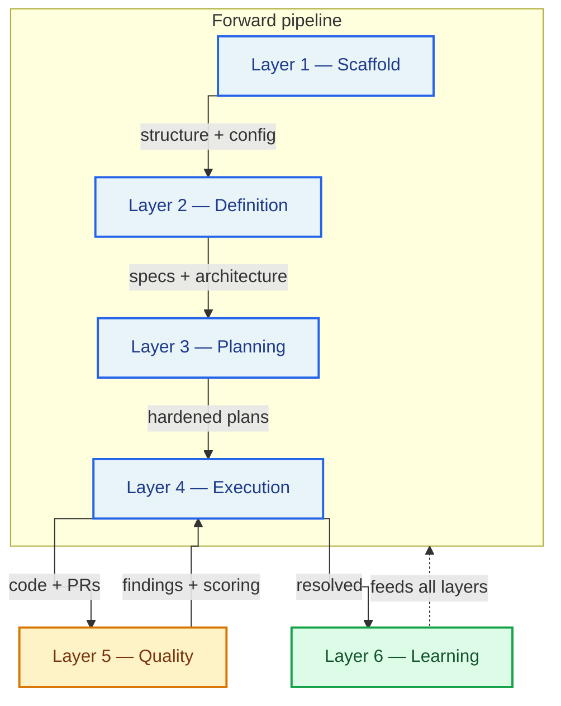
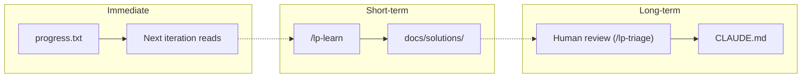

# Methodology

> **The agentic coding harness that gives AI full context about your codebase, runs it in structured loops, and enforces quality before anything reaches `main`.**

AI coding tools are powerful. Without structure, they're a trap.

You prompt an agent to build a feature. It generates code that looks right — until you discover it hallucinated an API, ignored your existing patterns, or duplicated a utility that already exists. You fix it, start a new session, and the agent has forgotten everything. No specs. No guardrails. No memory. Just vibes.

The best practices exist. Spec-driven development. Compound loops with fresh context. Structure enforcement. Automated quality gates. Context engineering via CLAUDE.md. They're scattered across blog posts, repos, and conference talks. You know you should set them up. You haven't had time.

LaunchPad is an AI coding harness where all of it is already wired in and working. Install the plugin into any repository, run `/lp-kickoff`, and start building with an AI workflow that has specs, guardrails, autonomous execution loops, pre-commit hooks, CI pipelines, and automated code review — from the first commit.

For the day-to-day workflow guide, see [How It Works](HOW_IT_WORKS.md).

---

**Contents:**

- [The six-layer model](#the-six-layer-model)
- [The four meta-orchestrators](#the-four-meta-orchestrators)
- [Design principles](#design-principles)
- [Why Claude Code](#why-claude-code)
- [The agent fleet](#the-agent-fleet)
- [The command roster](#the-command-roster)
- [Skill creation infrastructure](#skill-creation-infrastructure)
- [Inspirations and credits](#inspirations-and-credits)

---

## The six-layer model

LaunchPad organizes AI-assisted development into six layers. Each layer addresses a specific failure mode of unstructured AI coding. They build on each other sequentially — scaffold provides runtime infrastructure, definition produces specs, planning converts specs into hardened plans, execution builds and ships, quality catches mistakes through multi-agent review and confidence scoring, and learning feeds improvements back into every layer.



The first four layers form a forward pipeline. Layer 5 (Quality) creates a tight feedback loop with Layer 4 (Execution) — review findings are resolved and re-validated before shipping. Layer 6 (Learning) wraps everything, extracting knowledge from resolved problems and feeding it back into future cycles.

| Layer             | What it does                                                                                  | Key artifacts                                                                            |
| ----------------- | --------------------------------------------------------------------------------------------- | ---------------------------------------------------------------------------------------- |
| 1. **Scaffold**   | Runtime directories, agent configuration, stack-adapted commands, structure drift detection   | `.harness/`, `.launchpad/agents.yml`, `.launchpad/config.yml`, `.launchpad/audit.log`    |
| 2. **Definition** | Brainstorming, product definition, design system, architecture docs, section shaping          | `docs/architecture/`, `docs/tasks/sections/`, `docs/brainstorms/`, `SECTION_REGISTRY.md` |
| 3. **Planning**   | Design workflow, implementation planning, plan hardening, human approval gate                 | Plan files, `.harness/design-artifacts/`, hardening notes                                |
| 4. **Execution**  | Autonomous build, multi-agent review, finding resolution, browser testing, shipping, learning | Feature branches, PRs, `.harness/todos/`, `docs/solutions/`                              |
| 5. **Quality**    | Confidence scoring, false-positive suppression, plan hardening agents, merge prevention       | `.harness/review-summary.md`, `.harness/observations/`                                   |
| 6. **Learning**   | 5-agent research pipeline, compound-docs taxonomy, solution documentation                     | `docs/solutions/`, `progress.txt`, `CLAUDE.md`                                           |

For the command-level detail of each layer, see [How It Works → The four meta-orchestrators](HOW_IT_WORKS.md#the-four-meta-orchestrators).

---

## The four meta-orchestrators

Four meta-orchestrators chain the layers into end-to-end workflows. Each owns a phase of the lifecycle and checks status before proceeding — so you can invoke any one independently when resuming work.

| Meta-orchestrator | Layers | What it chains                                                                                         |
| ----------------- | ------ | ------------------------------------------------------------------------------------------------------ |
| `/lp-kickoff`     | 2      | `/lp-brainstorm` (research agents + design document capture)                                           |
| `/lp-define`      | 4      | `/lp-define-product` → `/lp-define-design` → `/lp-define-architecture` → `/lp-shape-section`           |
| `/lp-plan`        | 3      | design → `/lp-pnf` → `/lp-harden-plan` → human approval                                                |
| `/lp-build`       | 6      | `/lp-inf` → `/lp-review` → `/lp-resolve-todo-parallel` → `/lp-test-browser` → `/lp-ship` → `/lp-learn` |

Each orchestrator works against a **status contract** — every section progresses through a strict chain:

```
defined → shaped → designed / "design:skipped" → planned → hardened → approved → reviewed → built
```

The orchestrator reads status from the section spec's YAML frontmatter, routes to the appropriate step, and refuses to run if the section is not at the expected stage.

---

## Design principles

Five principles guided the design. Together they form a system where AI agents can work autonomously at high tempo, but cannot silently produce low-quality or unsafe output.

### 1. Status contract over free-form state

Every section has a tracked status, and every meta-orchestrator validates that status plus the artifacts that status implies. Re-running a command produces identical results if nothing else changed. This eliminates whole classes of "the AI thinks we're in state X but we're actually in state Y" bugs.

### 2. Fresh-context execution loops

Each loop iteration (`loop.sh` inside `/lp-inf`) runs in a **fresh AI context**. Memory persists via git commits and state files (`prd.json`, `progress.txt`), not conversation history. This prevents context drift across long sessions — a 25-iteration run doesn't degrade into confusion because every iteration starts clean.

### 3. Confidence scoring, not false-positive avalanches

`/lp-review` dispatches 7+ review agents in parallel. Raw output would bury real issues under generic advice. Instead, every finding is scored (0.00–1.00) with boosters for multi-agent agreement and security concerns, and suppressed below a 0.60 threshold — with audit trail. A P1 floor ensures critical findings are never auto-suppressed.

### 4. Multi-layer merge prevention

No automated merge ever happens. Four layers enforce this:

1. **Command prohibition** — `/lp-ship` and `/lp-commit` explicitly refuse to run `gh pr merge` or `git merge main`.
2. **PreToolUse hook** — `.claude/hooks/block-merges.sh` intercepts merge, force-push, and approve commands at the tool level before execution.
3. **GitHub branch protection** — server-side rules requiring approvals.
4. **Destructive Command Guard (recommended companion)** — [dcg](https://github.com/Dicklesworthstone/destructive_command_guard) is a third-party `PreToolUse` hook that pattern-matches against destructive shell commands (`rm -rf`, `git reset --hard`, `DROP TABLE`, etc.) that LaunchPad's built-in hook does not cover. Strongly recommended whenever `--dangerously-skip-permissions` is in play. See [SECURITY.md](../../SECURITY.md#recommended-companion-destructive-command-guard-dcg).

Autonomous execution is further gated by an acknowledgment file (`.launchpad/autonomous-ack.md`, must be tracked in git before `/lp-build` runs) and a content-hash audit that records every invocation in `.launchpad/audit.log` with a hash of the canonical commands block.

### 5. Compound learning

Each unit of work should make future work easier — not harder. Knowledge flows through a **three-tier knowledge system** — Immediate, Short-term, and Long-term — from transient per-iteration notes to permanent project rules:



1. **First occurrence** — problem takes 30 minutes to research and solve.
2. **Document** — `/lp-learn` extracts structured learnings (automatic, 5 sub-agents in parallel).
3. **Next occurrence** — AI reads `docs/solutions/` during planning and recognizes the pattern in seconds.
4. **Promotion** — valuable patterns graduate into `CLAUDE.md` via human review; all future sessions start with the pattern pre-loaded.

The loop has one human-invoked inflection point: **`/lp-triage`**. Review findings land in `.harness/todos/` automatically, but they don't become learnings until you run `/lp-triage` and explicitly route each one toward fix, drop, or defer. Without that step, findings pile up without direction. With it, every cycle feeds the next one better than the last — which is the whole point of "compound" learning.

A 30-minute fix becomes a seconds-long pattern match on the next occurrence, and eventually a rule that prevents the problem entirely.

#### Optional fourth tier — MemPalace

The three tiers above (Immediate, Short-term, Long-term) cover the cases where structured artifacts can encode the knowledge: progress notes, structured solution docs, and project-wide principles. None of them cover **verbatim transcript recall** — being able to ask "what did we say three sessions ago about authentication?" and get the conversation back.

For that gap, LaunchPad recommends pairing with [MemPalace](https://github.com/MemPalace/mempalace) as an optional fourth tier. MemPalace indexes session transcripts and project files into a local vector store, exposing 19 retrieval tools over an MCP server. It does not replace any of the three core tiers; it adds raw transcript retrieval alongside them.

This is a recommended pairing, not a dependency. LaunchPad does not bundle MemPalace, does not auto-install it, and runs identically without it. Setup cookbook: [docs/guides/MEMPALACE_INTEGRATION.md](MEMPALACE_INTEGRATION.md).

---

## Why Claude Code

LaunchPad's source of truth is a **Claude Code plugin**. That's a deliberate scope choice — but not because the primitives are Claude-only. As of 2026, all three major AI coding CLIs have similar primitives:

| Primitive                      | Claude Code | Codex                      | Gemini CLI                             |
| ------------------------------ | ----------- | -------------------------- | -------------------------------------- |
| Plugin system with marketplace | ✓           | ✓ (`codex plugin`)         | ✓ (`gemini extensions`)                |
| Slash commands                 | ✓ markdown  | ✓ (deprecated for skills)  | ✓ TOML only                            |
| Parallel sub-agent dispatch    | ✓ `Task`    | ✓ (`agents.max_threads=6`) | ✓ (experimental, March 2026)           |
| Skills (`SKILL.md`)            | ✓           | ✓ (same format)            | ✓ (via extensions)                     |
| Agent-persona files            | ✓ md + YAML | ✓ TOML                     | ✓ md + YAML (near-identical to Claude) |
| Context file                   | `CLAUDE.md` | `AGENTS.md`                | `GEMINI.md` with `@imports`            |

So _portability_ is achievable — the formats differ, but the capabilities are there.

The reason LaunchPad is Claude-first is **development focus**, not primitive availability. A single codebase shipping to three marketplaces with three manifest formats, TOML-vs-markdown agent conversions, and tool-specific slash-command namespacing is a significant maintenance tax. We chose to build LaunchPad well in one ecosystem first, rather than spread thin across three.

### What this means in practice

- **Claude Code users** get the full plugin experience — 38 slash commands, 36 sub-agents, 16 skills, and all the parallel orchestration `Task` enables.
- **Codex / Gemini / Cursor / other CLI users** can still use LaunchPad via the [bridge pattern in `AGENTS.md`](../../AGENTS.md) — the template scaffold, the architecture docs, and plain-file command invocation (_"read `plugins/launchpad/commands/lp-<name>.md` and follow it"_). About 70% of LaunchPad's value is accessible this way.
- **The ~30% gap** is the loss of true parallel sub-agent dispatch — in non-Claude CLIs, a `/lp-review` that would normally fan out 7+ specialized reviewers collapses into a single generalist review. Output looks complete, but per-specialist perspectives (security, performance, TypeScript, architecture, testing, etc.) are diluted.

### v1.1 roadmap: Codex overlay

A **Codex overlay generator** is scoped for v1.1. Source of truth stays as the Claude Code plugin; a build script produces `.codex-plugin/plugin.json` and TOML-converted sub-agents for Codex. The pattern is proven by projects like [`alexei-led/cc-thingz`](https://github.com/alexei-led/cc-thingz). This closes the 30% gap for Codex users so they get real parallel dispatch through Codex's native subagent system — no more degradation.

**Gemini overlay is deferred.** Gemini support is not blocked technically — the same generator pattern extends to `gemini-extension.json` with TOML commands and Gemini-format sub-agents — but usage demand and development bandwidth justify focusing v1.1 on Codex alone. Gemini users today can still invoke LaunchPad via the `AGENTS.md` bridge pattern (with `AGENTS.md` manually added to Gemini's `context.fileName`), accepting the same parallel-dispatch degradation that applies cross-tool until a full overlay ships.

### The honest framing

**LaunchPad is Claude Code-first by development choice, with a best-effort cross-tool bridge today and a Codex overlay planned for v1.1.** Template-path users get tool-neutral scaffold value regardless of which AI they use. Claude Code users get the full agentic experience via the plugin. Codex users get a degraded-but-functional experience today via `AGENTS.md` pointers, and a native-parity experience in v1.1. Gemini and other CLI users continue to use the `AGENTS.md` bridge indefinitely, with a Gemini overlay on the long-term roadmap if demand warrants.

---

## The agent fleet

LaunchPad ships ~36 agents across six namespaces. The fleet is read from `.launchpad/agents.yml` at command time, so downstream projects can tune the roster (add custom reviewers, drop agents they don't need) without forking the plugin.

### Two-wave research pattern

Whenever LaunchPad needs to understand a codebase (during `/lp-define`, `/lp-pnf`, `/lp-harden-plan`, and `/lp-research-codebase`), it organizes sub-agents in a two-wave orchestration. This ordering ensures the expensive Read-heavy agents only fire against paths the fast locators actually found — preventing wasted context tokens on files nothing pointed at.

**Wave 1 — Discovery** (parallel, fast, Grep/Glob/LS only — no file reads):

- `file-locator` — finds relevant source files
- `docs-locator` — finds relevant docs by frontmatter, date-prefixed filenames, directory structure
- `pattern-finder` — identifies recurring code patterns
- `web-researcher` — gathers external context

**Wave 2 — Analysis** (parallel, waits for Wave 1):

- `code-analyzer` — deep analysis of architecture using the paths Wave 1 returned
- `docs-analyzer` — extracts decisions, rejected approaches, constraints, promoted patterns

The pattern is adapted from HumanLayer's context-engineering work (see [Inspirations and credits](#inspirations-and-credits)).

### research/ (8 agents)

Read-only documentarians. Dispatched during definition, planning, and hardening to gather codebase and documentation context.

| Agent                  | Purpose                                                                               |
| ---------------------- | ------------------------------------------------------------------------------------- |
| `file-locator`         | Find source files (Grep/Glob/LS only)                                                 |
| `code-analyzer`        | Deep analysis with file:line precision (Read)                                         |
| `pattern-finder`       | Find existing patterns to model after                                                 |
| `docs-locator`         | Find docs by frontmatter, date-prefixed filenames, directory structure                |
| `docs-analyzer`        | Extract decisions, rejected approaches, constraints from docs                         |
| `web-researcher`       | External documentation, API references                                                |
| `learnings-researcher` | Search `docs/solutions/` by frontmatter metadata                                      |
| `skill-evaluator`      | 3-pass quality evaluation (first-principles, baseline detection, Anthropic checklist) |

### review/ (13 agents)

Dispatched by `/lp-review` in parallel with confidence scoring.

| Agent                                                                                                                                                                   | Dispatch condition                 |
| ----------------------------------------------------------------------------------------------------------------------------------------------------------------------- | ---------------------------------- |
| `pattern-finder` / `security-auditor` / `kieran-foad-ts-reviewer` / `performance-auditor` / `code-simplicity-reviewer` / `architecture-strategist` / `testing-reviewer` | Always                             |
| `schema-drift-detector`                                                                                                                                                 | Prisma changes (runs first)        |
| `data-migration-auditor` / `data-integrity-auditor`                                                                                                                     | Prisma changes (with drift report) |
| `spec-flow-analyzer` / `frontend-races-reviewer`                                                                                                                        | Plan hardening                     |
| `deployment-verification-agent`                                                                                                                                         | Opt-in                             |

### document-review/ (7 agents)

Dispatched by `/lp-harden-plan` Step 3.5 to stress-test plans at the document level.

- `adversarial-document-reviewer` — red-team attack on plan assumptions
- `coherence-reviewer` — internal consistency, logical flow
- `feasibility-reviewer` — technical feasibility, resource estimation
- `scope-guardian-reviewer` — scope creep detection
- `product-lens-reviewer` — product strategy alignment
- `security-lens-reviewer` — security implications in plan design
- `design-lens-reviewer` — UI/design alignment (conditional: UI sections only)

### resolve/ (2 agents)

- `harness-todo-resolver` — fix individual review findings from `.harness/todos/`
- `pr-comment-resolver` — batch-resolve unresolved PR review comments

### design/ (6 agents)

- `design-ui-auditor` — 5 quick checks with P1/P2/P3 severity
- `design-responsive-auditor` — 6 responsive checks
- `design-alignment-checker` — 14-dimension audit against `DESIGN_SYSTEM.md`
- `design-implementation-reviewer` — Figma comparison (report-only, conditional on Figma URL)
- `design-iterator` — iterative screenshot-analyze-improve (ONE change per cycle)
- `figma-design-sync` — sync implementation with Figma designs via Figma MCP

### skills/ (1 agent)

- `skill-evaluator` — 3-pass quality evaluation for `/lp-create-skill` and `/lp-update-skill`

---

## The command roster

LaunchPad ships 38 human-facing slash commands organized by lifecycle phase. The four meta-orchestrators chain the others — but every command below can be invoked standalone when you're resuming work or targeting a specific step.

### Meta-orchestrators

| Command       | Layer | What it chains                                                                                         |
| ------------- | ----- | ------------------------------------------------------------------------------------------------------ |
| `/lp-kickoff` | 2     | `/lp-brainstorm` → hand-off to `/lp-define`                                                            |
| `/lp-define`  | 2     | `/lp-define-product` → `/lp-define-design` → `/lp-define-architecture` → `/lp-shape-section`           |
| `/lp-plan`    | 3     | design → `/lp-pnf` → `/lp-harden-plan` → human approval                                                |
| `/lp-build`   | 4–6   | `/lp-inf` → `/lp-review` → `/lp-resolve-todo-parallel` → `/lp-test-browser` → `/lp-ship` → `/lp-learn` |

### Definition

| Command                    | Layer | What it does                                                                       |
| -------------------------- | ----- | ---------------------------------------------------------------------------------- |
| `/lp-brainstorm`           | 2     | Collaborative brainstorming with research agents and design document capture       |
| `/lp-define-product`       | 2     | Interactive wizard → `PRD.md` + `TECH_STACK.md` + section registry                 |
| `/lp-define-design`        | 2     | Interactive wizard → `DESIGN_SYSTEM.md` + `APP_FLOW.md` + `FRONTEND_GUIDELINES.md` |
| `/lp-define-architecture`  | 2     | Interactive wizard → `BACKEND_STRUCTURE.md` + `CI_CD.md`                           |
| `/lp-shape-section [name]` | 2     | Deep-dive into a product section → `docs/tasks/sections/[name].md`                 |
| `/lp-update-spec`          | 2     | Scan spec files for gaps, TBDs, inconsistencies → fix them                         |

### Planning

| Command                  | Layer | What it does                                                |
| ------------------------ | ----- | ----------------------------------------------------------- |
| `/lp-pnf [section]`      | 3     | Plan Next Feature from section spec → implementation plan   |
| `/lp-harden-plan [path]` | 3     | Stress-test plan with code + document review agents         |
| `/lp-design-review`      | 3     | Comprehensive quality audit and design critique             |
| `/lp-design-polish`      | 3     | Pre-ship refinement (alignment, spacing, copy, consistency) |
| `/lp-design-onboard`     | 3     | Design onboarding flows, empty states, first-time UX        |
| `/lp-copy`               | 3     | Read copy brief from section spec and provide copy context  |
| `/lp-copy-review`        | 3     | Dispatch copy review agents from `agents.yml`               |
| `/lp-feature-video`      | 3     | Record walkthrough → screenshots → MP4+GIF → upload         |

### Execution

| Command                   | Layer | What it does                                                                       |
| ------------------------- | ----- | ---------------------------------------------------------------------------------- |
| `/lp-inf`                 | 4     | Build pipeline: branch → PRD → tasks → execution loop (add `--dry-run` to preview) |
| `/lp-implement-plan`      | 4     | Execute plan phase by phase with checkpoints                                       |
| `/lp-commit`              | 4     | Interactive commit with quality gates and 3-gate PR monitoring                     |
| `/lp-ship`                | 4     | Quality gates → commit → PR → CI monitoring. Never merges.                         |
| `/lp-resolve-pr-comments` | 4     | Batch-resolve unresolved PR review comments                                        |

### Review & resolution

| Command                     | Layer | What it does                                                                                          |
| --------------------------- | ----- | ----------------------------------------------------------------------------------------------------- |
| `/lp-review`                | 4–5   | Multi-agent code review with confidence scoring                                                       |
| `/lp-resolve-todo-parallel` | 4     | Parallel finding resolution (max 5 agents)                                                            |
| `/lp-test-browser`          | 4     | Browser testing for UI routes affected by changes                                                     |
| `/lp-triage`                | 5     | Interactive triage: fix / drop / defer — **the human inflection point in the compound-learning loop** |

### Learning & maintenance

| Command                  | Layer | What it does                                                     |
| ------------------------ | ----- | ---------------------------------------------------------------- |
| `/lp-learn`              | 6     | 5-agent parallel research → structured solution doc              |
| `/lp-regenerate-backlog` | 6     | Regenerate `BACKLOG.md` from deferred observations               |
| `/lp-defer`              | 6     | Manually add a task to the project backlog                       |
| `/lp-memory-report`      | 6     | Update session memory files and create a detailed session report |

### Skill & agent infrastructure

| Command                    | What it does                                                  |
| -------------------------- | ------------------------------------------------------------- |
| `/lp-create-skill [topic]` | 7-phase Meta-Skill Forge                                      |
| `/lp-update-skill [name]`  | Iterate on existing skill                                     |
| `/lp-port-skill [source]`  | Port external skill into LaunchPad format                     |
| `/lp-create-agent`         | Create a new agent or convert an existing skill into an agent |

### Utilities

| Command                 | What it does                                                  |
| ----------------------- | ------------------------------------------------------------- |
| `/lp-hydrate`           | Session bootstrapping with minimal context                    |
| `/lp-research-codebase` | Two-wave research → `docs/reports/` (input for `/lp-inf`)     |
| `/lp-pull-launchpad`    | Pull upstream LaunchPad scaffold updates (template path only) |

---

## Skill creation infrastructure

LaunchPad ships the infrastructure to create, port, and update domain-specific AI skills — not pre-built skills for specific domains. Every downstream project can create its own skills from day one.

### `/lp-create-skill` — Meta-Skill Forge

A 7-phase methodology:

| Phase                    | What happens                                          |
| ------------------------ | ----------------------------------------------------- |
| 1. Context Ingestion     | Two-wave sub-agent research (Discovery → Analysis)    |
| 2. Targeted Extraction   | 4 collaborative rounds with the user                  |
| 3. Contrarian Analysis   | Write out generic version, then engineer away from it |
| 4. Architecture Decision | Route to Simple / Moderate / Full complexity          |
| 5. Write the Skill       | Produce `SKILL.md` orchestrator + reference files     |
| 6. Quality Validation    | Recursive evaluation loop (max 3 cycles, 16 criteria) |
| 7. Ship It               | Generate evals, register in `CLAUDE.md`               |

### `/lp-port-skill` — External skill import

4-phase workflow: Ingest → Adapt → Validate → Register. Fully detaches from source after import.

### `/lp-update-skill` — Iterative improvement

Reads existing skill files, performs delta analysis, re-runs relevant Forge phases.

### `/lp-create-agent` — Agent creation

Companion command to the skill tooling: creates a new sub-agent (or converts an existing skill into one) with the correct frontmatter, dispatch conditions, and `.launchpad/agents.yml` wiring. Uses the `lp-creating-agents` skill.

---

## Inspirations and credits

LaunchPad stands on the shoulders of several excellent projects and frameworks. The synthesis is LaunchPad's contribution; the primitives are theirs.

### Compound Engineering Plugin

**By:** Kieran Klaassen / Every — [EveryInc/compound-engineering-plugin](https://github.com/EveryInc/compound-engineering-plugin)

The compounding philosophy and structured learning capture system. All 29 agents, 22 commands, and 19 skills from the CE plugin have been ported natively into LaunchPad. The `docs/solutions/` pattern, the learnings extraction pipeline, and the WRONG/CORRECT anti-pattern format are CE's. The plugin is no longer required as a separate installation — its capabilities are built in.

### Compound Product

**By:** Ryan Carson — [snarktank/compound-product](https://github.com/snarktank/compound-product)

The core pipeline: report → analysis → PRD → tasks → autonomous loop → PR. Adapted into `scripts/compound/` (template path) with significant modifications.

### Ralph

**By:** Ryan Carson — [snarktank/ralph](https://github.com/snarktank/ralph) — and **Geoffrey Huntley** — [ghuntley.com/ralph](https://ghuntley.com/ralph/)

The autonomous execution loop concept — fresh context per iteration, git as memory. LaunchPad's `loop.sh` and the entire fresh-context principle come from this lineage.

### HumanLayer

**By:** [humanlayer/humanlayer](https://github.com/humanlayer/humanlayer)

Context-engineering patterns: Research → Plan → Implement workflow, the locator/analyzer agent pair pattern, and two-wave orchestration (Discovery parallel, Analysis parallel-waits-for-Discovery).

### Spec-Driven Development

**Inspired by:** Thoughtworks Technology Radar, GitHub SpecKit, AWS Kiro

The philosophy of "specify before building." LaunchPad's implementation produces project-level canonical documents (PRD, design system, app flow, backend structure, CI/CD) that persist and evolve, and every AI session starts with them loaded via `CLAUDE.md`.

---

## Related

- [README](../../README.md)
- [How It Works](HOW_IT_WORKS.md) — day-to-day operator's manual
- [Repository Structure](../architecture/REPOSITORY_STRUCTURE.md) — file-placement decision tree (template path)
- [Release notes](../releases/v1.0.0.md)
