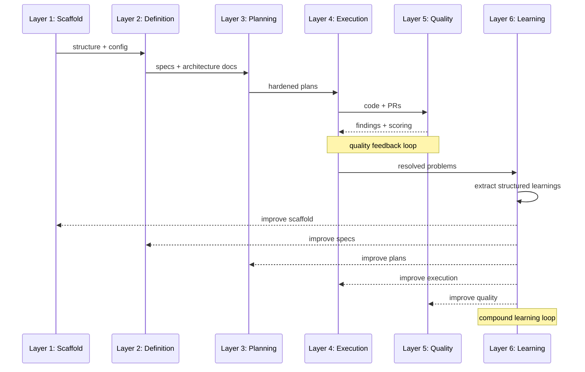
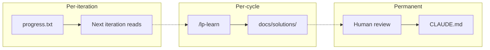

# Methodology

AI coding tools are powerful. Without structure, they're a trap.

You prompt an agent to build a feature. It generates code that looks right — until you discover it hallucinated an API, ignored your existing patterns, or duplicated a utility that already exists. You fix it, start a new session, and the agent has forgotten everything. No specs. No guardrails. No memory. Just vibes.

The best practices exist. Spec-driven development. Compound loops with fresh context. Structure enforcement. Automated quality gates. Context engineering via CLAUDE.md. They're scattered across blog posts, repos, and conference talks. You know you should set them up. You haven't had time.

LaunchPad is an AI coding harness where all of it is already wired in and working. Install the plugin into any repository, run `/lp-kickoff`, and start building with an AI workflow that has specs, guardrails, autonomous execution loops, pre-commit hooks, CI pipelines, and automated code review — from the first commit.

For the day-to-day workflow guide, see [How It Works](HOW_IT_WORKS.md).

---

**Contents:**

- [The six-layer model](#the-six-layer-model)
- [The four meta-orchestrators](#the-four-meta-orchestrators)
- [Design principles](#design-principles)
- [The agent fleet](#the-agent-fleet)
- [Skill creation infrastructure](#skill-creation-infrastructure)
- [Inspirations and credits](#inspirations-and-credits)

---

## The six-layer model

LaunchPad organizes AI-assisted development into six layers. Each layer addresses a specific failure mode of unstructured AI coding. They build on each other sequentially — scaffold provides runtime infrastructure, definition produces specs, planning converts specs into hardened plans, execution builds and ships, quality catches mistakes through multi-agent review and confidence scoring, and learning feeds improvements back into every layer.



The first four layers form a forward pipeline. Layer 5 (Quality) creates a tight feedback loop with Layer 4 (Execution) — review findings are resolved and re-validated before shipping. Layer 6 (Learning) wraps everything, extracting knowledge from resolved problems and feeding it back into future cycles.

| Layer             | What it does                                                                                  | Key artifacts                                                                            |
| ----------------- | --------------------------------------------------------------------------------------------- | ---------------------------------------------------------------------------------------- |
| 1. **Scaffold**   | Runtime directories, agent configuration, stack-adapted commands, structure drift detection   | `.harness/`, `.launchpad/agents.yml`, `.launchpad/config.yml`, `.launchpad/audit.log`    |
| 2. **Definition** | Brainstorming, product definition, design system, architecture docs, section shaping          | `docs/architecture/`, `docs/tasks/sections/`, `docs/brainstorms/`, `SECTION_REGISTRY.md` |
| 3. **Planning**   | Design workflow, implementation planning, plan hardening, human approval gate                 | Plan files, `.harness/design-artifacts/`, hardening notes                                |
| 4. **Execution**  | Autonomous build, multi-agent review, finding resolution, browser testing, shipping, learning | Feature branches, PRs, `.harness/todos/`, `docs/solutions/`                              |
| 5. **Quality**    | Confidence scoring, false-positive suppression, plan hardening agents, merge prevention       | `.harness/review-summary.md`, `.harness/observations/`                                   |
| 6. **Learning**   | 5-agent research pipeline, compound-docs taxonomy, solution documentation                     | `docs/solutions/`, `progress.txt`, `CLAUDE.md`                                           |

For the command-level detail of each layer, see [How It Works → The four meta-orchestrators](HOW_IT_WORKS.md#the-four-meta-orchestrators).

**Kernel posture extends to consumers (v2.1.2+)**: prior to v2.1.2, the lefthook gates that protect Layer 1 ran only against LaunchPad's own commits — an inward-facing posture. At v2.1.2 the same gate philosophy propagates outward: stack adapters can contribute pre-commit/pre-push gates that scaffold into consumer repositories, so a `/lp-define`-generated project inherits the harness's "fail loud, fix at commit time" stance instead of waiting for CI to catch what the kernel could have caught locally. See [CI_CD.md → Consumer Python gates](../architecture/CI_CD.md#consumer-python-gates) for the gate inventory and per-stack opt-out paths.

---

## The four meta-orchestrators

Four meta-orchestrators chain the layers into end-to-end workflows. Each owns a phase of the lifecycle and checks status before proceeding — so you can invoke any one independently when resuming work.

| Meta-orchestrator | Layers | What it chains                                                                                         |
| ----------------- | ------ | ------------------------------------------------------------------------------------------------------ |
| `/lp-kickoff`     | 2      | `/lp-brainstorm` (research agents + design document capture)                                           |
| `/lp-define`      | 2      | `/lp-define-product` → `/lp-define-design` → `/lp-define-architecture` → `/lp-shape-section`           |
| `/lp-plan`        | 3      | design → `/lp-pnf` → `/lp-harden-plan` → human approval                                                |
| `/lp-build`       | 4–6    | `/lp-inf` → `/lp-review` → `/lp-resolve-todo-parallel` → `/lp-test-browser` → `/lp-ship` → `/lp-learn` |

Each orchestrator works against a **status contract** — every section progresses through a strict chain:

```
defined → shaped → designed / "design:skipped" → planned → hardened → approved → reviewed → built
```

The orchestrator reads status from the section spec's YAML frontmatter, routes to the appropriate step, and refuses to run if the section is not at the expected stage.

---

## Design principles

Five principles guided the design. Together they form a system where AI agents can work autonomously at high tempo, but cannot silently produce low-quality or unsafe output.

### 1. Status contract over free-form state

Every section has a tracked status, and every meta-orchestrator validates that status plus the artifacts that status implies. Re-running a command produces identical results if nothing else changed. This eliminates whole classes of "the AI thinks we're in state X but we're actually in state Y" bugs.

### 2. Fresh-context execution loops

Each loop iteration (`loop.sh` inside `/lp-inf`) runs in a **fresh AI context**. Memory persists via git commits and state files (`prd.json`, `progress.txt`), not conversation history. This prevents context drift across long sessions — a 25-iteration run doesn't degrade into confusion because every iteration starts clean.

### 3. Confidence scoring, not false-positive avalanches

`/lp-review` dispatches 7+ review agents in parallel. Raw output would bury real issues under generic advice. Instead, every finding is scored (0.00–1.00) with boosters for multi-agent agreement and security concerns, and suppressed below a 0.60 threshold — with audit trail. A P1 floor ensures critical findings are never auto-suppressed.

### 4. Multi-layer merge prevention

No automated merge ever happens. Three layers enforce this:

1. **Command prohibition** — `/lp-ship` and `/lp-commit` explicitly refuse to run `gh pr merge` or `git merge main`.
2. **PreToolUse hook** — intercepts merge commands at the tool level.
3. **GitHub branch protection** — server-side rules requiring approvals.

Autonomous execution is further gated by `.launchpad/autonomous-ack.md` (D8, must exist in the repo before `/lp-build` runs) and a content-hash audit (D3) that records every invocation in `.launchpad/audit.log`.

### 5. Compound learning

Each unit of work should make future work easier — not harder. `/lp-learn` spawns 5 parallel sub-agents after every cycle, extracting structured learnings into `docs/solutions/`. These flow through a three-tier knowledge system:



A 30-minute fix becomes a seconds-long pattern match on next occurrence, and eventually a pre-loaded rule that prevents the problem entirely:

1. **First occurrence** — problem takes 30 minutes to research and solve.
2. **Document** — `/lp-learn` extracts structured learnings (automatic).
3. **Next occurrence** — AI reads `docs/solutions/` during planning and recognizes the pattern (seconds).
4. **Promotion** — valuable patterns graduate into `CLAUDE.md`; all future sessions start with the pattern pre-loaded.

### 6. Provider-profile inheritance for external-infrastructure preflight

External-infrastructure prerequisites (deploy provider account, project, GitHub Secrets, DNS, custom domain) are gated at the front of the autonomous flow via `lp_preflight.py` (BL-364, v2.1.7). The mechanism mirrors the autonomous-ack gate (BL-356): surface the requirement before the costly autonomous work starts, refuse with an actionable message until resolved, then proceed.

The design separates the engine from provider knowledge. The engine knows only four check categories (auto-detect-silent, API-verified-with-credentials, user-confirmed-with-probe, user-confirmed-trust-only) plus the dispatch rules between them. Each provider ships its own profile YAML under `plugins/launchpad/preflight-profiles/<name>.yaml` listing the checks for that provider's surface (account, token, project, secrets, DNS, analytics, etc.) with per-check default stale windows. A consuming project's `.launchpad/preflight.config.yaml` declares which profiles to apply plus per-item overrides; adding a new provider equals adding a profile YAML, with zero changes to the engine.

The same gate fires at `/lp-build` Step 0.6 (before entering `/lp-inf`) AND `/lp-ship` Step 0.6 (before any quality-gate work) so the direct-invocation bypass path cannot avoid the prerequisite verification. Standalone usage: `/lp-preflight`. The user-facing surface is `.launchpad/preflight-checklist.md`, gitignored by default; ticking the `- [ ]` boxes for C1/C2 items records a `Last confirmed: <iso-timestamp>` line that the engine re-reads on subsequent runs and re-prompts when the configured stale window has elapsed.

---

## The agent fleet

LaunchPad ships ~36 agents across six namespaces. The fleet is read from `.launchpad/agents.yml` at command time, so downstream projects can tune the roster (add custom reviewers, drop agents they don't need) without forking the plugin.

### research/ (8 agents)

Read-only documentarians. Dispatched during definition, planning, and hardening to gather codebase and documentation context.

| Agent                  | Purpose                                                                               |
| ---------------------- | ------------------------------------------------------------------------------------- |
| `file-locator`         | Find source files (Grep/Glob/LS only)                                                 |
| `code-analyzer`        | Deep analysis with file:line precision (Read)                                         |
| `pattern-finder`       | Find existing patterns to model after                                                 |
| `docs-locator`         | Find docs by frontmatter, date-prefixed filenames, directory structure                |
| `docs-analyzer`        | Extract decisions, rejected approaches, constraints from docs                         |
| `web-researcher`       | External documentation, API references                                                |
| `learnings-researcher` | Search `docs/solutions/` by frontmatter metadata                                      |
| `skill-evaluator`      | 3-pass quality evaluation (first-principles, baseline detection, Anthropic checklist) |

### review/ (13 agents)

Dispatched by `/lp-review` in parallel with confidence scoring.

| Agent                                                                                                                                                                   | Dispatch condition                 |
| ----------------------------------------------------------------------------------------------------------------------------------------------------------------------- | ---------------------------------- |
| `pattern-finder` / `security-auditor` / `kieran-foad-ts-reviewer` / `performance-auditor` / `code-simplicity-reviewer` / `architecture-strategist` / `testing-reviewer` | Always                             |
| `schema-drift-detector`                                                                                                                                                 | Prisma changes (runs first)        |
| `data-migration-auditor` / `data-integrity-auditor`                                                                                                                     | Prisma changes (with drift report) |
| `spec-flow-analyzer` / `frontend-races-reviewer`                                                                                                                        | Plan hardening                     |
| `deployment-verification-agent`                                                                                                                                         | Opt-in                             |

### document-review/ (7 agents)

Dispatched by `/lp-harden-plan` Step 3.5 to stress-test plans at the document level.

- `adversarial-document-reviewer` — red-team attack on plan assumptions
- `coherence-reviewer` — internal consistency, logical flow
- `feasibility-reviewer` — technical feasibility, resource estimation
- `scope-guardian-reviewer` — scope creep detection
- `product-lens-reviewer` — product strategy alignment
- `security-lens-reviewer` — security implications in plan design
- `design-lens-reviewer` — UI/design alignment (conditional: UI sections only)

### resolve/ (2 agents)

- `harness-todo-resolver` — fix individual review findings from `.harness/todos/`
- `pr-comment-resolver` — batch-resolve unresolved PR review comments

### design/ (6 agents)

- `design-ui-auditor` — 5 quick checks with P1/P2/P3 severity
- `design-responsive-auditor` — 6 responsive checks
- `design-alignment-checker` — 14-dimension audit against `DESIGN_SYSTEM.md`
- `design-implementation-reviewer` — Figma comparison (report-only, conditional on Figma URL)
- `design-iterator` — iterative screenshot-analyze-improve (ONE change per cycle)
- `figma-design-sync` — sync implementation with Figma designs via Figma MCP

### skills/ (1 agent)

- `skill-evaluator` — 3-pass quality evaluation for `/lp-create-skill` and `/lp-update-skill`

---

## Skill creation infrastructure

LaunchPad ships the infrastructure to create, port, and update domain-specific AI skills — not pre-built skills for specific domains. Every downstream project can create its own skills from day one.

### `/lp-create-skill` — Meta-Skill Forge

A 7-phase methodology:

| Phase                    | What happens                                          |
| ------------------------ | ----------------------------------------------------- |
| 1. Context Ingestion     | Two-wave sub-agent research (Discovery → Analysis)    |
| 2. Targeted Extraction   | 4 collaborative rounds with the user                  |
| 3. Contrarian Analysis   | Write out generic version, then engineer away from it |
| 4. Architecture Decision | Route to Simple / Moderate / Full complexity          |
| 5. Write the Skill       | Produce `SKILL.md` orchestrator + reference files     |
| 6. Quality Validation    | Recursive evaluation loop (max 3 cycles, 16 criteria) |
| 7. Ship It               | Generate evals, register in `CLAUDE.md`               |

### `/lp-port-skill` — External skill import

4-phase workflow: Ingest → Adapt → Validate → Register. Fully detaches from source after import.

### `/lp-update-skill` — Iterative improvement

Reads existing skill files, performs delta analysis, re-runs relevant Forge phases.

---

## Inspirations and credits

LaunchPad stands on the shoulders of several excellent projects and frameworks. The synthesis is LaunchPad's contribution; the primitives are theirs.

### Compound Engineering Plugin

**By:** Kieran Klaassen / Every — [EveryInc/compound-engineering-plugin](https://github.com/EveryInc/compound-engineering-plugin)

The compounding philosophy and structured learning capture system. All 29 agents, 22 commands, and 19 skills from the CE plugin have been ported natively into LaunchPad. The `docs/solutions/` pattern, the learnings extraction pipeline, and the WRONG/CORRECT anti-pattern format are CE's. The plugin is no longer required as a separate installation — its capabilities are built in.

### Compound Product

**By:** Ryan Carson — [snarktank/compound-product](https://github.com/snarktank/compound-product)

The core pipeline: report → analysis → PRD → tasks → autonomous loop → PR. Adapted into `scripts/compound/` (rendered into every project via `/lp-bootstrap`; delivery mechanism changes from template-clone to plugin-bundled in v2.1 per BL-247) with significant modifications.

### Ralph

**By:** Ryan Carson — [snarktank/ralph](https://github.com/snarktank/ralph) — and **Geoffrey Huntley** — [ghuntley.com/ralph](https://ghuntley.com/ralph/)

The autonomous execution loop concept — fresh context per iteration, git as memory. LaunchPad's `loop.sh` and the entire fresh-context principle come from this lineage.

### HumanLayer

**By:** [humanlayer/humanlayer](https://github.com/humanlayer/humanlayer)

Context-engineering patterns: Research → Plan → Implement workflow, the locator/analyzer agent pair pattern, and two-wave orchestration (Discovery parallel, Analysis parallel-waits-for-Discovery).

### Spec-Driven Development

**Inspired by:** Thoughtworks Technology Radar, GitHub SpecKit, AWS Kiro

The philosophy of "specify before building." LaunchPad's implementation produces project-level canonical documents (PRD, design system, app flow, backend structure, CI/CD) that persist and evolve, and every AI session starts with them loaded via `CLAUDE.md`.

---

## Related

- [README](../../README.md)
- [How It Works](HOW_IT_WORKS.md) — day-to-day operator's manual
- [Repository Structure](../architecture/REPOSITORY_STRUCTURE.md) — file-placement decision tree
- [Release notes](../releases/v1.0.0.md)
