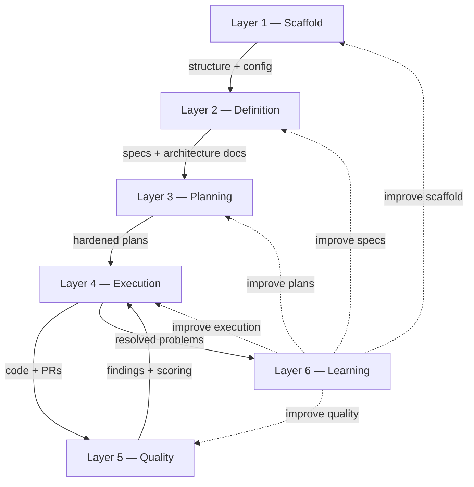
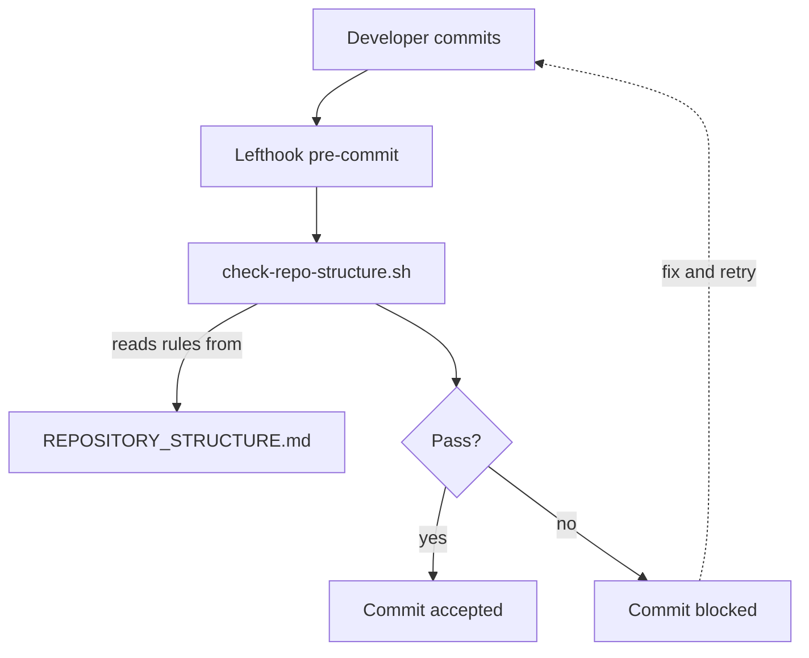
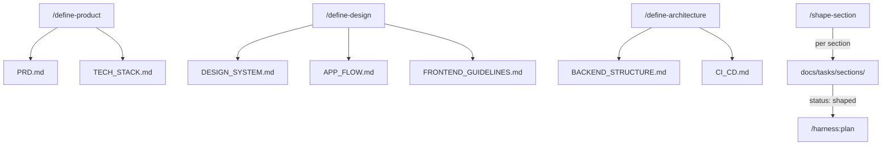
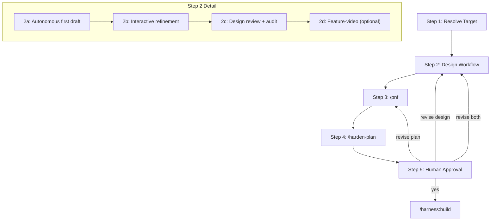
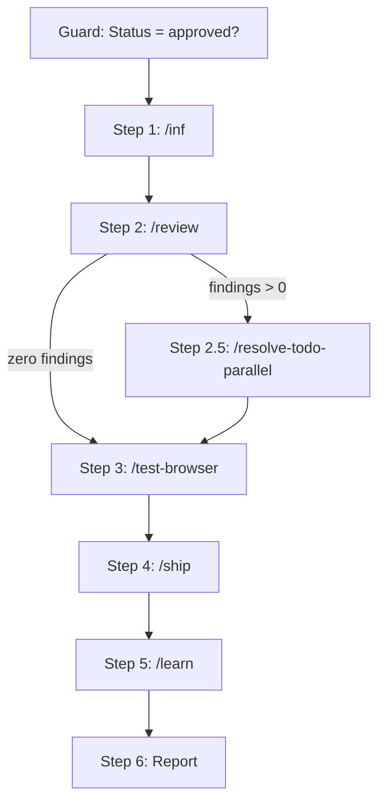
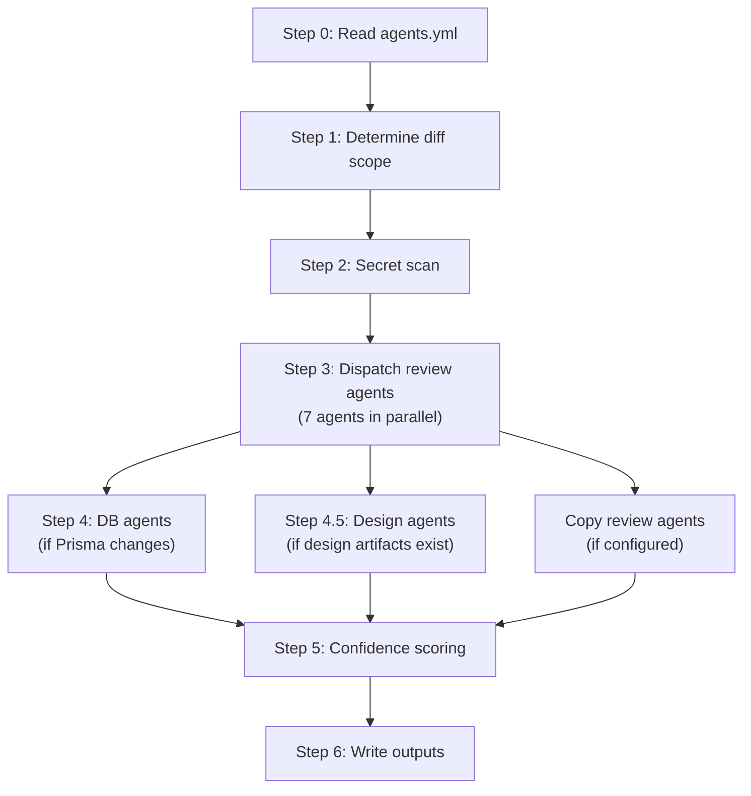
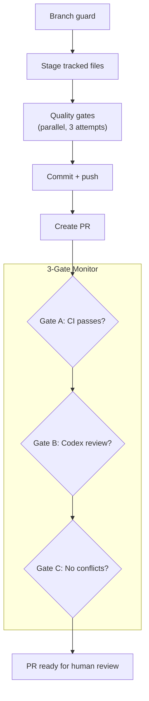
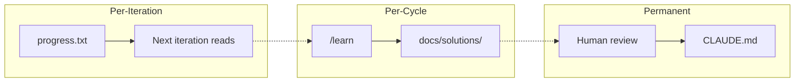

# Methodology

> **The harness your AI agent didn't know it needed. With best practices pre-wired for AI coding.**

AI coding tools are powerful. Without structure, they're a trap.

You prompt an agent to build a feature. It generates code that looks right -- until you discover it hallucinated an API, ignored your existing patterns, or duplicated a utility that already exists. You fix it, start a new session, and the agent has forgotten everything. No specs. No guardrails. No memory. Just vibes.

The best practices exist. Spec-driven development. Compound loops with fresh context. Structure enforcement. Automated quality gates. Context engineering via CLAUDE.md. They're scattered across blog posts, repos, and conference talks. You know you should set them up. You haven't had time.

Launchpad is an AI coding harness where all of it is already wired in and working. Clone it, define your product, and start building with an AI workflow that has specs, guardrails, autonomous execution loops, pre-commit hooks, CI pipelines, and automated code review -- from the first commit.

For a step-by-step workflow guide, see [How It Works](HOW_IT_WORKS.md).

---

## Overview



Launchpad organizes AI-assisted development into six layers. Each layer addresses a specific failure mode of unstructured AI coding. The layers build on each other sequentially -- scaffold provides the runtime directory structure and configuration, definition produces specs that describe what to build, planning converts specs into hardened implementation plans, execution builds and ships, quality catches mistakes through multi-agent review and confidence scoring, and learning feeds improvements back into every layer.

The first four layers form a forward pipeline. Layer 5 (Quality) creates a tight feedback loop with Layer 4 (Execution) -- review findings are resolved and re-validated before shipping. Layer 6 (Learning) wraps everything, extracting knowledge from resolved problems and feeding it back into future cycles.

Four **meta-orchestrators** chain the layers into end-to-end workflows:

| Meta-Orchestrator  | Layers | What It Chains                                                                            |
| ------------------ | ------ | ----------------------------------------------------------------------------------------- |
| `/harness:kickoff` | 2      | `/brainstorm` (brainstorming skill + document-review)                                     |
| `/harness:define`  | 2      | `/define-product` -> `/define-design` -> `/define-architecture` -> `/shape-section`       |
| `/harness:plan`    | 3      | design -> `/pnf` -> `/harden-plan` -> human approval                                      |
| `/harness:build`   | 4-6    | `/inf` -> `/review` -> `/resolve-todo-parallel` -> `/test-browser` -> `/ship` -> `/learn` |

| Layer                                 | What It Does                                                                                  | Key Artifacts                                                     |
| ------------------------------------- | --------------------------------------------------------------------------------------------- | ----------------------------------------------------------------- |
| 1. [Scaffold](#layer-1--scaffold)     | Runtime directories, agent configuration, structure drift detection                           | `.harness/`, `.launchpad/agents.yml`, `detect-structure-drift.sh` |
| 2. [Definition](#layer-2--definition) | Brainstorming, product definition, design system, architecture docs, section shaping          | `docs/architecture/`, `docs/tasks/sections/`, `docs/brainstorms/` |
| 3. [Planning](#layer-3--planning)     | Design workflow, implementation planning, plan hardening, human approval                      | Plan files, `.harness/design-artifacts/`, hardening notes         |
| 4. [Execution](#layer-4--execution)   | Autonomous build, multi-agent review, finding resolution, browser testing, shipping, learning | Feature branches, PRs, `.harness/todos/`, `docs/solutions/`       |
| 5. [Quality](#layer-5--quality)       | Confidence scoring, false-positive suppression, plan hardening agents, merge prevention       | `.harness/review-summary.md`, `.harness/observations/`            |
| 6. [Learning](#layer-6--learning)     | 5-agent research pipeline, compound-docs taxonomy, solution documentation                     | `docs/solutions/`, `progress.txt`, `CLAUDE.md`                    |

---

## Layer 1 -- Scaffold

### What It Provides

The scaffold layer creates the runtime infrastructure that every subsequent layer depends on. It consists of four components: the `.harness/` runtime directory, the `.launchpad/` configuration directory, two maintenance scripts, and the monorepo topology.

### `.harness/` -- Runtime Directory

The `.harness/` directory is the runtime workspace for the harness. It is created per-project and is `.gitignore`d -- it contains session-specific artifacts, not source code.

| Subdirectory        | Purpose                                                            |
| ------------------- | ------------------------------------------------------------------ |
| `todos/`            | Review findings written by `/review` (YAML frontmatter + markdown) |
| `observations/`     | Out-of-scope observations from `code-simplicity-reviewer`          |
| `design-artifacts/` | Approved design screenshots (`[section]-approved.png`)             |
| `screenshots/`      | Working screenshots from design iteration cycles                   |
| `harness.local.md`  | Project-specific review context read by all agents                 |

### `.launchpad/` -- Configuration

The `.launchpad/` directory holds agent configuration and security patterns. It is checked into git.

**`agents.yml`** -- The central agent roster with 7 keys:

```yaml
review_agents: # Dispatched by /review (always)
review_db_agents: # Dispatched by /review (when Prisma changes detected)
review_design_agents: # Dispatched by /review (when design artifacts exist)
review_copy_agents: # Dispatched by /copy-review (downstream projects populate)
harden_plan_agents: # Dispatched by /harden-plan (both intensities)
harden_plan_conditional_agents: # Dispatched by /harden-plan (--full only)
harden_document_agents: # Dispatched by /harden-plan Step 3.5
protected_branches: # Read by /ship, /commit (default: [main, master])
```

**`secret-patterns.txt`** -- One regex per line, used by `/review` Step 2 for pre-dispatch secret scanning. Patterns include `sk-`, `ghp_`, `AKIA`, `-----BEGIN .* PRIVATE KEY-----`, etc.

### Maintenance Scripts

**`scripts/maintenance/detect-structure-drift.sh`** -- Detects when the repository structure has drifted from `REPOSITORY_STRUCTURE.md`. Runs as a pre-commit hook via Lefthook.

**`scripts/agent_hydration/hydrate.sh`** -- Session bootstrapping script invoked by `/hydrate`. Loads minimal context for a new agent session.

### Structure Enforcement

The scaffold includes a closed-loop structure enforcement system:



`REPOSITORY_STRUCTURE.md` defines the canonical file placement rules with a 12-branch decision tree. `check-repo-structure.sh` validates against it on every commit (5 checks: duplicate detection, root whitelist, loose scripts, loose app files, sandbox protocol). CI runs the same check as a safety net.

### Monorepo Topology

`pnpm-workspace.yaml` declares two workspace globs (`apps/*` and `packages/*`). `turbo.json` defines the task pipeline with `^build` dependencies. The project initialization wizard (`scripts/setup/init-project.sh`) transforms a fresh Launchpad clone into a new project.

Key files:

- `.harness/` -- runtime workspace (gitignored)
- `.launchpad/agents.yml` -- agent roster (7 keys)
- `.launchpad/secret-patterns.txt` -- secret scanning patterns
- `scripts/maintenance/detect-structure-drift.sh` -- structure drift detection
- `scripts/maintenance/check-repo-structure.sh` -- structure validation (5 checks)
- `scripts/agent_hydration/hydrate.sh` -- session bootstrapping
- `docs/architecture/REPOSITORY_STRUCTURE.md` -- canonical file placement rules
- `scripts/setup/init-project.sh` -- interactive project initialization wizard

---

## Layer 2 -- Definition

### What It Provides

Before any code is written, the project needs specs. This layer produces architecture documents, a design system, and section specs through two meta-orchestrators: `/harness:kickoff` (brainstorming) and `/harness:define` (product/design/architecture definition + section shaping).

### `/harness:kickoff` -- Brainstorming

Delegates to `/brainstorm`, which loads the **brainstorming skill** for structured idea exploration:

1. Dispatches research agents when a codebase exists (file-locator, pattern-finder, docs-locator)
2. Runs collaborative dialogue with progressive questioning
3. Captures design document to `docs/brainstorms/`
4. Refines via the **document-review skill** (6-step assessment, 4 quality criteria, 2-pass recommendation)
5. Hands off to `/harness:define`

### `/harness:define` -- Product Definition Pipeline

Chains four commands in sequence, detecting existing artifacts for update mode:



#### `/define-product` -- 15 interactive questions

Populates `PRD.md` (product requirements, section registry with data shapes) and `TECH_STACK.md` (frontend, backend, database, auth, hosting). One question at a time. "TBD" is always acceptable. Dual-mode: create vs. update detected automatically.

#### `/define-design` -- 18 interactive questions

Populates three documents:

- `DESIGN_SYSTEM.md` -- color palette, typography, spacing, component styling, dark mode, animation
- `APP_FLOW.md` -- auth flow, user journeys, pages/routes, navigation, error handling
- `FRONTEND_GUIDELINES.md` -- component architecture, state management, responsive strategy

#### `/define-architecture` -- 9 interactive questions

Populates two documents:

- `BACKEND_STRUCTURE.md` -- data models, API endpoints, auth strategy, external integrations
- `CI_CD.md` -- CI pipeline configuration, deploy strategy, environments

All questions are tailored to the tech stack chosen in `/define-product`.

#### `/shape-section` -- Deep Section Shaping

Deep-dives into individual product sections, producing detailed specs at `docs/tasks/sections/`. Loads the **responsive-design skill** in Mode B (injects responsive-first thinking into specs: mobile-first layout decisions, breakpoint behavior per component, touch targets, viewport-specific patterns).

Each shaped section gets status `shaped` in its spec file's YAML frontmatter.

#### The Architecture Documents

| Document                                   | Purpose                   | Created By             |
| ------------------------------------------ | ------------------------- | ---------------------- |
| `docs/architecture/PRD.md`                 | What to build and why     | `/define-product`      |
| `docs/architecture/TECH_STACK.md`          | Technical decisions       | `/define-product`      |
| `docs/architecture/DESIGN_SYSTEM.md`       | Visual design system      | `/define-design`       |
| `docs/architecture/APP_FLOW.md`            | User flows and navigation | `/define-design`       |
| `docs/architecture/BACKEND_STRUCTURE.md`   | API and data models       | `/define-architecture` |
| `docs/architecture/FRONTEND_GUIDELINES.md` | Components and state mgmt | `/define-design`       |
| `docs/architecture/CI_CD.md`               | CI/CD and deployment      | `/define-architecture` |

All seven feed into `CLAUDE.md`, so every AI session -- interactive or autonomous -- starts with full project context.

#### Two-Wave Research Pattern

Both interactive and autonomous paths use 6-8 sub-agents organized in a two-wave orchestration pattern:

**Wave 1 -- Discovery** (parallel, fast -- Grep/Glob/LS only, no file reads):

- `file-locator` -- finds relevant source files
- `docs-locator` -- finds relevant docs by frontmatter, date-prefixed filenames, directory structure
- `pattern-finder` -- identifies recurring code patterns
- `web-researcher` -- gathers external context

**Wave 2 -- Analysis** (parallel, waits for Wave 1):

- `code-analyzer` -- deep analysis of architecture using paths from Wave 1
- `docs-analyzer` -- extracts decisions, rejected approaches, constraints, promoted patterns

This two-wave ordering ensures expensive Read operations target only what locators actually found, preventing wasted context tokens.

Key files:

- `.claude/commands/brainstorm.md` -- brainstorming command
- `.claude/commands/define-product.md` -- product definition wizard
- `.claude/commands/define-design.md` -- design system wizard
- `.claude/commands/define-architecture.md` -- architecture wizard
- `.claude/commands/shape-section.md` -- section shaping
- `docs/architecture/` -- seven output documents

---

## Layer 3 -- Planning

### What It Provides

This layer converts shaped sections into hardened, human-approved implementation plans. The `/harness:plan` meta-orchestrator chains five steps: target resolution, design workflow, plan generation, plan hardening, and human approval.



### Step 1: Resolve Target

Reads the section spec's YAML frontmatter `status:` field and routes to the appropriate step:

| Current Status                   | Route To                          |
| -------------------------------- | --------------------------------- |
| `hardened`                       | Step 5 (approval)                 |
| `planned`                        | Step 4 (harden)                   |
| `designed` or `"design:skipped"` | Step 3 (plan)                     |
| `shaped`                         | Step 2 (design)                   |
| `defined` or no status           | "Not shaped. Run /harness:define" |

Registry integrity is validated at every transition -- the harness refuses to proceed if artifacts are missing for the current status (e.g., status is `approved` but `approved_at` field is absent).

### Step 2: Design Workflow

Design runs before planning so the plan incorporates concrete design decisions. The harness detects UI work via keyword scanning (40+ UI-related keywords) and file reference checking (`apps/web/`, `packages/ui/`).

**Step 2a -- Autonomous First Draft:**

- Loads `frontend-design`, `web-design-guidelines`, `responsive-design` skills
- Loads copy context via `/copy` (reads copy brief from section spec)
- Builds UI components following design system tokens
- Opens browser (agent-browser CLI primary, Playwright MCP fallback)
- Screenshot -> self-evaluate -> adjust -> screenshot (3-5 auto-cycles via `design-iterator`)

**Step 2b -- Interactive Refinement:**

- User feedback -> `design-iterator` agent (ONE change per iteration)
- Figma sync -> `figma-design-sync` agent (requires Figma URL)
- Systematic polish -> `/design-polish`
- Onboarding flows -> `/design-onboard`

**Step 2c -- Design Review and Audit:**

1. `/design-review` runs first (8 design + 4 tech dimensions, AI slop detection)
2. Then in parallel: `design-ui-auditor` (5 checks), `design-responsive-auditor` (6 checks), `design-alignment-checker` (14 dimensions), `design-implementation-reviewer` (Figma comparison, conditional), `/copy-review` (dispatches `review_copy_agents`)
3. Re-audit cap: 3 cycles maximum
4. Clean -> save approved screenshots to `.harness/design-artifacts/[section]-approved.png`

**Step 2d -- Design Walkthrough Recording (optional):**

- `/feature-video` captures screenshots -> MP4+GIF via ffmpeg, uploads via rclone or imgup

### Step 3: `/pnf` -- Plan Next Feature

Research-first plan builder that produces implementation plans from section specs.

**Two-wave research:** Same 6-agent pattern as Layer 2 (file-locator, docs-locator, pattern-finder, web-researcher in Wave 1; code-analyzer, docs-analyzer in Wave 2).

**Conditional skill loading:**

- IF section references frontend pages/components/UI: load `react-best-practices` (70 rules across 9 categories)
- IF section references payment/billing/checkout/Stripe: load `stripe-best-practices`

**Gap detection:** Scans the section spec for TBDs, empty sections, missing flows, missing edge cases. Presents gaps and asks whether to fill or proceed.

**Plan output:** Phases with automated verification commands, manual verification steps, and every decision resolved before finalization. Sets status -> `planned`.

### Step 4: `/harden-plan` -- Plan Stress-Testing

Stress-tests implementation plans using specialized review agents in two categories: code-focused (technical gaps) and document-focused (quality/coherence).

**Two intensity levels:**

- `--full` (section builds): dispatches all agents from `harden_plan_agents` + `harden_plan_conditional_agents` (up to 8 agents)
- `--lightweight` (standalone features): dispatches only `harden_plan_agents` (4 agents)

**Steps:**

| Step | What Happens                                                                                                                                                            |
| ---- | ----------------------------------------------------------------------------------------------------------------------------------------------------------------------- |
| 2    | Document quality pre-check via document-review skill (fast-path if no red flags)                                                                                        |
| 2.5  | Learnings scan -- `learnings-researcher` searches `docs/solutions/` by YAML frontmatter (parallel with 2.7)                                                             |
| 2.7  | Context7 technology enrichment -- queries current docs for breaking changes, deprecated APIs (parallel with 2.5)                                                        |
| 3    | Dispatch code-focused agents in parallel (plan + project context + learnings + Context7)                                                                                |
| 3.5  | Dispatch document-review agents in parallel (7 agents: adversarial, coherence, feasibility, scope-guardian, product-lens, security-lens, design-lens conditional on UI) |
| 3.7  | Interactive deepening -- present each agent's findings one-by-one: Accept / Reject / Discuss                                                                            |
| 4    | Synthesize, deduplicate, prioritize (P1/P2/P3)                                                                                                                          |
| 5    | Append `## Hardening Notes` to plan file                                                                                                                                |

Idempotent: skips if plan already contains `## Hardening Notes`. Sets status -> `hardened`.

### Step 5: Human Approval Gate

Presents plan summary (content, hardening notes, design status). Four options:

| Choice            | Effect                                                           |
| ----------------- | ---------------------------------------------------------------- |
| **Yes**           | Status -> `approved`, writes `approved_at` + `plan_hash` to spec |
| **Revise design** | Reset to `shaped`, clear design artifacts, restart Step 2        |
| **Revise plan**   | Reset to `designed`/`"design:skipped"`, restart Step 3           |
| **Revise both**   | Reset to `shaped`, clear everything, restart Step 2              |

On approval, proceeds to `/harness:build`.

Key files:

- `.claude/commands/harness/plan.md` -- meta-orchestrator
- `.claude/commands/pnf.md` -- plan generation
- `.claude/commands/harden-plan.md` -- plan hardening
- `.claude/commands/design-review.md` -- design critique
- `.claude/commands/design-polish.md` -- design refinement
- `.claude/commands/feature-video.md` -- walkthrough recording
- `.claude/commands/copy-review.md` -- copy review dispatch

---

## Layer 4 -- Execution

### What It Provides

This layer implements the autonomous execution pipeline. The `/harness:build` meta-orchestrator chains six steps: implement, review, resolve, test, ship, and learn.



### Guard: Status Check

Validates that the section has `approved` status with `approved_at` metadata. Refuses if not approved or if approval metadata is missing.

### Step 1: `/inf` -- Implement Next Feature

Build-only pipeline that reads the approved plan, creates a feature branch, and executes tasks.

**Conditional skill loading:** Same gates as `/pnf` -- loads `react-best-practices` and/or `stripe-best-practices` based on task content.

**Execution:** Delegates to `build.sh`, which runs up to 25 iterations in a fresh-context loop (`loop.sh`). Each iteration reads `prd.json` (task status), `progress.txt` (learnings), and `CLAUDE.md` (project knowledge). No memory persists in the AI's conversation history -- only in artifacts.

**Optional evaluator steps:**

- Step 5.5: Sprint contract negotiation (GAN-inspired Generator/Evaluator architecture)
- Step 6.5: Live application evaluation via Playwright (4 dimensions: Design, Originality, Craft, Functionality)

Both are opt-in via `scripts/compound/config.json` and do not affect the pipeline when disabled.

### Step 2: `/review` -- Multi-Agent Code Review

The core quality mechanism. Dispatches review agents from `.launchpad/agents.yml` in parallel with confidence-based false-positive suppression.



**Review agent fleet** (from `agents.yml`):

- Always: pattern-finder, security-auditor, kieran-foad-ts-reviewer, performance-auditor, code-simplicity-reviewer, architecture-strategist, testing-reviewer
- DB (conditional): schema-drift-detector (sequential first), then data-migration-auditor + data-integrity-auditor (parallel with drift report as context)
- Design (artifact-based): design-ui-auditor, design-responsive-auditor, design-alignment-checker, design-implementation-reviewer (Figma conditional)
- Copy: dispatches `review_copy_agents` from agents.yml (downstream projects populate)

**Confidence scoring** (0.00-1.00 per finding):

| Tier        | Range     | Meaning                                         |
| ----------- | --------- | ----------------------------------------------- |
| Certain     | 0.90-1.00 | Verified bug, security vulnerability with proof |
| High        | 0.75-0.89 | Strong evidence, clear code path to failure     |
| Moderate    | 0.60-0.74 | Reasonable concern, benefits from review        |
| Low         | 0.40-0.59 | Possible issue, limited evidence                |
| Speculative | 0.20-0.39 | Theoretical concern, no concrete evidence       |
| Noise       | 0.00-0.19 | Generic advice, not actionable                  |

**Threshold: 0.60.** Findings below this are suppressed (not written to `.harness/todos/`) but logged in `.harness/review-summary.md` with suppression reason for audit trail.

**6 false-positive categories:** Pre-existing issues, style nitpicks, intentional patterns, handled-elsewhere, code restatement, generic advice.

**Boosters:**

- Multi-agent agreement (2+ agents flag same issue): +0.10
- Security/data concern (auth, secrets, PII): +0.10
- P1 floor: any P1 finding has minimum 0.60 (never auto-suppressed)

**Intent verification:** If a PR exists, reads PR title/body/labels. Findings that contradict stated PR intent are suppressed.

**Headless mode** (`--headless`): Same Steps 0-6 but suppresses interactive output. Used by `/harden-plan` and `/commit`.

### Step 2.5: `/resolve-todo-parallel` -- Finding Resolution

Spawns parallel `harness-todo-resolver` agents (max 5 concurrent) to fix findings in `.harness/todos/`. Groups overlapping files sequentially. Post-execution scope validation. Commits "fix: resolve review findings" -- durable commit safe from crashes.

### Step 3: `/test-browser` -- Browser Testing

Maps changed files to UI routes (max 15). Self-scoping: detects agent-browser CLI or Playwright MCP. Tests routes (30s per route, 5min total). Writes findings to `.harness/todos/`.

Browser test findings are informational, not blocking -- they proceed to `/ship` and are included in the PR description for human review.

### Step 4: `/ship` -- Autonomous Shipping

Stages, quality gates, commits, pushes, creates PR, and monitors CI. **Never merges.**



**Three-layer merge prevention:**

1. `/ship` hard rule: NEVER runs `gh pr merge`, NEVER runs `git merge main/master`
2. Branch protection: `protected_branches` in `agents.yml` (default: `[main, master]`)
3. Quality gates: parallel `pnpm test` + `pnpm typecheck` + `pnpm lint` + `lefthook run pre-commit`, auto-fix cycle (max 3 attempts)

### Step 5: `/learn` -- Knowledge Capture

Captures learnings from the build session into structured solution docs. See [Layer 6](#layer-6--learning) for details.

### Step 6: Report

Sets status -> `built`. Prints summary (what was built, review findings, PR URL). Runs `/regenerate-backlog` to update the project backlog.

Key files:

- `.claude/commands/harness/build.md` -- meta-orchestrator
- `.claude/commands/inf.md` -- build pipeline
- `.claude/commands/review.md` -- multi-agent review
- `.claude/commands/resolve-todo-parallel.md` -- parallel finding resolution
- `.claude/commands/test-browser.md` -- browser testing
- `.claude/commands/ship.md` -- shipping pipeline
- `.claude/commands/learn.md` -- learning capture
- `scripts/compound/build.sh` -- autonomous execution script
- `scripts/compound/loop.sh` -- fresh-context iteration loop

---

## Layer 5 -- Quality

### What It Provides

Quality is enforced through four mechanisms: confidence scoring in `/review`, plan hardening in `/harden-plan`, interactive triage in `/triage`, and merge prevention in `/ship`.

### Confidence Scoring

The `/review` confidence scoring system (detailed in Layer 4, Step 2) prevents false positives from polluting the finding queue. Key properties:

- **0.60 threshold** -- only moderate-confidence or higher findings are written to `.harness/todos/`
- **6 FP suppression categories** -- pre-existing issues, style nitpicks, intentional patterns, handled-elsewhere, code restatement, generic advice
- **Multi-agent agreement boost** -- 2+ agents flagging the same issue: +0.10
- **P1 floor** -- critical findings are never auto-suppressed (minimum 0.60)
- **Intent verification** -- PR context used to suppress contradictory findings

### Plan Hardening

The `/harden-plan` system (detailed in Layer 3, Step 4) validates plans before execution begins:

- **`--full` mode:** 8 code-focused agents + 7 document-review agents
- **`--lightweight` mode:** 4 code-focused agents + 7 document-review agents
- **Step 2.7:** Context7 technology enrichment (parallel queries for current framework docs, breaking changes, deprecated APIs)
- **Step 3.7:** Interactive deepening (user approves/rejects each finding)

**Document-review agents** (from `harden_document_agents` in `agents.yml`):

- `adversarial-document-reviewer` -- adversarial stress-testing
- `coherence-reviewer` -- internal consistency
- `feasibility-reviewer` -- technical feasibility
- `scope-guardian-reviewer` -- scope creep detection
- `product-lens-reviewer` -- product alignment
- `security-lens-reviewer` -- security implications
- `design-lens-reviewer` -- UI/design alignment (conditional: only when section has UI)

### Interactive Triage: `/triage`

Interactive routing of review findings. Presents each pending finding one-by-one (sorted P1 -> P2 -> P3, grouped by same file:line) with three options:

| Decision  | Effect                                                              |
| --------- | ------------------------------------------------------------------- |
| **Fix**   | Status -> `ready`, queued for `/resolve-todo-parallel`              |
| **Drop**  | Status -> `dismissed`, removed from queue with audit trail          |
| **Defer** | Status -> `deferred`, moved to `.harness/observations/` for backlog |

Overflow cap: if more than 25 pending findings, top 25 are presented and the rest are auto-deferred.

### Merge Prevention (3-Layer)

1. `/ship` hard rules: 5 explicit NEVER rules (no merge, no `--no-verify`, no skip gates)
2. `protected_branches` in `agents.yml`: branch guard reads this before every commit/ship
3. Quality gates: parallel checks with auto-fix cycle, hard stop after 3 failures

### Pre-Commit Hooks (Lefthook)

Seven hooks on every commit, organized by priority:

**Auto-fixers (run first):**

| Priority | Hook           | What It Does         |
| -------- | -------------- | -------------------- |
| 1        | `prettier-fix` | Format staged files  |
| 2        | `eslint-fix`   | Auto-fix lint issues |

**Validators (block commit on failure):**

| Priority | Hook                  | What It Does                 |
| -------- | --------------------- | ---------------------------- |
| 10       | `typecheck`           | TypeScript strict mode       |
| 10       | `structure-check`     | Repo structure rules         |
| 10       | `large-file-guard`    | Block files over 500KB       |
| 10       | `trailing-whitespace` | No trailing whitespace       |
| 10       | `end-of-file-newline` | POSIX-compliant file endings |

### CI Pipeline (GitHub Actions)

6 jobs on every push to `main` and every PR:

```
install (caches node_modules)
  |-- lint
  |-- typecheck
  |-- build
  +-- test

structure (standalone)

summary (depends on all 5 check jobs)
```

Key files:

- `.claude/commands/review.md` -- confidence scoring implementation
- `.claude/commands/harden-plan.md` -- plan hardening
- `.claude/commands/triage.md` -- interactive triage
- `.claude/commands/ship.md` -- merge prevention rules
- `lefthook.yml` -- hook definitions
- `.github/workflows/ci.yml` -- CI workflow

---

## Layer 6 -- Learning

### What It Provides

The compound philosophy is that each unit of work should make future work easier -- not harder. This layer captures learnings from resolved problems and feeds them back into the system through a structured pipeline.

### `/learn` -- 5-Agent Parallel Research Pipeline

Spawns 5 inline sub-agents in parallel (each returns text only -- no file writes):

| Agent                 | What It Extracts                                                  |
| --------------------- | ----------------------------------------------------------------- |
| Context Analyzer      | Module, problem summary, environment details                      |
| Solution Extractor    | Failed approaches, working solution, code changes                 |
| Related Docs Finder   | Matching docs from `docs/solutions/` (by tags/module frontmatter) |
| Prevention Strategist | Future prevention strategies (tests, tooling, docs, patterns)     |
| Category Classifier   | Category (1 of 14), component, root_cause, resolution_type        |

### Compound-Docs Skill

The `compound-docs` skill defines the taxonomy and schema for solution documents:

- **14 categories** for classifying problems (e.g., database, api, auth, deployment, testing)
- **16 components** for identifying affected system parts
- **17 root causes** for diagnosing why problems occurred

### Solution Documents

Written to `docs/solutions/[category]/YYYY-MM-DD-[slug].md` with YAML-validated frontmatter:

```yaml
---
title: Feature Name
category: database
component: prisma-client
root_cause: missing-null-check
resolution_type: code-fix
severity: medium
tags: [prisma, n+1, query-optimization]
modules_touched: [packages/db, apps/api]
---
```

**Safety gates:** YAML validation blocks write if frontmatter is invalid. Secret scan redacts API keys, tokens, passwords before writing.

### Three-Tier Knowledge System



1. **Immediate** (`progress.txt`): Learnings from prior iterations available within the same compound cycle
2. **Short-term** (`docs/solutions/`): Structured solution docs available to future cycles via `docs-locator` and `docs-analyzer` agents during `/pnf` and `/research-codebase`
3. **Long-term** (`CLAUDE.md`): Patterns promoted from `docs/solutions/` become permanent project knowledge, automatically loaded in every AI session

### Feedback Loop

The feedback loop operates at three speeds. A 30-minute fix becomes a seconds-long pattern match on the next occurrence, and eventually a pre-loaded rule that prevents the problem entirely:

1. **First occurrence:** Problem takes 30 minutes to research and solve
2. **Document:** `/learn` extracts structured learnings (automatic)
3. **Next occurrence:** AI reads `docs/solutions/` during planning and recognizes the pattern (seconds)
4. **Promotion:** Valuable patterns graduate into `CLAUDE.md` -- all future sessions start with the pattern pre-loaded

Key files:

- `.claude/commands/learn.md` -- learning capture command
- `.claude/skills/compound-docs/` -- taxonomy skill (14 categories, 16 components, 17 root causes)
- `docs/solutions/` -- structured solution documents
- `scripts/compound/compound-learning.sh` -- fallback extraction script
- `scripts/compound/progress.txt` -- per-run iteration log

---

## Agent Fleet

Launchpad ships ~37 agents across 6 namespaces:

### research/ (8 agents)

| Agent                  | Purpose                                                                |
| ---------------------- | ---------------------------------------------------------------------- |
| `file-locator`         | Find source files and components (Grep/Glob/LS only)                   |
| `code-analyzer`        | Deep analysis of how code works with file:line precision (Read)        |
| `pattern-finder`       | Find existing patterns and code examples to model after                |
| `docs-locator`         | Find docs by frontmatter, date-prefixed filenames, directory structure |
| `docs-analyzer`        | Extract decisions, rejected approaches, constraints from docs          |
| `web-researcher`       | External documentation, API references, best practices                 |
| `learnings-researcher` | Search `docs/solutions/` by frontmatter metadata for `/harden-plan`    |
| `skill-evaluator`      | Evaluate skills against 16 quality criteria (3-pass)                   |

### review/ (13 agents)

| Agent                           | Dispatch Condition                                |
| ------------------------------- | ------------------------------------------------- |
| `pattern-finder`                | Always                                            |
| `security-auditor`              | Always                                            |
| `kieran-foad-ts-reviewer`       | Always                                            |
| `performance-auditor`           | Always                                            |
| `code-simplicity-reviewer`      | Always (observations to `.harness/observations/`) |
| `architecture-strategist`       | Always                                            |
| `testing-reviewer`              | Always                                            |
| `schema-drift-detector`         | Prisma changes (runs first)                       |
| `data-migration-auditor`        | Prisma changes (with drift report)                |
| `data-integrity-auditor`        | Prisma changes (with drift report)                |
| `spec-flow-analyzer`            | Plan hardening                                    |
| `frontend-races-reviewer`       | Plan hardening (`--full` only)                    |
| `deployment-verification-agent` | Opt-in                                            |

### document-review/ (7 agents)

| Agent                           | Dispatch Condition                         |
| ------------------------------- | ------------------------------------------ |
| `adversarial-document-reviewer` | Plan hardening Step 3.5                    |
| `coherence-reviewer`            | Plan hardening Step 3.5                    |
| `feasibility-reviewer`          | Plan hardening Step 3.5                    |
| `scope-guardian-reviewer`       | Plan hardening Step 3.5                    |
| `product-lens-reviewer`         | Plan hardening Step 3.5                    |
| `security-lens-reviewer`        | Plan hardening Step 3.5                    |
| `design-lens-reviewer`          | Plan hardening Step 3.5 (UI sections only) |

### resolve/ (2 agents)

| Agent                   | Purpose                        |
| ----------------------- | ------------------------------ |
| `harness-todo-resolver` | Fix individual review findings |
| `pr-comment-resolver`   | Fix PR review comments         |

### design/ (6 agents)

| Agent                            | Dispatch Condition                           |
| -------------------------------- | -------------------------------------------- |
| `design-ui-auditor`              | Design review + code review (artifact-based) |
| `design-responsive-auditor`      | Design review + code review (artifact-based) |
| `design-alignment-checker`       | Design review + code review (artifact-based) |
| `design-implementation-reviewer` | Figma artifacts exist                        |
| `design-iterator`                | Interactive design refinement                |
| `figma-design-sync`              | Figma URL provided                           |

### skills/ (1 agent)

| Agent             | Purpose                                                                               |
| ----------------- | ------------------------------------------------------------------------------------- |
| `skill-evaluator` | 3-pass quality evaluation (first-principles, baseline detection, Anthropic checklist) |

---

## Skill Creation Infrastructure

Launchpad ships the infrastructure to create, port, and update domain-specific AI skills -- not pre-built skills for specific domains. Every downstream project can create its own skills from day one.

### `/create-skill` -- Meta-Skill Forge

A 7-phase methodology:

| Phase                    | What Happens                                          |
| ------------------------ | ----------------------------------------------------- |
| 1. Context Ingestion     | Two-wave sub-agent research (Discovery -> Analysis)   |
| 2. Targeted Extraction   | 4 collaborative rounds with the user                  |
| 3. Contrarian Analysis   | Write out generic version, then engineer away from it |
| 4. Architecture Decision | Route to Simple / Moderate / Full complexity          |
| 5. Write the Skill       | Produce SKILL.md orchestrator + reference files       |
| 6. Quality Validation    | Recursive evaluation loop (max 3 cycles, 16 criteria) |
| 7. Ship It               | Generate evals, register in CLAUDE.md                 |

### `/port-skill` -- External Skill Import

4-phase workflow: Ingest -> Adapt -> Validate -> Register. Fully detaches from source after import.

### `/update-skill` -- Iterative Improvement

Reads existing skill files, performs delta analysis, re-runs relevant Forge phases.

Key files:

- `.claude/skills/creating-skills/SKILL.md` -- Meta-skill orchestrator
- `.claude/skills/creating-skills/references/` -- methodology, quality gates, contrarian frame, templates
- `.claude/agents/skills/skill-evaluator.md` -- 3-pass evaluation agent

---

## Quick Reference: All Commands

### Meta-Orchestrators

| Command            | Layer | What It Chains                                                                            |
| ------------------ | ----- | ----------------------------------------------------------------------------------------- |
| `/harness:kickoff` | 2     | `/brainstorm` -> handoff to `/harness:define`                                             |
| `/harness:define`  | 2     | `/define-product` -> `/define-design` -> `/define-architecture` -> `/shape-section`       |
| `/harness:plan`    | 3     | design -> `/pnf` -> `/harden-plan` -> human approval                                      |
| `/harness:build`   | 4-6   | `/inf` -> `/review` -> `/resolve-todo-parallel` -> `/test-browser` -> `/ship` -> `/learn` |

### Definition Commands

| Command                 | Layer | What It Does                                                                  |
| ----------------------- | ----- | ----------------------------------------------------------------------------- |
| `/brainstorm`           | 2     | Collaborative brainstorming with research agents and design document capture  |
| `/define-product`       | 2     | Interactive wizard -> PRD.md + TECH_STACK.md + section registry               |
| `/define-design`        | 2     | Interactive wizard -> DESIGN_SYSTEM.md + APP_FLOW.md + FRONTEND_GUIDELINES.md |
| `/define-architecture`  | 2     | Interactive wizard -> BACKEND_STRUCTURE.md + CI_CD.md                         |
| `/shape-section [name]` | 2     | Deep-dive into a product section -> docs/tasks/sections/[name].md             |
| `/update-spec`          | 2     | Scan spec files for gaps, TBDs, inconsistencies -> fix them                   |

### Planning Commands

| Command               | Layer | What It Does                                                     |
| --------------------- | ----- | ---------------------------------------------------------------- |
| `/pnf [section]`      | 3     | Plan Next Feature from section spec -> implementation plan       |
| `/harden-plan [path]` | 3     | Stress-test plan with code + document review agents              |
| `/design-review`      | 3     | Comprehensive quality audit and design critique                  |
| `/design-polish`      | 3     | Pre-ship refinement pass (alignment, spacing, copy, consistency) |
| `/design-onboard`     | 3     | Design onboarding flows, empty states, first-time UX             |
| `/copy`               | 3     | Read copy brief from section spec and provide copy context       |
| `/copy-review`        | 3     | Dispatch copy review agents from agents.yml                      |
| `/feature-video`      | 3     | Record walkthrough -> screenshots -> MP4+GIF -> upload           |

### Execution Commands

| Command                  | Layer | What It Does                                                   |
| ------------------------ | ----- | -------------------------------------------------------------- |
| `/inf`                   | 4     | Build pipeline: branch -> PRD -> tasks -> execution loop       |
| `/implement-plan`        | 4     | Execute plan phase by phase with checkpoints                   |
| `/review`                | 4-5   | Multi-agent code review with confidence scoring                |
| `/resolve-todo-parallel` | 4     | Parallel finding resolution (max 5 agents)                     |
| `/test-browser`          | 4     | Browser testing for UI routes affected by changes              |
| `/triage`                | 5     | Interactive triage: fix / drop / defer                         |
| `/ship`                  | 4     | Quality gates -> commit -> PR -> CI monitoring. Never merges.  |
| `/commit`                | 4     | Interactive commit with quality gates and 3-gate PR monitoring |
| `/resolve-pr-comments`   | 4     | Batch-resolve unresolved PR review comments                    |

### Learning Commands

| Command               | Layer | What It Does                                         |
| --------------------- | ----- | ---------------------------------------------------- |
| `/learn`              | 6     | 5-agent parallel research -> structured solution doc |
| `/regenerate-backlog` | 6     | Regenerate BACKLOG.md from deferred observations     |
| `/defer`              | 6     | Manually add a task to the project backlog           |
| `/memory-report`      | 6     | Update session memory files                          |

### Skill Commands

| Command                 | Layer | What It Does                              |
| ----------------------- | ----- | ----------------------------------------- |
| `/create-skill [topic]` | --    | 7-phase Meta-Skill Forge                  |
| `/update-skill [name]`  | --    | Iterate on existing skill                 |
| `/port-skill [source]`  | --    | Port external skill into Launchpad format |

### Utility Commands

| Command              | Layer | What It Does                                          |
| -------------------- | ----- | ----------------------------------------------------- |
| `/hydrate`           | --    | Session bootstrapping with minimal context            |
| `/research-codebase` | --    | Two-wave research -> docs/reports/ (input for `/inf`) |
| `/pull-launchpad`    | --    | Pull upstream Launchpad changes                       |

---

## Quick Reference: All Scripts

| Script                                          | Layer | What It Does                                   |
| ----------------------------------------------- | ----- | ---------------------------------------------- |
| `scripts/compound/build.sh`                     | 4     | Autonomous pipeline (8+ steps)                 |
| `scripts/compound/loop.sh`                      | 4     | Fresh-context execution loop                   |
| `scripts/compound/analyze-report.sh`            | 4     | Multi-provider report analysis                 |
| `scripts/compound/board.sh`                     | 4     | Kanban board renderer (ASCII/Markdown/Summary) |
| `scripts/compound/compound-learning.sh`         | 6     | Fallback learning extraction                   |
| `scripts/compound/iteration-claude.md`          | 4     | Per-iteration prompt template                  |
| `scripts/maintenance/check-repo-structure.sh`   | 1     | Structure enforcement (5 checks)               |
| `scripts/maintenance/detect-structure-drift.sh` | 1     | Structure drift detection                      |
| `scripts/agent_hydration/hydrate.sh`            | 1     | Session bootstrapping                          |
| `scripts/setup/init-project.sh`                 | 1     | Interactive project initialization wizard      |

---

## Credits and Inspirations

Launchpad is built on the shoulders of three frameworks:

### Compound Product

**By:** Ryan Carson ([snarktank/compound-product](https://github.com/snarktank/compound-product))

The core pipeline: report -> analysis -> PRD -> tasks -> autonomous loop -> PR. Adapted into `scripts/compound/` with significant modifications.

### Compound Engineering Plugin

**By:** Kieran Klaassen / Every ([EveryInc/compound-engineering-plugin](https://github.com/EveryInc/compound-engineering-plugin))

The compounding philosophy and structured learning capture system. The `docs/solutions/` pattern, the learnings extraction pipeline, and the WRONG/CORRECT anti-pattern format.

### Ralph Pattern

**By:** Geoffrey Huntley

The autonomous execution loop concept -- fresh context per iteration, git as memory.

### Spec-Driven Development

**Inspired by:** Thoughtworks Technology Radar, GitHub SpecKit, AWS Kiro

The philosophy of "specify before building." Our implementation produces project-level canonical documents that persist and evolve.

---

## Related

- [README](../../README.md)
- [How It Works](HOW_IT_WORKS.md) -- step-by-step workflow guide
- [Repository Structure](../architecture/REPOSITORY_STRUCTURE.md)
