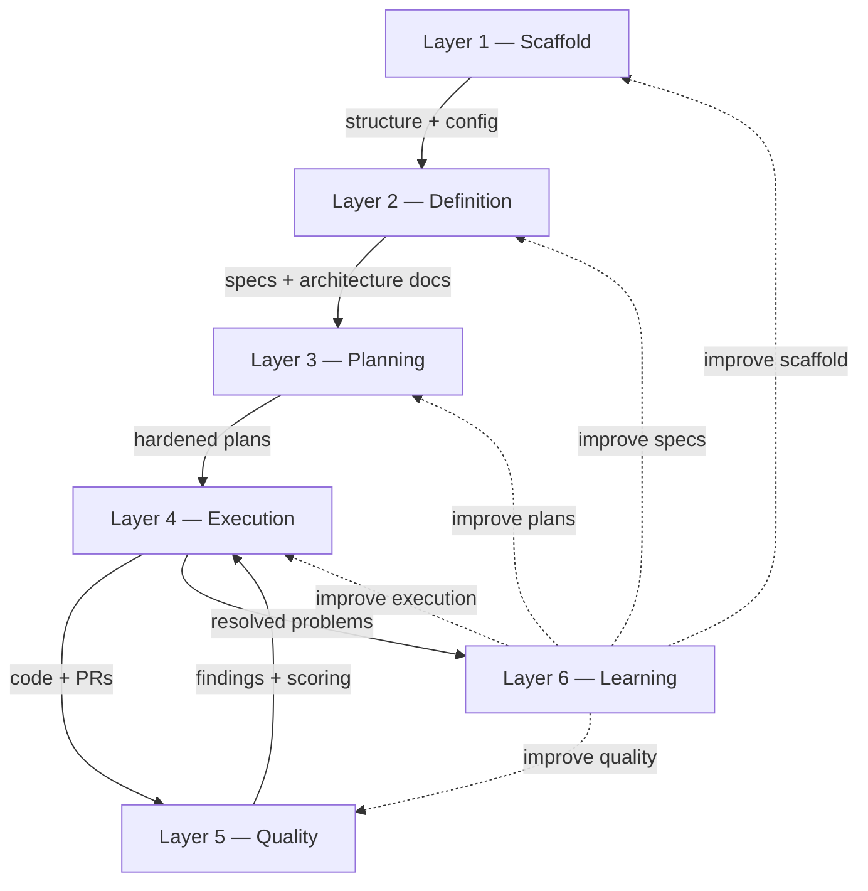

# Methodology

> **The harness your AI agent didn't know it needed. With best practices pre-wired for AI coding.**

AI coding tools are powerful. Without structure, they're a trap.

You prompt an agent to build a feature. It generates code that looks right -- until you discover it hallucinated an API, ignored your existing patterns, or duplicated a utility that already exists. You fix it, start a new session, and the agent has forgotten everything. No specs. No guardrails. No memory. Just vibes.

The best practices exist. Spec-driven development. Compound loops with fresh context. Structure enforcement. Automated quality gates. Context engineering via CLAUDE.md. They're scattered across blog posts, repos, and conference talks. You know you should set them up. You haven't had time.

Launchpad is an AI coding harness where all of it is already wired in and working. Clone it, define your product, and start building with an AI workflow that has specs, guardrails, autonomous execution loops, pre-commit hooks, CI pipelines, and automated code review -- from the first commit.

This document explains **why** the system is shaped the way it is. For day-to-day usage -- commands, configuration, security, troubleshooting -- see [How It Works](HOW_IT_WORKS.md).

---

## Overview

Launchpad organizes AI-assisted development into six layers. Each layer addresses a specific failure mode of unstructured AI coding. The layers build on each other sequentially -- scaffold provides the runtime directory structure and configuration, definition produces specs that describe what to build, planning converts specs into hardened implementation plans, execution builds and ships, quality catches mistakes through multi-agent review and confidence scoring, and learning feeds improvements back into every layer.

The first four layers form a forward pipeline. Layer 5 (Quality) creates a tight feedback loop with Layer 4 (Execution) -- review findings are resolved and re-validated before shipping. Layer 6 (Learning) wraps everything, extracting knowledge from resolved problems and feeding it back into future cycles.

Four **meta-orchestrators** chain the layers into end-to-end workflows:

| Meta-Orchestrator  | Layers | What It Chains                                                                            |
| ------------------ | ------ | ----------------------------------------------------------------------------------------- |
| `/harness:kickoff` | 2      | `/brainstorm` (brainstorming skill + document-review)                                     |
| `/harness:define`  | 2      | `/define-product` -> `/define-design` -> `/define-architecture` -> `/shape-section`       |
| `/harness:plan`    | 3      | design -> `/pnf` -> `/harden-plan` -> human approval                                      |
| `/harness:build`   | 4-6    | `/inf` -> `/review` -> `/resolve-todo-parallel` -> `/test-browser` -> `/ship` -> `/learn` |

| Layer                                 | What It Addresses                                                                                                     |
| ------------------------------------- | --------------------------------------------------------------------------------------------------------------------- |
| 1. [Scaffold](#layer-1--scaffold)     | AI drifts without structure. Provides runtime directories, agent configuration, and structure drift detection.        |
| 2. [Definition](#layer-2--definition) | AI hallucinates without specs. Produces PRDs, design systems, architecture docs, and per-section specs before coding. |
| 3. [Planning](#layer-3--planning)     | Plans fail silently. Design precedes planning, plans are stress-tested by review agents, humans approve before build. |
| 4. [Execution](#layer-4--execution)   | Long sessions drift in context. Fresh-context loops with git as memory, not conversation history.                     |
| 5. [Quality](#layer-5--quality)       | Noisy reviews get ignored. Confidence scoring suppresses false positives; three-layer merge prevention.               |
| 6. [Learning](#layer-6--learning)     | Lessons get forgotten. Structured solution docs turn every resolved problem into future context.                      |

> For every command, script, agent, and step-by-step workflow detail, see [How It Works](HOW_IT_WORKS.md).

---

## Layer 1 -- Scaffold

### Why It Exists

AI agents don't know where files belong. Without enforcement, they scatter modules, duplicate utilities, and grow the codebase in shapes the team didn't intend. The scaffold layer encodes a canonical structure and validates against it on every commit.

### What It Provides

Two directories and two scripts:

- **`.harness/`** -- gitignored runtime workspace (todos, observations, design artifacts, screenshots, per-project review context)
- **`.launchpad/`** -- checked-in configuration (`agents.yml` agent roster, `secret-patterns.txt` for pre-dispatch scanning)
- **`check-repo-structure.sh`** -- pre-commit validator driven by `REPOSITORY_STRUCTURE.md`
- **`detect-structure-drift.sh`** -- detects structural drift before it accumulates

The 12-branch decision tree in `REPOSITORY_STRUCTURE.md` is the single source of truth. Lefthook runs the validator before every commit; CI runs it again as a safety net.

> For directory contents, agent roster keys, and exact script checks, see [How It Works](HOW_IT_WORKS.md).

---

## Layer 2 -- Definition

### Why It Exists

AI agents produce better code when they know what the team is actually building. Without specs, every session starts cold: the agent re-derives requirements from whatever file happens to be open, guesses at conventions, and invents APIs that do not exist. The definition layer produces seven architecture documents and per-section specs so every AI session starts with full project context.

### What It Provides

Two meta-orchestrators collaborate with the user through structured Q&A:

- **`/harness:kickoff`** -- brainstorming for pre-product exploration
- **`/harness:define`** -- four sequential wizards producing PRD, tech stack, design system, app flow, frontend guidelines, backend structure, and CI/CD configuration

A **two-wave research pattern** underpins the wizards -- Wave 1 locators (Grep/Glob/LS only) find relevant artifacts, then Wave 2 analyzers read only what was found. Expensive reads are never wasted on speculation.

After architecture is defined, `/shape-section` deep-dives each product section into a spec with responsive-first thinking baked in. Each shaped section gets status `shaped` in its YAML frontmatter.

> For the full question lists, output documents, and sub-agent roster, see [How It Works](HOW_IT_WORKS.md).

---

## Layer 3 -- Planning

### Why It Exists

Plans that go straight from spec to code silently fail. The AI misses edge cases, misreads requirements, or picks an approach incompatible with the existing codebase. The planning layer forces three things before any code is written: design decisions are concrete (so the plan reflects real UI), plans are stress-tested by review agents (so weaknesses surface early), and a human explicitly approves (so the autonomous build is always consensual).

### What It Provides

`/harness:plan` chains five steps: resolve target from section registry, run design workflow, generate the plan, harden it, request human approval. Design precedes planning so the plan incorporates concrete screenshots, not speculation. Hardening dispatches both code-focused review agents and document-review agents in parallel, scans `docs/solutions/` for relevant past learnings, and runs Context7 enrichment for current framework docs. Status transitions are strict: `shaped -> designed -> planned -> hardened -> approved`.

> For the sub-step breakdown, hardening agent list, and approval options, see [How It Works](HOW_IT_WORKS.md).

---

## Layer 4 -- Execution

### Why It Exists

Long AI coding sessions drift. As the conversation grows, the agent forgets earlier constraints, contradicts its own decisions, and burns context on summarization. The execution layer runs every iteration in a **fresh AI context** -- memory persists through git commits and state files (`prd.json`, `progress.txt`), not conversation history.

### What It Provides

`/harness:build` is fully autonomous once a section has `approved` status. Six steps chain `/inf` (build), `/review` (multi-agent audit), `/resolve-todo-parallel` (fix findings), `/test-browser` (UI validation), `/ship` (PR creation, never merges), and `/learn` (capture learnings). The build loop is capped at 25 iterations. Each iteration reads state from disk and writes results back -- the loop is resumable after crashes.

> For the per-step detail, loop contract, and optional evaluator steps, see [How It Works](HOW_IT_WORKS.md).

---

## Layer 5 -- Quality

### Why It Exists

Noisy reviews get ignored. When every finding is "consider adding a comment here" or "this could be more idiomatic," developers stop reading. The quality layer uses confidence scoring to suppress false positives so the findings that remain are worth acting on, and it enforces three independent layers of merge prevention so autonomous agents cannot self-merge.

### What It Provides

**Confidence scoring (0.00-1.00)** is applied to every `/review` finding with a **0.60 threshold**. Boosters promote multi-agent agreement and security concerns; a P1 floor ensures critical findings are never auto-suppressed. Six false-positive categories are recognized and suppressed with an audit trail.

**Plan hardening** is the upstream counterpart -- weaknesses are caught in the plan before code is written, not after.

**Three-layer merge prevention:** `/ship` and `/commit` refuse to run merge commands; a `PreToolUse` hook intercepts at the tool level; GitHub branch protection is the server-side gate.

**Pre-commit hooks** (Lefthook) and CI are the first and last gates.

> For the FP categories, booster values, and hook/CI job list, see [How It Works](HOW_IT_WORKS.md).

---

## Layer 6 -- Learning

### Why It Exists

Every unit of work should make future work easier. Without capture, lessons are forgotten: the same bug is solved three times in three sessions. The learning layer turns every resolved problem into structured knowledge that future sessions automatically read.

### What It Provides

A three-tier knowledge system:

1. **Immediate** -- `progress.txt` carries learnings across iterations within the same build cycle
2. **Short-term** -- `/learn` writes YAML-frontmatter solution docs to `docs/solutions/` that future `/pnf` and `/research-codebase` sessions automatically discover
3. **Long-term** -- patterns that repeat graduate into `CLAUDE.md`, pre-loaded in every future AI session

The `compound-docs` skill defines the schema: 14 categories, 16 components, 17 root causes. YAML validation blocks writes with invalid frontmatter; a secret scan redacts API keys before writing.

The **compounding effect** is the point: a 30-minute research session on first occurrence becomes seconds-long pattern match on the second occurrence, and eventually a pre-loaded rule that prevents the problem entirely.

> For the 5-agent research pipeline and taxonomy details, see [How It Works](HOW_IT_WORKS.md).

---

## Credits and Inspirations

Launchpad is built on the shoulders of four frameworks. Where a framework's concepts were adopted, they were re-implemented natively into Launchpad so the harness has no external runtime dependencies.

### Compound Product

**By:** Ryan Carson ([snarktank/compound-product](https://github.com/snarktank/compound-product))

The core pipeline: report -> analysis -> PRD -> tasks -> autonomous loop -> PR. Adapted into `scripts/compound/` with significant modifications (two-wave research, confidence-scored review, strict status contract).

### Compound Engineering Plugin

**By:** Kieran Klaassen / Every ([EveryInc/compound-engineering-plugin](https://github.com/EveryInc/compound-engineering-plugin))

The compounding philosophy and structured learning capture system. The `docs/solutions/` pattern, the learnings extraction pipeline, and the WRONG/CORRECT anti-pattern format. All 29 agents, 22 commands, and 19 skills have been ported natively into Launchpad -- the plugin is no longer needed as a separate installation.

### Ralph Pattern

**By:** Ryan Carson ([snarktank/ralph](https://github.com/snarktank/ralph)) & Geoffrey Huntley ([ghuntley.com/ralph](https://ghuntley.com/ralph/))

The autonomous execution loop concept -- fresh context per iteration, git as memory. Implemented as `scripts/compound/loop.sh`.

### Spec-Driven Development

**Inspired by:** Thoughtworks Technology Radar, GitHub SpecKit, AWS Kiro, AgentOS

The philosophy of "specify before building." Launchpad's implementation produces seven canonical architecture documents that persist across sessions and evolve via update-mode wizards.

### Context Engineering

**By:** HumanLayer ([github.com/humanlayer/humanlayer](https://github.com/humanlayer/humanlayer))

The Research -> Plan -> Implement workflow, the locator/analyzer agent pair pattern, and two-wave orchestration. Applied across `/harness:define`, `/pnf`, and `/research-codebase`.

---

## Related

- [README](../../README.md)
- [How It Works](HOW_IT_WORKS.md) -- day-to-day reference: commands, configuration, security, troubleshooting
- [Repository Structure](../architecture/REPOSITORY_STRUCTURE.md)
