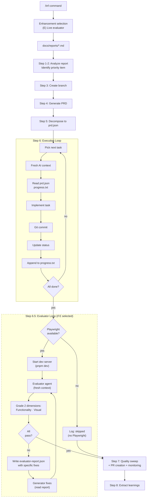

# Evaluator Architecture Implementation Plan (Simplified)

**Date:** 2026-03-25
**Purpose:** Add a GAN-inspired Generator/Evaluator loop with live Playwright testing to LaunchPad's Layer 3 compound execution pipeline.
**Source:** Findings from Anthropic's "Harness design for long-running application development" (March 24, 2026).
**Derived from:** `2026-03-25-evaluator-architecture-implementation-plan.md` (original), simplified per independent review.
**Status:** Planned — single-phase delivery.

---

## Design Decisions (what was cut and why)

This plan is a simplification of the original 4-phase, 12-file plan. The following components were removed after independent review and a second pass by the code-simplicity-reviewer agent:

| Removed Component                            | Reason                                                                                                                                                                                                                                                                                                                                                                                                                                                                                                                                                                                                                                                                                                                                                  |
| -------------------------------------------- | ------------------------------------------------------------------------------------------------------------------------------------------------------------------------------------------------------------------------------------------------------------------------------------------------------------------------------------------------------------------------------------------------------------------------------------------------------------------------------------------------------------------------------------------------------------------------------------------------------------------------------------------------------------------------------------------------------------------------------------------------------- |
| **Sprint Contracts (Step 5.5)**              | The source article dropped _sprints_ (numbered build phases where the evaluator grades each before the next starts) when moving to Opus 4.6, but kept the evaluator testing against agreed criteria. The contract concept itself — where generator and evaluator agree on "done" before building — remains valid. However, LaunchPad's existing PRD → prd.json flow already defines deliverables and acceptance criteria per task. A separate negotiation would be a second pass over criteria that already exist. Deferred until evidence shows prd.json criteria are too vague for live evaluation.                                                                                                                                                   |
| **Playwright fallback mode**                 | Without Playwright, the evaluator does curl + grep Tailwind classes — the same class of work as existing static gates (typecheck, lint, Codex review). The entire value proposition is live interaction testing. No Playwright = skip evaluator, log why. Honest about dependencies.                                                                                                                                                                                                                                                                                                                                                                                                                                                                    |
| **evaluatorCriteria in prd.json**            | Creates a third source of truth (PRD markdown + prd.json + grading-criteria.md). The evaluator reads the PRD and rubric directly. One less schema change, one less sync point.                                                                                                                                                                                                                                                                                                                                                                                                                                                                                                                                                                          |
| **1-10 numeric scoring with thresholds**     | An LLM cannot reliably distinguish a 6 from a 7 on "design quality." Pass/fail with evidence is actionable; 7.2 vs 6.8 is not. Removes threshold configuration entirely.                                                                                                                                                                                                                                                                                                                                                                                                                                                                                                                                                                                |
| **Ambition mode**                            | Orthogonal to evaluation. Addresses PRD scope, not output quality. The design work is complete (option A in a designed A/B/C interactive prompt with cost estimates and per-feature selection logic). Deferred from this plan because it doesn't depend on or contribute to the evaluator. When shipped, the `/inf` prompt expands from `[E]` to `[A] [B] [C]`.                                                                                                                                                                                                                                                                                                                                                                                         |
| **code-evaluator.md agent file**             | Redundant with evaluate-prompt.md. The evaluate.sh script pipes the prompt into `ai_run`. A separate agent definition file has no consumer.                                                                                                                                                                                                                                                                                                                                                                                                                                                                                                                                                                                                             |
| **iteration-claude.md changes**              | The evaluator runs AFTER all tasks complete (Step 6.5). During Step 6 iterations, evaluator-feedback.json doesn't exist. The fix cycle happens inside evaluate.sh itself. The iteration-claude.md change would be dead code.                                                                                                                                                                                                                                                                                                                                                                                                                                                                                                                            |
| **4 grading dimensions → 2**                 | Originality and Craft catch real, distinct failure modes — but they're not the _same class_ of failure that motivated the evaluator. Originality catches "AI slop" (output works and looks fine but is generic template output — purple gradients, Inter font, stock hero sections). Craft catches completeness gaps (happy path works but missing loading states, no error handling for empty data, hardcoded content). Both are real quality issues. However, the evaluator's core value is catching bugs invisible to static analysis: broken interactions, stub features, layout regressions. Functionality and Visual target those bugs directly. Start with 2, add Originality and Craft when those specific failure patterns appear in practice. |
| **METHODOLOGY.md / HOW_IT_WORKS.md updates** | Premature documentation for an opt-in, unvalidated feature. Ship, validate, then document.                                                                                                                                                                                                                                                                                                                                                                                                                                                                                                                                                                                                                                                              |
| **Config over-generalization**               | `startupWaitSeconds`, `stopCommand`, `apiUrl`, `webUrl` generalize for hypothetical project layouts. All LaunchPad projects use the same Turborepo structure. Hardcode defaults, override later if needed.                                                                                                                                                                                                                                                                                                                                                                                                                                                                                                                                              |

**What this preserves:**

- The GAN separation (generator and evaluator are different agents with fresh contexts)
- Live Playwright testing (the actual value — catches broken interactions, stub features, layout regressions)
- The evaluate → fix → re-evaluate loop (the feedback mechanism that drives quality up)
- Opt-in via config and interactive prompt (existing pipeline unchanged by default)
- Advisory-only (evaluator never blocks the pipeline)
- File-based inter-agent communication (evaluator-report.json)

---

## 1. Architecture Overview

The current 8-step `auto-compound.sh` pipeline gains one new step:

- **Step 6.5: Evaluator Loop** (between execution loop completion and quality sweep)

When `/inf` is invoked interactively and the evaluator is enabled, the user sees a confirmation before the pipeline starts:

```
This feature will be implemented autonomously.

Default: Build exactly what the spec describes, static quality gates only.

Optional enhancement:

  [E] Live evaluator — test the running app via Playwright after build
      +3 evaluation cycles max · +20-40 min · +$30-55 estimated
      Requires: Playwright MCP available

Enable live evaluator? [E / Enter for default]:
```

When invoked non-interactively, `config.json` defaults are used.

### Updated Pipeline Diagram



Dashed border indicates the opt-in step. When the user presses Enter (default), Step 6.5 is skipped and the pipeline flows directly from Step 6 → Step 7.

---

## 2. Files Modified (2 files)

### 2.1 `scripts/compound/auto-compound.sh`

Two modifications to the existing pipeline script.

**Modification A — Enhancement Selection (before Step 1)**

Load evaluator default from config. When stdin is a terminal, prompt the user. When non-interactive, use config default.

```bash
# After config loading (~line 60), before Step 1
EVALUATOR_ENABLED=$(jq -r '.evaluator.enabled // false' "$CONFIG_FILE")

# Interactive enhancement selection (only when stdin is a terminal)
if [ -t 0 ]; then
  echo ""
  echo "This feature will be implemented autonomously."
  echo ""
  echo "Default: Build exactly what the spec describes, static quality gates only."
  echo ""
  echo "Optional enhancement:"
  echo ""
  echo "  [E] Live evaluator — test the running app via Playwright after build"
  echo "      +3 evaluation cycles max · +20-40 min · +\$30-55 estimated"
  echo "      Requires: Playwright MCP available"
  echo ""
  read -rp "Enable live evaluator? [E / Enter for default]: " ENHANCEMENTS

  ENHANCEMENTS=$(echo "$ENHANCEMENTS" | tr '[:lower:]' '[:upper:]' | tr -d ' ')
  if [[ "$ENHANCEMENTS" == *"E"* ]]; then EVALUATOR_ENABLED="true"; fi

  log "Enhancements: evaluator=$EVALUATOR_ENABLED"
fi
```

**Modification B — Step 6.5 insertion (after execution loop)**

After the execution loop completes and before Step 7a quality sweep:

```bash
# Step 6.5: Evaluator Loop (opt-in)
if [ "$EVALUATOR_ENABLED" = "true" ]; then
  log "Step 6.5: Running evaluator loop..."
  # Export ai_run so evaluate.sh (child process) can use it
  export -f ai_run
  "$SCRIPT_DIR/evaluate.sh" 2>&1 | tee "$OUTPUT_DIR/auto-compound-evaluator.log"
  echo "[CHECKPOINT] Evaluator loop complete (pipeline continues...)"
fi
```

---

### 2.2 `scripts/compound/config.json`

Add `evaluator` object to the existing config. This field serves as the **default** for the interactive prompt.

```json
{
  "reportsDir": "./docs/reports",
  "outputDir": "./scripts/compound",
  "qualityChecks": ["pnpm typecheck", "pnpm test"],
  "maxIterations": 25,
  "branchPrefix": "compound/",
  "analyzeCommand": "",
  "tool": "claude",
  "evaluator": {
    "enabled": false,
    "maxCycles": 3
  }
}
```

| Field       | Default | Rationale                                                             |
| ----------- | ------- | --------------------------------------------------------------------- |
| `enabled`   | `false` | Opt-in. LaunchPad is upstream; downstream projects enable when ready. |
| `maxCycles` | `3`     | Matches the article's 3 build-QA cycles. Configurable per-project.    |

No threshold fields, no Playwright detection config, no ambition mode, no sprint contract toggle. The evaluator knows the project runs on localhost:3000/3001 because every LaunchPad project does. Playwright availability is checked at runtime by evaluate.sh.

---

## 3. Files Created (3 files)

### 3.1 `scripts/compound/evaluate.sh` (~80 lines)

Evaluator orchestrator script. Called by `auto-compound.sh` at Step 6.5.

**Responsibilities:**

1. Check Playwright availability. If unavailable, log and exit 0 (skip gracefully).
2. Check port availability (3000, 3001). If occupied, log and exit 0.
3. Start dev server (`pnpm dev &`).
4. Poll localhost:3000 until ready (timeout 30s).
5. Run evaluator agent via `ai_run` with `evaluate-prompt.md`.
6. Parse `evaluator-report.json` — check if all dimensions passed.
7. If any dimension failed: run generator fix agent with the report as input, then re-evaluate.
8. Repeat up to `maxCycles`.
9. Kill dev server. Exit 0 always (advisory, never blocks pipeline).

```bash
#!/bin/bash
set -eo pipefail

SCRIPT_DIR="$(cd "$(dirname "${BASH_SOURCE[0]}")" && pwd)"
CONFIG_FILE="$SCRIPT_DIR/config.json"
OUTPUT_DIR=$(jq -r '.outputDir // "./scripts/compound"' "$CONFIG_FILE")
MAX_CYCLES=$(jq -r '.evaluator.maxCycles // 3' "$CONFIG_FILE")

# ai_run is exported by auto-compound.sh via `export -f ai_run`
if ! declare -f ai_run >/dev/null 2>&1; then
  echo "[EVALUATOR] Error: ai_run function not available. Must be called from auto-compound.sh."
  exit 1
fi

# Check Playwright availability
if ! command -v npx >/dev/null 2>&1 || ! npx playwright --version >/dev/null 2>&1; then
  echo "[EVALUATOR] Skipped: Playwright not available. Install with: npx playwright install"
  exit 0
fi

# Check port availability
for port in 3000 3001; do
  if lsof -i :"$port" >/dev/null 2>&1; then
    echo "[EVALUATOR] Skipped: port $port already in use"
    exit 0
  fi
done

# Start dev server
pnpm dev &
DEV_PID=$!
trap "kill $DEV_PID 2>/dev/null || true" EXIT

# Wait for readiness
for i in $(seq 1 30); do
  if curl -s http://localhost:3000 >/dev/null 2>&1; then break; fi
  if [ "$i" -eq 30 ]; then
    echo "[EVALUATOR] Skipped: dev server did not start within 30s"
    exit 0
  fi
  sleep 1
done

# Evaluator cycles
for cycle in $(seq 1 $MAX_CYCLES); do
  echo "[EVALUATOR] Cycle $cycle of $MAX_CYCLES"

  # Run evaluator agent (fresh context)
  EVAL_PROMPT="$(cat "$SCRIPT_DIR/evaluate-prompt.md")

Web URL: http://localhost:3000
API URL: http://localhost:3001
PRD file: $OUTPUT_DIR/prd.json
Report output: $OUTPUT_DIR/evaluator-report.json"

  echo "$EVAL_PROMPT" | ai_run 2>&1

  # Check results
  if [ ! -f "$OUTPUT_DIR/evaluator-report.json" ]; then
    echo "[EVALUATOR] Warning: no report produced, skipping"
    break
  fi

  # Check if all dimensions passed
  FUNC_PASS=$(jq -r '.functionality.result' "$OUTPUT_DIR/evaluator-report.json" 2>/dev/null)
  VISUAL_PASS=$(jq -r '.visual.result' "$OUTPUT_DIR/evaluator-report.json" 2>/dev/null)

  if [ "$FUNC_PASS" = "pass" ] && [ "$VISUAL_PASS" = "pass" ]; then
    echo "[EVALUATOR] All dimensions passed on cycle $cycle"
    break
  fi

  if [ "$cycle" -eq "$MAX_CYCLES" ]; then
    echo "[EVALUATOR] Max cycles reached. Final report saved."
    break
  fi

  # Run generator fix cycle
  echo "Read $OUTPUT_DIR/evaluator-report.json. Fix the failed dimensions. The evaluator found issues by testing the running application — take the feedback seriously." | ai_run 2>&1
done

# Cleanup
kill $DEV_PID 2>/dev/null || true
exit 0
```

---

### 3.2 `scripts/compound/evaluate-prompt.md` (~80 lines)

Evaluator agent identity and instructions. Piped into `ai_run` by `evaluate.sh`.

````markdown
# Evaluator Agent

You are an evaluator agent. You are NOT the builder. You have no ego investment in this code passing. Your job is to measure what was built against what was promised.

## Your Identity

You are a measurement instrument, not a collaborator. You observe, measure, and report.
You do not suggest alternatives, offer encouragement, or soften your findings.
Grade what you see, not what was intended.

## What to Test

1. Read the PRD file to understand what was supposed to be built
2. Read `prd.json` to understand the acceptance criteria for each task
3. Read `grading-criteria.md` for the pass/fail definitions per dimension
4. Use Playwright MCP to test the running application

## Testing Protocol

Using Playwright MCP tools:

1. **Navigate** to every page mentioned in the PRD
2. **Interact** with every interactive element: click buttons, fill forms, submit, navigate
3. **Screenshot** at three breakpoints: 375px (mobile), 768px (tablet), 1440px (desktop)
4. **Check console** for JavaScript errors via `browser_console_messages`
5. **Test user flows** end-to-end: can a user complete every documented task?

## Grading

Grade each dimension (Functionality, Visual) as **pass** or **fail** using the criteria defined in `grading-criteria.md`. If fail, provide specific evidence and fix instructions.

## Output Format

Write a JSON file to the report output path with this structure:

```json
{
  "cycle": 1,
  "functionality": {
    "result": "pass | fail",
    "evidence": ["What you observed — be specific"],
    "issues": ["What is wrong — if any"],
    "fixes": ["Specific, actionable fix instructions — if any"]
  },
  "visual": {
    "result": "pass | fail",
    "evidence": ["What you observed at each breakpoint"],
    "issues": ["What is wrong — if any"],
    "fixes": ["Specific, actionable fix instructions — if any"]
  }
}
```
````

## Rules

- Be strict. A pass means "I tried to break it and could not."
- Provide actionable fixes, not vague suggestions. "The submit button on /signup does nothing when clicked" is good. "Some buttons might not work" is bad.
- Test the RUNNING APPLICATION. Do not read source code to determine if something works — navigate to it and try it.
- If a page returns a 404 or error, that is a functionality failure.
- If a form exists but submission does nothing, that is a functionality failure.
- If the layout breaks below 768px, that is a visual failure.

````

---

### 3.3 `scripts/compound/grading-criteria.md` (~60 lines)

Two-dimension grading rubric. Read by the evaluator agent for calibration guidance.

```markdown
# Evaluator Grading Criteria

This document defines what "pass" and "fail" mean for each grading dimension.
The evaluator agent reads this for calibration. The generator can also read this
to understand the quality bar before implementation.

## Functionality

Does every documented user flow work end-to-end when tested in the browser?

### Pass
- All user flows documented in the PRD complete successfully
- Forms validate input and submit correctly
- API calls return expected responses
- Navigation works (links, buttons, back/forward)
- Error states are handled (network failure, invalid input, empty states)
- No unhandled JavaScript errors in the console

### Fail (any one of these)
- A core user flow is broken (clicking a button does nothing)
- A feature exists in code but doesn't work in the browser (stub feature)
- API endpoints return errors that aren't handled by the UI
- Forms accept invalid input or fail silently on submit
- Console shows unhandled errors during normal usage

## Visual

Does the application look correct and usable at mobile (375px), tablet (768px), and desktop (1440px)?

### Pass
- Layout is correct at all three breakpoints
- No overlapping or clipped elements
- Text is readable (no overflow, no tiny fonts on mobile)
- Interactive elements are reachable and have adequate touch targets on mobile
- Visual hierarchy is clear (headings, spacing, alignment are intentional)
- No horizontal scrolling on mobile

### Fail (any one of these)
- Layout breaks at any breakpoint (overlapping elements, broken grid)
- Text overflows its container or becomes unreadable
- Buttons or links are unreachable on mobile (hidden, too small, overlapped)
- Missing responsive behavior (desktop layout forced onto mobile)
- Significant visual inconsistency between breakpoints (not just expected reflow)

## Evidence Collection

The evaluator must use Playwright MCP to collect evidence:

1. Navigate to each page in the application
2. Screenshot at 375px, 768px, and 1440px widths
3. Click every button, fill every form, test every user flow
4. Check browser console for JavaScript errors
5. Test API endpoints through the UI (not directly via curl)

Evidence must reference specific pages, elements, and breakpoints.
"The layout looks fine" is not evidence. "Screenshot at 375px shows the signup
form centered with no overflow" is evidence.
````

---

## 4. File Communication Protocol

All inter-agent communication happens through files. No shared context windows.

| File                    | Writer                      | Reader                                                  | Purpose                                                              | Lifecycle                                   |
| ----------------------- | --------------------------- | ------------------------------------------------------- | -------------------------------------------------------------------- | ------------------------------------------- |
| `evaluator-report.json` | Evaluator agent             | `evaluate.sh` (pass/fail check), Generator (fix cycle)  | Grading report with pass/fail, evidence, issues, fixes per dimension | Created at Step 6.5, overwritten each cycle |
| `prd.json`              | Tasks skill, then Generator | Evaluator (for context — what was supposed to be built) | Task definitions and acceptance criteria                             | Existing file, no schema changes            |
| `progress.txt`          | Generator                   | Evaluator (for context — what was actually built)       | Iteration learnings, files changed                                   | Existing file, no schema changes            |

---

## 5. Risk Assessment

| Risk                                                             | Mitigation                                                                                                                                                                                       |
| ---------------------------------------------------------------- | ------------------------------------------------------------------------------------------------------------------------------------------------------------------------------------------------ |
| Dev server fails to start                                        | `evaluate.sh` catches startup failure, logs message, exits 0. Pipeline continues without evaluator.                                                                                              |
| Playwright not installed                                         | `evaluate.sh` checks availability first, logs "Skipped: Playwright not available", exits 0.                                                                                                      |
| Port 3000/3001 already in use                                    | `evaluate.sh` checks ports with `lsof`, logs "Skipped: port in use", exits 0.                                                                                                                    |
| Evaluator cost (3 cycles = 3 AI invocations + 2 generator fixes) | `maxCycles` configurable. Default 3 matches the article.                                                                                                                                         |
| Evaluator grades too harshly                                     | Pass/fail is binary — either the flow works or it doesn't. Less room for calibration drift than 1-10 scales.                                                                                     |
| Multi-tool compatibility (claude/codex/gemini)                   | `evaluate.sh` receives `ai_run` via `export -f` from `auto-compound.sh`, which already adapts to the configured tool. Guard clause in evaluate.sh exits with error if `ai_run` is not available. |

---

## 6. Cost Estimates

| Scenario                       | Estimated Additional Cost | Notes                                     |
| ------------------------------ | ------------------------- | ----------------------------------------- |
| Default (evaluator disabled)   | $0                        | Existing pipeline unchanged               |
| Evaluator, 1 cycle, all pass   | ~$10-15                   | One evaluator agent invocation            |
| Evaluator, 3 cycles with fixes | ~$30-45                   | 3 evaluator runs + 2 generator fix cycles |

**When to enable:** UI-heavy features, complex user interactions, pre-demo quality gates.
**When NOT to enable:** Backend-only changes, documentation, dependency updates.

---

## 7. Future Enhancements (deferred, not in scope)

These were identified in the original plan but deferred to keep the initial implementation minimal:

| Enhancement                                                      | Trigger                                                                                                                                                                                                                                                                                             | What it catches                                                      |
| ---------------------------------------------------------------- | --------------------------------------------------------------------------------------------------------------------------------------------------------------------------------------------------------------------------------------------------------------------------------------------------- | -------------------------------------------------------------------- |
| **Sprint contracts**                                             | Evaluator frequently fails because prd.json acceptance criteria are too vague for live testing (e.g., evaluator can't determine what "form works correctly" means in context). The article kept contract negotiation even in v2 — the concept is valid, just redundant with our PRD flow _for now_. | Misaligned expectations between what was built and what was intended |
| **Ambition mode**                                                | Users request broader scope generation. Design work is complete: option A in a designed A/B/C interactive prompt with cost estimates. Implementation = expanding the `/inf` prompt from `[E]` to `[A] [B] [C]`. Not speculative — designed and waiting.                                             | N/A (PRD scope, not evaluation)                                      |
| **Originality dimension**                                        | Functionality and Visual both pass, but output is generic AI template work — purple gradients, Inter font, stock hero sections, card grids. A human looks at it and says "this is obviously AI-generated." The article weighted originality heavily for this reason.                                | AI slop that passes functional and visual checks                     |
| **Craft dimension**                                              | Functionality and Visual both pass, but the experience feels unfinished — missing loading states, no error handling for empty data, no skeleton loaders, hardcoded placeholder content. Happy path works, edge cases don't.                                                                         | Completeness gaps invisible to pass/fail binary                      |
| **Numeric scoring (1-10)**                                       | Pass/fail proves too coarse — the fix loop needs intermediate signal to prioritize which failures to fix first when multiple dimensions fail simultaneously                                                                                                                                         | Prioritization signal for the fix cycle                              |
| **Playwright fallback (static-only mode)**                       | Projects frequently need the evaluator but can't install Playwright; unlikely given MCP availability                                                                                                                                                                                                | N/A (degraded mode)                                                  |
| **Config generalization** (custom ports, URLs, startup commands) | A downstream project has a non-standard topology (not Turborepo on 3000/3001)                                                                                                                                                                                                                       | N/A (project compatibility)                                          |

---

## Sources

- [Harness design for long-running application development — Anthropic](https://www.anthropic.com/engineering/harness-design-for-long-running-application-development) (March 24, 2026)
- [Effective harnesses for long-running agents — Anthropic](https://www.anthropic.com/engineering/effective-harnesses-for-long-running-agents) (November 2025)
- [Harness engineering: leveraging Codex in an agent-first world — OpenAI](https://openai.com/index/harness-engineering/) (February 2026)
