# Evaluator Architecture Implementation Plan

**Date:** 2026-03-25 (revised 2026-03-26)
**Purpose:** Add a GAN-inspired Generator/Evaluator loop with live Playwright testing, sprint contracts, ambition mode, and gradable criteria to LaunchPad's Layer 3 compound execution pipeline.
**Source:** Findings from Anthropic's "Harness design for long-running application development" (March 24, 2026).
**Status:** Planned -- single-phase delivery.

---

## Design Decisions

This plan was consolidated from an original 12-file, 4-phase plan after independent review. The following components were removed or simplified:

| Removed / Simplified                         | Reason                                                                                                                                                                                                                        |
| -------------------------------------------- | ----------------------------------------------------------------------------------------------------------------------------------------------------------------------------------------------------------------------------- |
| **Playwright fallback mode**                 | Without Playwright, the evaluator does curl + grep -- the same class of work as existing static gates (typecheck, lint, Codex review). The entire value is live interaction testing. No Playwright = skip evaluator, log why. |
| **1-10 numeric scoring with thresholds**     | An LLM cannot reliably distinguish a 6 from a 7. Pass/fail with evidence is actionable. Removes threshold configuration entirely.                                                                                             |
| **evaluatorCriteria in prd.json**            | Creates a third source of truth (PRD markdown + prd.json + grading-criteria.md). The evaluator reads the PRD and rubric directly. One less schema change, one less sync point.                                                |
| **code-evaluator.md agent file**             | Redundant with evaluate-prompt.md. The evaluate.sh script pipes the prompt into `ai_run`. A separate agent definition file has no consumer.                                                                                   |
| **iteration-claude.md changes**              | The evaluator runs AFTER all tasks complete (Step 6.5). The fix cycle happens inside evaluate.sh itself. Modifying iteration-claude.md would be dead code.                                                                    |
| **Config over-generalization**               | `startupWaitSeconds`, `stopCommand`, `apiUrl`, `webUrl` generalize for hypothetical project layouts. All LaunchPad projects use the same Turborepo structure. Hardcode defaults, override later if needed.                    |
| **METHODOLOGY.md / HOW_IT_WORKS.md updates** | Premature documentation for an unvalidated feature. Ship, validate, then document.                                                                                                                                            |
| **4-phase rollout**                          | Unnecessary ceremony. Single-phase delivery.                                                                                                                                                                                  |

**What this preserves:**

- The GAN separation (generator and evaluator are different agents with fresh contexts)
- Live Playwright testing (the actual value -- catches broken interactions, stub features, layout regressions)
- The evaluate --> fix --> re-evaluate loop (the feedback mechanism that drives quality up)
- All 4 grading dimensions: Design, Originality, Craft, Functionality
- Ambition mode (option A in `/inf` prompt)
- Sprint contract negotiation (option B in `/inf` prompt)
- Interactive A/B/C enhancement selection at `/inf` entry
- Opt-in via config and interactive prompt (existing pipeline unchanged by default)
- Advisory-only (evaluator never blocks the pipeline)
- File-based inter-agent communication

---

## 1. Architecture Overview

The current 8-step `auto-compound.sh` pipeline gains a new interactive prompt and two new opt-in steps:

- **Step 0: Enhancement Selection** (interactive prompt at `/inf` entry)
- **Step 5.5: Sprint Contract Negotiation** (if B selected)
- **Step 6.5: Evaluator Loop** (if C selected)

### Enhancement Selection (Step 0)

When `/inf` is invoked interactively, the user sees this prompt before any pipeline work begins:

```
This feature will be implemented autonomously.

Default: Build exactly what the spec describes, static quality gates only.

Optional enhancements (comma-separated, or press Enter for default):

  [A] Ambition mode — expand scope beyond the spec, suggest AI features, add polish
      +5-10 tasks · +30-60 min · +$15-30 estimated

  [B] Sprint contract — generator and evaluator agree on "done" criteria before building
      +3 negotiation rounds max · +5-10 min · +$5-10 estimated

  [C] Live evaluator — test the running app via Playwright after build, grade against criteria
      +3 evaluation cycles max · +20-40 min · +$30-55 estimated
      Requires: Playwright MCP available

Choose [A,B,C / Enter for default]:
```

- Config.json fields set the **default selections**. The user overrides per-run.
- Non-interactive invocations (CI, piped input) skip the prompt and use config defaults.
- Options are additive and independent. Any combination is valid.
- Selecting B auto-enables C (the contract is what the evaluator tests against).

### Updated Pipeline Diagram

```mermaid
flowchart TD
    INF["/inf command"]
    PROMPT["Step 0: Enhancement selection\n(A) Ambition · (B) Contract · (C) Evaluator"]
    REPORT["docs/reports/*.md"]
    ANALYZE["Step 1-2: Analyze report\nIdentify priority item"]
    BRANCH["Step 3: Create branch"]
    PRD["Step 4: Generate PRD\n(+ ambition mode if A)"]
    TASKS["Step 5: Decompose to prd.json"]

    subgraph CONTRACT["Step 5.5: Sprint Contract (if B selected)"]
        direction TB
        PROPOSE["Generator proposes\nwhat to build +\nhow to verify"]
        CHALLENGE["Evaluator challenges\nambiguity, missing criteria"]
        AGREE{"Contract\nagreed?"}
        REVISE["Revise proposal"]

        PROPOSE --> CHALLENGE
        CHALLENGE --> AGREE
        AGREE -->|"no"| REVISE
        REVISE --> CHALLENGE
    end

    subgraph EXECLOOP["Step 6: Execution Loop"]
        direction TB
        PICK["Pick next task"]
        INVOKE["Fresh AI context"]
        READ_EXEC["Read prd.json\nprogress.txt"]
        IMPL["Implement task"]
        COMMIT["Git commit"]
        UPDATE["Update status"]
        LOG["Append to progress.txt"]
        DONE{"All done?"}

        PICK --> INVOKE
        INVOKE --> READ_EXEC
        READ_EXEC --> IMPL
        IMPL --> COMMIT
        COMMIT --> UPDATE
        UPDATE --> LOG
        LOG --> DONE
        DONE -->|"no"| PICK
    end

    subgraph EVALLOOP["Step 6.5: Evaluator Loop (if C selected)"]
        direction TB
        CHECK_PW{"Playwright\navailable?"}
        SKIP["Log: skipped\n(no Playwright)"]
        START_APP["Start dev server\n(pnpm dev)"]
        EVAL_RUN["Evaluator agent\n(fresh context)"]
        GRADE["Grade 4 dimensions:\nDesign · Originality\nCraft · Functionality"]
        THRESH{"All\npass?"}
        FEEDBACK["Write evaluator-report.json\nwith specific fixes"]
        FIX_LOOP["Generator fixes\n(read report)"]

        CHECK_PW -->|"no"| SKIP
        CHECK_PW -->|"yes"| START_APP
        START_APP --> EVAL_RUN
        EVAL_RUN --> GRADE
        GRADE --> THRESH
        THRESH -->|"no"| FEEDBACK
        FEEDBACK --> FIX_LOOP
        FIX_LOOP --> EVAL_RUN
    end

    QUALITY["Step 7: Quality sweep\n+ PR creation + monitoring"]
    LEARN["Step 8: Extract learnings"]

    INF --> PROMPT
    PROMPT --> REPORT
    REPORT --> ANALYZE
    ANALYZE --> BRANCH
    BRANCH --> PRD
    PRD --> TASKS
    TASKS --> PROPOSE
    AGREE -->|"yes"| PICK
    DONE -->|"yes"| CHECK_PW
    THRESH -->|"yes"| QUALITY
    SKIP --> QUALITY
    QUALITY --> LEARN

    style CONTRACT stroke-dasharray: 5 5
    style EVALLOOP stroke-dasharray: 5 5
```



Dashed borders indicate opt-in steps. When the user presses Enter (default), Steps 5.5 and 6.5 are skipped and the pipeline flows directly from Step 5 --> Step 6 --> Step 7.

---

## 2. Files Modified (2 files)

### 2.1 `scripts/compound/auto-compound.sh`

Four modifications (A-D) to the existing pipeline script.

**Modification A -- Step 0: Interactive Enhancement Selection (before Step 1)**

```bash
# After config loading (~line 60), before Step 1

# Load defaults from config
AMBITION_MODE=$(jq -r '.ambitionMode // false' "$CONFIG_FILE")
EVALUATOR_ENABLED=$(jq -r '.evaluator.enabled // false' "$CONFIG_FILE")
SPRINT_CONTRACT=$(jq -r '.evaluator.sprintContract // false' "$CONFIG_FILE")

# Step 0: Interactive enhancement selection (only when stdin is a terminal)
if [ -t 0 ]; then
  echo ""
  echo "This feature will be implemented autonomously."
  echo ""
  echo "Default: Build exactly what the spec describes, static quality gates only."
  echo ""
  echo "Optional enhancements (comma-separated, or press Enter for default):"
  echo ""
  echo "  [A] Ambition mode — expand scope beyond the spec, suggest AI features, add polish"
  echo "      +5-10 tasks · +30-60 min · +\$15-30 estimated"
  echo ""
  echo "  [B] Sprint contract — generator and evaluator agree on \"done\" criteria before building"
  echo "      +3 negotiation rounds max · +5-10 min · +\$5-10 estimated"
  echo ""
  echo "  [C] Live evaluator — test the running app via Playwright after build, grade against criteria"
  echo "      +3 evaluation cycles max · +20-40 min · +\$30-55 estimated"
  echo "      Requires: Playwright MCP available"
  echo ""
  read -rp "Choose [A,B,C / Enter for default]: " ENHANCEMENTS

  # Parse user selection (case-insensitive)
  ENHANCEMENTS=$(echo "$ENHANCEMENTS" | tr '[:lower:]' '[:upper:]' | tr -d ' ')
  if [[ "$ENHANCEMENTS" == *"A"* ]]; then AMBITION_MODE="true"; fi
  if [[ "$ENHANCEMENTS" == *"B"* ]]; then SPRINT_CONTRACT="true"; EVALUATOR_ENABLED="true"; fi
  if [[ "$ENHANCEMENTS" == *"C"* ]]; then EVALUATOR_ENABLED="true"; fi

  log "Enhancements: ambition=$AMBITION_MODE, contract=$SPRINT_CONTRACT, evaluator=$EVALUATOR_ENABLED"
fi

# Export ai_run so evaluate.sh can use it
export -f ai_run
export TOOL
```

Note: Selecting B auto-enables C. `export -f ai_run` makes the function available to evaluate.sh subprocess.

**Modification B -- Step 4 PRD prompt (~line 227)**

When `AMBITION_MODE` is `true`, append ambition instructions to `PRD_PROMPT`:

```bash
if [ "$AMBITION_MODE" = "true" ]; then
  PRD_PROMPT="$PRD_PROMPT

AMBITION MODE ENABLED:
- Be ambitious about scope. Push beyond the minimum viable implementation.
- Suggest AI-powered features where they add genuine value.
- Include micro-interactions, loading states, empty states, error states.
- Think about what would make a user say 'this is well-built.'
- Still keep it completable within the iteration budget."
fi
```

**Modification C -- Step 5.5 insertion (~line 296)**

After prd.json creation and board rendering, before the git commit:

```bash
# Step 5.5: Sprint Contract Negotiation (opt-in)
if [ "$SPRINT_CONTRACT" = "true" ]; then
  log "Step 5.5: Negotiating sprint contract..."
  MAX_CONTRACT_ROUNDS=3
  CONTRACT_FILE="$OUTPUT_DIR/sprint-contract.json"

  # Generator proposes contract
  echo "$(cat "$SCRIPT_DIR/contract-prompt.md")

Read $OUTPUT_DIR/prd.json for task context.
Read $SCRIPT_DIR/grading-criteria.md for the four grading dimensions.
Write a sprint contract to $CONTRACT_FILE." | ai_run 2>&1 | tee "$OUTPUT_DIR/auto-compound-contract.log"

  for round in $(seq 1 $MAX_CONTRACT_ROUNDS); do
    # Evaluator challenges contract
    echo "You are an evaluator reviewing a sprint contract. Read $CONTRACT_FILE and $SCRIPT_DIR/grading-criteria.md.
Challenge any vague criteria, missing verification steps, or untestable claims.
Write your response back to $CONTRACT_FILE with approved: true if acceptable, or approved: false with challenges." | ai_run 2>&1 | tee -a "$OUTPUT_DIR/auto-compound-contract.log"

    APPROVED=$(jq -r '.approved // false' "$CONTRACT_FILE" 2>/dev/null)
    if [ "$APPROVED" = "true" ]; then
      log "Sprint contract approved after $round round(s)"
      break
    fi
    [ "$round" -eq "$MAX_CONTRACT_ROUNDS" ] && log "Sprint contract: max rounds reached, proceeding with latest version"
  done
  echo "[CHECKPOINT] Sprint contract negotiated (pipeline continues...)"
fi
```

**Modification D -- Step 6.5 insertion (~line 306)**

After the execution loop completes, before Step 7a quality sweep:

```bash
# Step 6.5: Evaluator Loop (opt-in)
if [ "$EVALUATOR_ENABLED" = "true" ]; then
  log "Step 6.5: Running evaluator loop..."
  "$SCRIPT_DIR/evaluate.sh" 2>&1 | tee "$OUTPUT_DIR/auto-compound-evaluator.log"
  echo "[CHECKPOINT] Evaluator loop complete (pipeline continues...)"
fi
```

---

### 2.2 `scripts/compound/config.json`

Add `evaluator` object and `ambitionMode` field. These serve as **defaults** for the interactive `/inf` prompt. The user overrides per-run.

```json
{
  "reportsDir": "./docs/reports",
  "outputDir": "./scripts/compound",
  "qualityChecks": ["pnpm typecheck", "pnpm test"],
  "maxIterations": 25,
  "branchPrefix": "compound/",
  "analyzeCommand": "",
  "tool": "claude",
  "evaluator": {
    "enabled": false,
    "maxCycles": 3,
    "sprintContract": false
  },
  "ambitionMode": false
}
```

| Field                      | Default | Rationale                                            |
| -------------------------- | ------- | ---------------------------------------------------- |
| `evaluator.enabled`        | `false` | Default for option C. Opt-in. LaunchPad is upstream. |
| `evaluator.maxCycles`      | `3`     | Matches the article's 3 build-QA cycles.             |
| `evaluator.sprintContract` | `false` | Default for option B. Opt-in per-feature.            |
| `ambitionMode`             | `false` | Default for option A. Separate from evaluator.       |

No threshold fields (pass/fail, not numeric). No Playwright detection config (checked at runtime). No custom ports or URLs (hardcoded to LaunchPad's standard Turborepo layout: localhost:3000/3001, `pnpm dev`).

---

## 3. Files Created (4 files)

### 3.1 `scripts/compound/evaluate.sh` (~100 lines)

Evaluator orchestrator script. Called by `auto-compound.sh` at Step 6.5.

**Responsibilities:**

1. Check Playwright availability. If unavailable, log and exit 0 (skip).
2. Check port availability (3000, 3001). If occupied, log and exit 0.
3. Start dev server (`pnpm dev &`).
4. Poll localhost:3000 until ready (timeout 30s).
5. Run evaluator agent via `ai_run` with `evaluate-prompt.md`.
6. Parse `evaluator-report.json` -- check if all 4 dimensions passed.
7. If any dimension failed: run generator fix cycle with the report as input, then re-evaluate.
8. Repeat up to `maxCycles`.
9. Kill dev server. Exit 0 always (advisory, never blocks pipeline).

```bash
#!/bin/bash
set -eo pipefail

SCRIPT_DIR="$(cd "$(dirname "${BASH_SOURCE[0]}")" && pwd)"
PROJECT_ROOT="$(cd "$SCRIPT_DIR/../.." && pwd)"
CONFIG_FILE="$SCRIPT_DIR/config.json"
OUTPUT_DIR=$(jq -r '.outputDir // "./scripts/compound"' "$CONFIG_FILE")
OUTPUT_DIR="$PROJECT_ROOT/$OUTPUT_DIR"
MAX_CYCLES=$(jq -r '.evaluator.maxCycles // 3' "$CONFIG_FILE")

log() { echo "[$(date '+%Y-%m-%d %H:%M:%S')] [EVALUATOR] $1"; }

# Check Playwright availability
if ! command -v npx >/dev/null 2>&1 || ! npx playwright --version >/dev/null 2>&1; then
  log "Skipped: Playwright not available. Install with: npx playwright install"
  exit 0
fi

# Check port availability
for port in 3000 3001; do
  if lsof -i :"$port" >/dev/null 2>&1; then
    log "Skipped: port $port already in use"
    exit 0
  fi
done

# Start dev server
cd "$PROJECT_ROOT"
pnpm dev &
DEV_PID=$!
trap "kill $DEV_PID 2>/dev/null || true" EXIT

# Wait for readiness
for i in $(seq 1 30); do
  if curl -s http://localhost:3000 >/dev/null 2>&1; then break; fi
  if [ "$i" -eq 30 ]; then
    log "Skipped: dev server did not start within 30s"
    exit 0
  fi
  sleep 1
done

log "Dev server ready."

# Read sprint contract if it exists
CONTRACT_CONTEXT=""
if [ -f "$OUTPUT_DIR/sprint-contract.json" ]; then
  CONTRACT_CONTEXT="
Sprint contract (the generator and evaluator agreed on these verification criteria before building):
$(cat "$OUTPUT_DIR/sprint-contract.json")"
fi

# Evaluator cycles
for cycle in $(seq 1 $MAX_CYCLES); do
  log "Cycle $cycle of $MAX_CYCLES"

  EVAL_PROMPT="$(cat "$SCRIPT_DIR/evaluate-prompt.md")

Read the grading criteria: $SCRIPT_DIR/grading-criteria.md
Web URL: http://localhost:3000
API URL: http://localhost:3001
PRD file: $(ls "$PROJECT_ROOT"/docs/tasks/prd-*.md 2>/dev/null | head -1)
Task file: $OUTPUT_DIR/prd.json
Report output: $OUTPUT_DIR/evaluator-report.json
$CONTRACT_CONTEXT"

  echo "$EVAL_PROMPT" | ai_run 2>&1

  # Check results
  if [ ! -f "$OUTPUT_DIR/evaluator-report.json" ]; then
    log "Warning: no report produced, skipping"
    break
  fi

  # Check if all 4 dimensions passed
  ALL_PASS=true
  for dim in design originality craft functionality; do
    RESULT=$(jq -r ".$dim.result" "$OUTPUT_DIR/evaluator-report.json" 2>/dev/null)
    if [ "$RESULT" != "pass" ]; then ALL_PASS=false; fi
  done

  if [ "$ALL_PASS" = "true" ]; then
    log "All dimensions passed on cycle $cycle"
    break
  fi

  if [ "$cycle" -eq "$MAX_CYCLES" ]; then
    log "Max cycles reached. Final report saved."
    break
  fi

  # Run generator fix cycle
  log "Dimensions failed. Running generator fix cycle..."
  echo "Read $OUTPUT_DIR/evaluator-report.json. Fix the failed dimensions. The evaluator found issues by testing the running application -- take the feedback seriously. Commit your fixes." | ai_run 2>&1

  git add -A
  if ! git diff --cached --quiet; then
    git commit -m "fix: address evaluator feedback (cycle $cycle)"
  fi
done

# Cleanup
kill $DEV_PID 2>/dev/null || true
exit 0
```

---

### 3.2 `scripts/compound/evaluate-prompt.md` (~60 lines)

Evaluator agent identity and instructions. Piped into `ai_run` by `evaluate.sh`.

```markdown
# Evaluator Agent

You are an evaluator agent. You are NOT the builder. You have no ego investment
in this code passing. Your job is to measure what was built against what was promised.

## Your Identity

You are a measurement instrument, not a collaborator. You observe, measure, and report.
You do not suggest alternatives, offer encouragement, or soften your findings.
Grade what you see, not what was intended.

## What to Test

1. Read the PRD file to understand what was supposed to be built
2. Read prd.json to understand the acceptance criteria for each task
3. Read grading-criteria.md for the pass/fail definitions
4. If a sprint contract exists, use it as the primary verification checklist
5. Use Playwright MCP to test the running application

## Testing Protocol

Using Playwright MCP tools:

1. **Navigate** to every page mentioned in the PRD
2. **Interact** with every interactive element: click buttons, fill forms, submit, navigate
3. **Screenshot** at three breakpoints: 375px (mobile), 768px (tablet), 1440px (desktop)
4. **Check console** for JavaScript errors via browser_console_messages
5. **Test user flows** end-to-end: can a user complete every documented task?

## Output Format

Write a JSON file to the report output path:

{
"cycle": 1,
"design": {
"result": "pass or fail",
"evidence": ["What you observed -- be specific"],
"issues": ["What is wrong -- if any"],
"fixes": ["Specific, actionable fix instructions -- if any"]
},
"originality": {
"result": "pass or fail",
"evidence": ["What you observed"],
"issues": ["What is wrong -- if any"],
"fixes": ["Specific fix instructions -- if any"]
},
"craft": {
"result": "pass or fail",
"evidence": ["What you observed"],
"issues": ["What is wrong -- if any"],
"fixes": ["Specific fix instructions -- if any"]
},
"functionality": {
"result": "pass or fail",
"evidence": ["What you observed"],
"issues": ["What is wrong -- if any"],
"fixes": ["Specific fix instructions -- if any"]
}
}

## Rules

- Be strict. A pass means "I tried to break it and could not."
- Provide actionable fixes, not vague suggestions. "The submit button on /signup
  does nothing when clicked" is good. "Some buttons might not work" is bad.
- Test the RUNNING APPLICATION. Do not read source code to determine if something
  works -- navigate to it and try it.
- If a page returns a 404 or error, that is a functionality failure.
- If a form exists but submission does nothing, that is a functionality failure.
- If the layout breaks below 768px, that is a design failure.
- If the output looks like generic AI template output (purple gradients, Inter font,
  stock card layouts), that is an originality failure.
- If loading states, error states, or empty states are missing, that is a craft failure.
```

---

### 3.3 `scripts/compound/contract-prompt.md` (~80 lines)

Sprint contract negotiation format. Used in Step 5.5.

```markdown
# Sprint Contract

You are proposing a sprint contract. This contract defines what you will build
and exactly how the evaluator should verify it.

## Why This Matters

The evaluator is a separate agent that will test your work by navigating the
RUNNING APPLICATION via Playwright. It will not read your code. If you don't
specify exactly what to test and how, the evaluator will miss features or
grade against wrong expectations.

## Contract Format

Output a JSON file:

{
"approved": false,
"version": 1,
"summary": "One-line description of what will be built",
"deliverables": [
{
"description": "What the user can do after this is complete",
"verification": {
"browser": ["Navigate to /page", "Click button", "Fill form", "Verify result"],
"api": ["POST /api/endpoint returns 201"],
"visual": ["Form centered on mobile", "Error states visible"]
}
}
],
"gradingExpectations": {
"design": "What good design means for this feature -- specific, not vague",
"originality": "What distinguishes this from generic AI template output",
"craft": "What polish looks like -- loading states, error handling, transitions",
"functionality": "Every user flow that must work end-to-end"
},
"outOfScope": ["Items the evaluator should NOT test or penalize"]
}

## Rules

1. Every deliverable MUST have browser verification steps the evaluator can follow
2. Visual checks MUST be specific ("button is blue" not "button looks nice")
3. API checks MUST include method, URL, and expected status
4. Grading expectations MUST be concrete for each of the four dimensions
5. Out-of-scope prevents the evaluator from penalizing unrelated areas
```

---

### 3.4 `scripts/compound/grading-criteria.md` (~100 lines)

Four-dimension grading rubric. Read by the evaluator agent for calibration. The evaluator uses pass/fail, not numeric scores. This document defines what each means.

```markdown
# Evaluator Grading Criteria

This document defines what "pass" and "fail" mean for each grading dimension.
The evaluator agent reads this for calibration. The generator can also read this
to understand the quality bar before implementation.

## Design

Does the UI feel like a coherent whole rather than a collection of parts?

### Pass

- Consistent color palette and typography across all pages
- Proper spacing and visual hierarchy (headings, body, captions are distinct)
- Layout is correct at 375px, 768px, and 1440px
- No overlapping or clipped elements at any breakpoint
- Interactive elements are reachable with adequate touch targets on mobile
- No horizontal scrolling on mobile

### Fail (any one of these)

- Layout breaks at any breakpoint (overlapping elements, broken grid)
- Text overflows its container or becomes unreadable
- Buttons or links are unreachable on mobile
- No visual hierarchy (everything looks the same weight)
- Inconsistent spacing or alignment between similar elements

## Originality

Is there evidence of custom decisions, or is this generic AI template output?

### Pass

- Colors, fonts, and layout patterns are customized to the project's domain
- No telltale signs of AI-generated defaults (purple gradients, Inter font, stock card layouts)
- Deliberate creative choices visible (custom icons, domain-specific metaphors, thoughtful defaults)
- A human designer would recognize intentional decisions

### Fail (any one of these)

- Output is recognizable as unmodified AI template (default colors, boilerplate structure)
- Uses stock patterns without customization (generic hero section, Lorem Ipsum, placeholder images)
- No evidence that design decisions were informed by the project's domain or audience

## Craft

Is the implementation complete, polished, and handles edge cases?

### Pass

- Loading states present on all data-fetching pages
- Error states handled (network failure, invalid input, empty data)
- Empty states present (what users see when there's no data yet)
- No unhandled JavaScript errors in the browser console
- Forms validate input and provide clear feedback
- Transitions and animations are smooth (no janky renders)

### Fail (any one of these)

- Missing loading states (content appears without transition)
- Missing error handling (unhandled API failures, raw error messages)
- Missing empty states (blank page when no data exists)
- Console shows unhandled JavaScript errors during normal usage
- Hardcoded or placeholder data in the UI

## Functionality

Does every documented user flow work end-to-end when tested in the browser?

### Pass

- All user flows documented in the PRD complete successfully
- Forms validate input and submit correctly
- API calls return expected responses
- Navigation works (links, buttons, back/forward)
- Clicking buttons does what they should
- No stub features (features that exist in code but don't work in the browser)

### Fail (any one of these)

- A core user flow is broken (clicking a button does nothing)
- A feature exists in code but doesn't work in the browser
- API endpoints return errors that aren't handled by the UI
- Forms accept invalid input or fail silently on submit
- Navigation leads to 404 pages or dead ends

## Evidence Collection

The evaluator must use Playwright MCP to collect evidence:

1. Navigate to each page in the application
2. Screenshot at 375px, 768px, and 1440px widths
3. Click every button, fill every form, test every user flow
4. Check browser console for JavaScript errors
5. Test API endpoints through the UI (not directly via curl)

Evidence must reference specific pages, elements, and breakpoints.
"The layout looks fine" is not evidence. "Screenshot at 375px shows the signup
form centered with no overflow" is evidence.
```

---

## 4. Sprint Contract Flow

1. **Step 5 completes** -- prd.json exists with tasks
2. **Generator reads** prd.json + grading-criteria.md + contract-prompt.md
3. **Generator writes** sprint-contract.json with deliverables, browser verification steps, API checks, visual checks, grading expectations per dimension, and out-of-scope exclusions
4. **Evaluator reads** sprint-contract.json + grading-criteria.md
5. **Evaluator challenges** vague criteria, missing verification steps, untestable claims. Writes challenges back with `approved: false`
6. **Generator reads** challenges and revises
7. **Evaluator approves** (`approved: true`) or challenges again (max 3 rounds)
8. **Contract saved** -- pipeline continues to Step 6

The contract serves two purposes: (a) it forces the generator to think about verifiability before writing code, and (b) it gives the evaluator concrete, feature-specific criteria to test against instead of relying solely on the generic grading rubric.

The contract is transient -- not committed to git. It exists only for the evaluator to reference during Step 6.5.

---

## 5. File Communication Protocol

All inter-agent communication happens through files. No shared context windows.

| File                    | Writer                                  | Reader                                                 | Purpose                                                              | Lifecycle                                                |
| ----------------------- | --------------------------------------- | ------------------------------------------------------ | -------------------------------------------------------------------- | -------------------------------------------------------- |
| `sprint-contract.json`  | Generator, then Evaluator (round-robin) | Both agents                                            | Pre-build agreement on deliverables and verification criteria        | Created at Step 5.5, consumed at Step 6.5, not committed |
| `evaluator-report.json` | Evaluator agent                         | `evaluate.sh` (pass/fail check), Generator (fix cycle) | Grading report with pass/fail, evidence, issues, fixes per dimension | Created at Step 6.5, overwritten each cycle              |
| `prd.json`              | Tasks skill, then Generator             | Evaluator (for context)                                | Task definitions and acceptance criteria                             | Existing file, no schema changes                         |
| `progress.txt`          | Generator                               | Evaluator (for context)                                | Iteration learnings, files changed                                   | Existing file, no schema changes                         |

---

## 6. Risk Assessment

| Risk                                  | Mitigation                                                                                         |
| ------------------------------------- | -------------------------------------------------------------------------------------------------- |
| Dev server fails to start             | `evaluate.sh` catches startup failure, logs message, exits 0. Pipeline continues.                  |
| Playwright not installed              | `evaluate.sh` checks availability first, logs "Skipped: Playwright not available", exits 0.        |
| Port 3000/3001 already in use         | `evaluate.sh` checks ports with `lsof`, logs "Skipped: port in use", exits 0.                      |
| Evaluator cost (3 cycles)             | `maxCycles` configurable. Default 3. Cost displayed in `/inf` prompt so user decides per-feature.  |
| Contract negotiation doesn't converge | Max 3 rounds cap. Proceeds with latest version. Advisory, not blocking.                            |
| Multi-tool compatibility              | `evaluate.sh` uses `ai_run` (exported from auto-compound.sh), which adapts to claude/codex/gemini. |
| Evaluator grades too harshly          | Pass/fail is binary. Criteria are explicit in grading-criteria.md. Can be tuned per-project.       |

---

## 7. Cost Estimates

| Scenario                                | Estimated Additional Cost | Notes                                        |
| --------------------------------------- | ------------------------- | -------------------------------------------- |
| Default (no enhancements)               | $0                        | Existing pipeline unchanged                  |
| A only (ambition mode)                  | ~$15-30                   | More tasks in the PRD, longer execution loop |
| C only (evaluator, 1 cycle, pass)       | ~$10-15                   | One evaluator agent invocation               |
| C only (evaluator, 3 cycles with fixes) | ~$30-45                   | 3 evaluator runs + 2 generator fix cycles    |
| B+C (contract + evaluator)              | ~$35-55                   | Contract negotiation + evaluator cycles      |
| A+B+C (all enhancements)                | ~$50-85                   | Maximum overhead case                        |

**When to enable:** UI-heavy features, complex user interactions, pre-demo quality gates, features at the edge of model capability.
**When NOT to enable:** Backend-only changes, documentation, dependency updates, features with no user-facing UI.

---

## Sources

- [Harness design for long-running application development -- Anthropic](https://www.anthropic.com/engineering/harness-design-long-running-apps) (March 24, 2026)
- [Effective harnesses for long-running agents -- Anthropic](https://www.anthropic.com/engineering/effective-harnesses-for-long-running-agents) (November 2025)
- [Harness engineering: leveraging Codex in an agent-first world -- OpenAI](https://openai.com/index/harness-engineering/) (February 2026)
